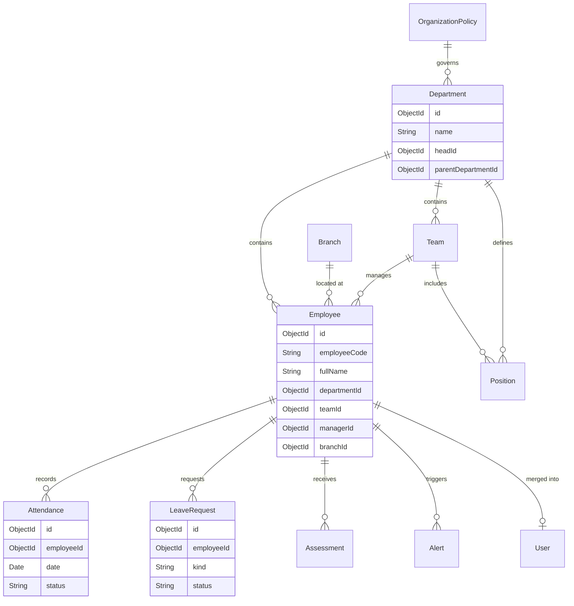

# HRMS System Map: Data Relations & CRUD Flow

This document provides a deep-dive mapping of the project's architecture, connecting the frontend components to the backend data models through the API and routing layers.

## 1. Entity Relationship Diagram (ERD)

The following diagram illustrates the core data entities and their relationships.

---

## 2. CRUD & File Connection Registry

This table maps the **Frontend Modules** to their **Backend Routes** and the **Data Models** they manipulate.

| Feature Area | Frontend Module (API) | Backend Route (Express) | Logic Location (Backend) | Primary Model(s) |
| :--- | :--- | :--- | :--- | :--- |
| **Employees** | `modules/employees/api.js` | `/api/employees` | `routes/employees.js` | `Employee`, `AuditLog` |
| **Attendance** | `modules/attendance/api.js` | `/api/attendance` | `routes/attendance.js` | `Attendance`, `Employee` |
| **Leave Requests** | `modules/employees/api.js` | `/api/leave-requests` | `routes/leaveRequests.js` | `LeaveRequest`, `Employee` |
| **Departments** | `modules/departments/api.js` | `/api/departments` | `routes/departments.js` | `Department` |
| **Onboarding** | `modules/employees/api.js` | `/api/onboarding` | `routes/onboarding.js` | `OnboardingRequest`, `OnboardingSubmission` |
| **Assessments** | `modules/employees/api.js` | `/api/assessments` | `controllers/assessmentController.js` | `Assessment` |
| **Auth & Users** | `modules/identity/api.js` | `/api/auth` | `routes/auth.js` | `Employee` (as User) |
| **Permissions** | `modules/permissions/api.js` | `/api/permissions` | `routes/permissions.js` | `UserPermission` |

---

## 3. Data Flow: From Page to Database

For any given feature, the data flows as follows:

1.  **Frontend Page**: A page in `frontend/src/pages` (e.g., `admin/employees/page.jsx`) uses a hook or state to trigger an action.
2.  **API Service**: The page calls a function from a module API file (e.g., `frontend/src/modules/employees/api.js`).
3.  **Fetch Wrapper**: The API function uses `fetchWithAuth` to send a request to the backend with the current user's JWT.
4.  **Backend Route**: The request is caught by an Express router (e.g., `backend/src/routes/employees.js`).
5.  **Middleware**: `requireAuth` verifies the token, and `resolveEmployeeAccess` determines the user's data scope (Admin, Dept Head, etc.).
6.  **Business Logic**: The router logic (directly in the file or through services) processes the request, performs manual validation, and interacts with Mongoose.
7.  **Database**: The Mongoose model interacts with MongoDB to persist or retrieve data.

---

## 4. Key Architectural Observations

> [!NOTE]
> **Merged User Model**: The `User` model is effectively deprecated and merged into the `Employee` model. Authentication uses the `email` and `passwordHash` stored directly on the `Employee` document.

> [!IMPORTANT]
> **Logic Encapsulation**: Unlike many MVC applications, this project consolidates much of its business logic within the **Route** files. If you are looking for the implementation of a specific calculation (like attendance status or leave balance), start in the corresponding `backend/src/routes` file.

> [!TIP]
> **Data Scoping**: The system uses a specialized `accessService` to implement Row-Level Security. Every data-fetching route automatically filters its results based on whether the requester is an `Admin`, `HR_MANAGER`, `MANAGER`, or `EMPLOYEE`.
