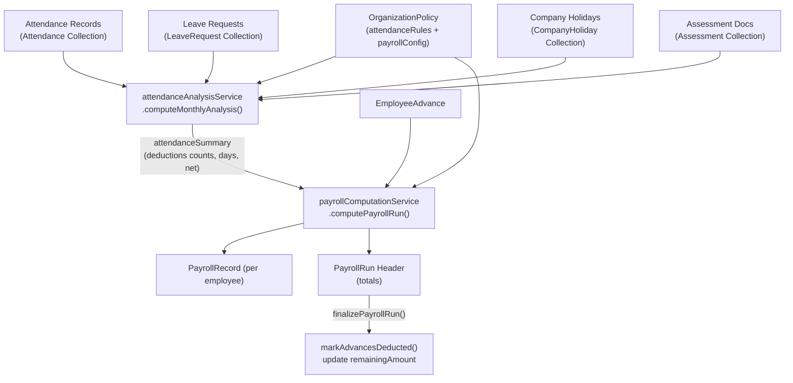

# تحليل عميق: Attendance & Time-Off ↔ Payroll & Advances

## 1. كيف يتواصل الموديولان (Data Flow)



---

## 2. نقاط الربط الحرجة بالتفصيل

### 2.1 الخطوة الأولى: `computeMonthlyAnalysis()` تُنتج ملخّص الحضور

في `attendanceAnalysisService.js`، الدالة تولّد لكل موظف:

| الحقل | ما يعني |
|---|---|
| `deductions.lateDays` | مجموع أيام الخصم بسبب التأخر (بالكسور, e.g. 0.5) |
| `deductions.absenceDays` | أيام الغياب الكاملة |
| `deductions.unpaidLeaveDays` | أيام الإجازات غير المدفوعة |
| `deductions.excessExcuseDays` | أيام الخصم من تجاوز حصة الأعذار |
| `deductions.excessExcuseAmountDirect` | مبلغ خصم مباشر (بالجنيه) لتجاوز الأعذار |
| `assessmentNet` | صافي مكافأة التقييم المحسوبة بالجنيه |
| `workingDays` | عدد أيام العمل الفعلية في الفترة |

> **ملاحظة حرجة**: الدالة تُرجع فقط **عدد الأيام** (not EGP). السعر اليومي يُحسب داخل payroll فقط.

---

### 2.2 الخطوة الثانية: `computePayrollRun()` تستهلك الملخص وتحسب EGP

```javascript
// payrollComputationService.js - Line 1095
const attResult = await computeMonthlyAnalysis(year, month, run.departmentId || undefined);

// Lines 507-530: تحويل أيام الخصم → EGP
const nonAbsenceDeductionDays =
    lateDeductionDays + earlyDepartureDeductionDays + incompleteDeductionDays +
    unpaidLeaveDeductionDays + excessExcuseDeductionDays;

const input = {
    attendanceDeduction: (nonAbsenceDeductionDays * rawDailyRate) + excessExcuseDeductionAmountDirect,
    daysAbsent: attendanceSummary?.absentDays || 0,
    ...
};
```

**المعادلة الكاملة للخصومات:**
```
totalDeductions = absentDeduction + attendanceDeduction + fixedDeduction + advanceAmount

حيث:
  absentDeduction = daysAbsent × dailyRate  (يُحد بـ effectiveGross لو غاب كل الشهر)
  attendanceDeduction = (لايت + مبكر + ناقص + إجازة بلا راتب + أعذار زيادة) × dailyRate
                      + مبلغ الأعذار المباشر
  advanceAmount = min(requestedAdvance, maxAvailablePool)
```

---

### 2.3 الخطوة الثالثة: Advances تُدمج في حساب صافي الراتب

```javascript
// payrollComputationService.js - Lines 165-203
async function getActiveAdvanceTotal(employeeId, runYear, runMonth) {
    // الحصول على السلف النشطة: APPROVED أو ACTIVE مع remainingAmount > 0
    // ONE_TIME: كل المبلغ المتبقي
    // INSTALLMENTS: monthlyDeduction فقط (محدود بالمتبقي)
}
```

**قانون التأمين على السلف**: السلفة لا تُخصم من الراتب الصافي مباشرة بل تُحسب كحد أقصى:
```javascript
maxAdvanceDeduction = max(0, grossPool - nonAdvanceDeductions)
advanceAmount = min(requestedAdvance, maxAdvanceDeduction)
```
بمعنى:لو الخصومات الأخرى أكلت الراتب ⇒ السلفة تُكبَّل لما تبقى.

---

### 2.4 الخطوة الرابعة: `finalizePayrollRun()` تُغلق السلف

بعد الإقرار النهائي:
```javascript
// Lines 1399-1400
const actualDeductions = buildDeterministicAdvanceDeductions(records, dp);
await markAdvancesDeducted(actualDeductions, runId, { session, decimalPlaces: dp });
```

`markAdvancesDeducted` تُحدّث كل سلفة:
- `remainingAmount -= deductedAmount`
- `status: "COMPLETED"` لو تصفّت، أو `"ACTIVE"` لو ما زالت 
- تُسجّل في `deductionHistory[]`

---

## 3. الفترة الزمنية (Fiscal Period) — نقطة حساسة

كلا الموديولين يحسبان نفس الفترة بنفس الدالة:

```javascript
// leavePolicyService.js – fiscalMonthPeriodStartUtc()
// تُستخدم في attendance: resolveMonthRange()
// تُستخدم في payroll: resolveRunPeriodRange()
```

**التوافق: ✅ الفترة متطابقة في كلا الموديولين.**

---

## 4. Assessment → Payroll → Attendance (التقييم كجزء من المعادلة)

```javascript
// attendanceAnalysisService.js – Lines 626-644
for (const a of empAssessments) {
    if (assessmentPayrollRules.bonusDaysEnabled && a.daysBonus > 0) {
        assessmentBonusAmount += r2(a.daysBonus * mult * rawDailyRate);
    }
    if (assessmentPayrollRules.deductionEnabled && a.deduction > 0) {
        assessmentDeductionAmount += r2(a.deduction * mult); // EGP مباشر — NOT × dailyRate
    }
}
const assessmentNet = assessmentBonusAmount + assessmentOvertimeAmount - assessmentDeductionAmount;
```

التقييم يدخل في payroll كـ `assessmentBonus` في حقل `totalAdditions`.

---

## 5. طبقة الفرونت إند

### 5.1 `payrollVerification.js` — Mirror دقيق للـ Backend

الفرونت إند فيه `computePayrollLikeModule()` تعيد نفس حسابات الباك إند بالضبط. يُستخدم للتحقق من صحة الأرقام قبل وبعد الحفظ:

```javascript
// verifyPayrollData() يتحقق من:
// 1. مجموع gross الصفوف = totals.totalGross
// 2. مجموع net الصفوف = totals.totalNet
// 3. كل صف: effectiveGross + additions - deductions = dueBeforeInsurance
// 4. كل صف (مؤمَّن): due - insurance - tax - martyrsFund = netSalary
```

**التوافق: ✅ الفرونت إند يعكس الباك إند بدقة عالية (نفس الـ tax brackets, insurance rates, rounding).**

### 5.2 `payroll/api.js` — مشكلة منفردة

```javascript
// Line 4
const API_URL = import.meta.env.VITE_API_URL || "http://localhost:5000/api";
```

> **⚠️ Bug موثَّق في DOCUMENTATION.md**: الـ fallback يستخدم port **5000** بينما الباك إند يعمل على **5001**.  
> إذا لم يكن `VITE_API_URL` مضبوط في `.env` سيفشل الـ API.  
> التوصية: تغيير الـ fallback إلى `5001` أو التأكد دائماً من وجود `.env`.

---

## 6. هل المنظومة تعمل بشكل صحيح؟

### ✅ ما يعمل بشكل صحيح

| الجانب | التقييم |
|---|---|
| تدفق البيانات من Attendance → Payroll | **✅ صحيح** — Payroll يستدعي `computeMonthlyAnalysis()` مباشرة |
| حساب السعر اليومي | **✅ صحيح** — يُحسب من `(baseSalary + allowances) / workingDaysPerMonth` |
| حماية السلفة من تجاوز الراتب | **✅ صحيح** — `min(requestedAdvance, maxAvailablePool)` |
| تسجيل السلفة بعد Finalize | **✅ صحيح** — `markAdvancesDeducted` مع transaction support |
| التحقق من PARTIAL_EXCUSED قبل Finalize | **✅ صحيح** — payroll يرفض الإقرار لو فيه صفوف PARTIAL_EXCUSED لم يُحسم عليها قرار |
| الفترة المالية متطابقة بين الموديولين | **✅ صحيح** — نفس دالة حساب الفترة |
| Tax brackets في الفرونت = الباك إند | **✅ صحيح** — نفس الشرائح بالضبط |
| Overtime من Assessment فقط (لا من Checkout) | **✅ مقصود** — `overtimeHrs = 0` صريح في `computePayrollRun()` line 1162 |
| الموظفون المنهيون مع حضور يُدرجون في Payroll | **✅ صحيح** — مع تسجيل سبب الإدراج |

---

### ⚠️ مشاكل وتحذيرات

#### **M1 - منخفض الأثر**: Port Mismatch في `payroll/api.js`
```diff
- const API_URL = import.meta.env.VITE_API_URL || "http://localhost:5000/api";
+ const API_URL = import.meta.env.VITE_API_URL || "http://localhost:5001/api";
```
**الأثر**: سيفشل Payroll كاملاً لو `.env` مش موجود.

---

#### **M2 - متوسط الأثر**: دقة التقريب بين `attendanceAnalysisService` و `payrollComputationService`

في `attendanceAnalysisService.js`:
```javascript
const r2 = (v) => Math.round(v * 100) / 100;  // always 2 decimal places
```

في `payrollComputationService.js`:
```javascript
const dp = clampDecimalPlaces(config?.decimalPlaces);  // from org policy, default 2
const rnd = (v) => roundMoney(v, dp);
```

لو HR غيّر `decimalPlaces` في السياسة إلى 3 أو 4 — الـ attendance analysis هتفضل بـ 2 decimal، بينما payroll هيستخدم 3 أو 4. ده ممكن يعمل انحراف طفيف في `assessmentBonus` و `dailyRate` الظاهر في report الحضور.

**الأثر**: الأرقام في Report الحضور مش هتتطابق مع الـ PayrollRecord في حالة `decimalPlaces ≠ 2`.

---

#### **M3 - متوسط الأثر**: `excessExcuseAmountDirect` — حقلين بنفس المعنى في الـ response

في `attendanceAnalysisService.js` line 691:
```javascript
deductions: {
    excessExcuseAmount: r2(excessExcuseDeductionAmount + excessExcuseAmountDeductionAmount), // مجموع
    excessExcuseAmountFromDays: excessExcuseDeductionAmount,    // من الأيام
    excessExcuseAmountDirect: excessExcuseAmountDeductionAmount, // المبلغ المباشر
}
```

وفي payroll (line 513):
```javascript
const excessExcuseDeductionAmountDirect =
    Number(attendanceSummary?.deductions?.excessExcuseAmountDirect) || 0;
```

**الحقل صحيح ومربوط**، لكن الفرونت إند لو عرض `excessExcuseAmount` هيجمع الاثنين معاً (ده عرض للمستخدم بس، مش حساب).

---

#### **M4 - عالي الأثر**: السلف بدون Transactions في MongoDB Standalone

```javascript
// payrollComputationService.js – Lines 1210+
const supportsTx = await mongoSupportsTransactions();
if (supportsTx) {
    // transaction: آمن
} else {
    // sequential writes: خطأ محتمل
    await PayrollRecord.deleteMany({ runId });
    await PayrollRecord.insertMany(records.map(...));
    // لو فشل هنا → Run يبقى COMPUTING ومفيش records
}
```

**الأثر**: في بيئة MongoDB Standalone (بدون Replica Set) — لو فشل `insertMany` بعد `deleteMany` → Run عالق في `COMPUTING` ومفيش بيانات. الكود فيه `catch` يرجع الـ status لـ DRAFT، لكن الـ records الـ deleted مش هترجع.

**الحل الموجود**: `POST /payroll/runs/:id/reset-processing` و `POST /payroll/runs/:id/repair-totals` لاستعادة الحالة.

---

#### **M5 - منخفض الأثر**: `getMyPayrollHistoryApi` و `GET /payroll/me/history` يسترجع آخر 30 يوم فقط

```javascript
// payroll.js route - Lines 214-216
const lastMonthCutoff = new Date();
lastMonthCutoff.setDate(lastMonthCutoff.getDate() - 30);
```

الموظف يشوف فقط آخر 30 يوم — لو الـ run تم بتاريخ أقدم من 30 يوم مش هيظهرله تاريخ راتبه. **مش bug تقني لكن UX مُقيَّد**.

---

## 7. خريطة التوافق الكاملة

```
Attendance status → Payroll deduction mapping:
─────────────────────────────────────────────
PRESENT          → 0 deduction
LATE             → lateDeductionTiers tiers (fractional days)
EXCUSED          → 0 (إلا لو quota تجاوز)
PARTIAL_EXCUSED  → BLOCKS finalize لو مش محسوم
EARLY_DEPARTURE  → earlyDepartureDeductionDays × dailyRate
INCOMPLETE       → incompleteRecordDeductionDays × dailyRate
ON_LEAVE (paid)  → 0
ON_LEAVE (unpaid)→ unpaidLeaveDeductionDays × dailyRate
ABSENT           → absenceDeductionDays × dailyRate
HOLIDAY          → 0 (أعلى أولوية)
```

---

## 8. الخلاصة

| التقييم | التفصيل |
|---|---|
| **المنظومة تعمل بشكل صحيح عموماً** | التدفق من Attendance → Payroll → Advances محكم ومدروس |
| **أخطرها**: port mismatch | يجعل الفرونت إند يفشل في بيئة بدون `.env` |
| **الأكثر أثراً على الدقة**: decimal places drift | فقط لو HR غيّر الإعداد عن القيمة الافتراضية 2 |
| **Risk بيئي**: MongoDB Standalone | يحتاج replica set للحصول على transactions حقيقية |
| **Frontend verification layer**: قوي جداً | `payrollVerification.js` يعيد تحقق من كل المعادلات client-side |
