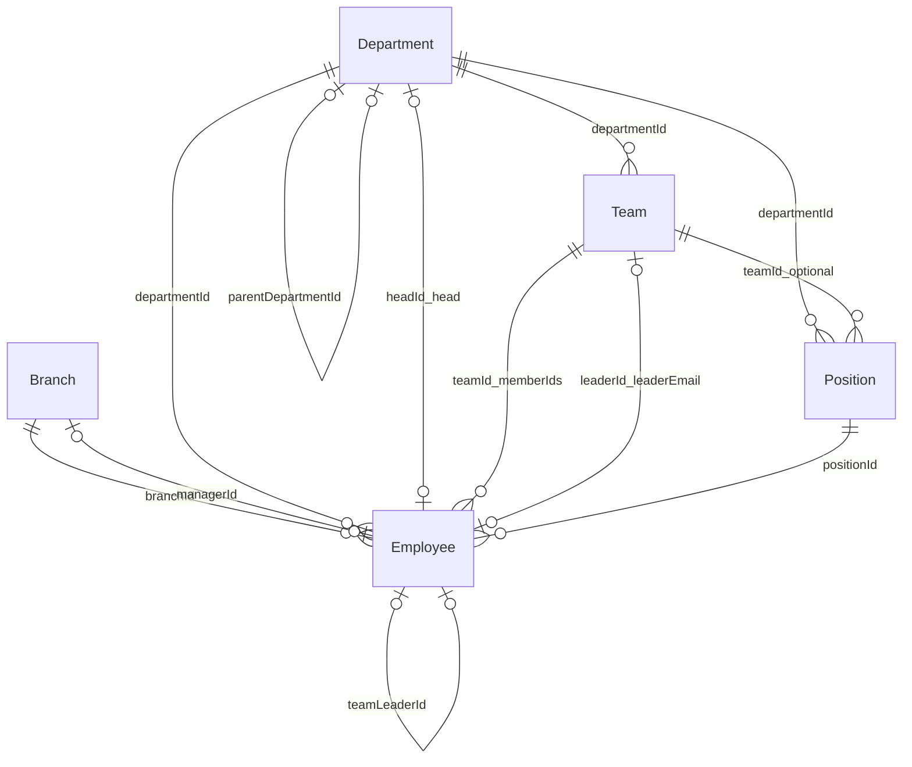
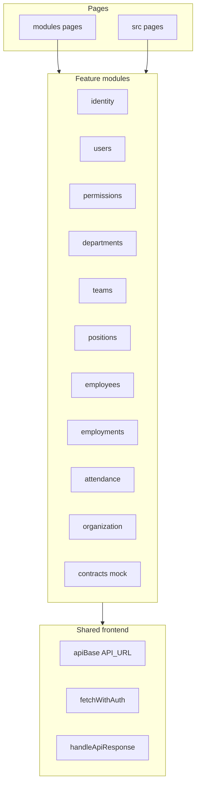
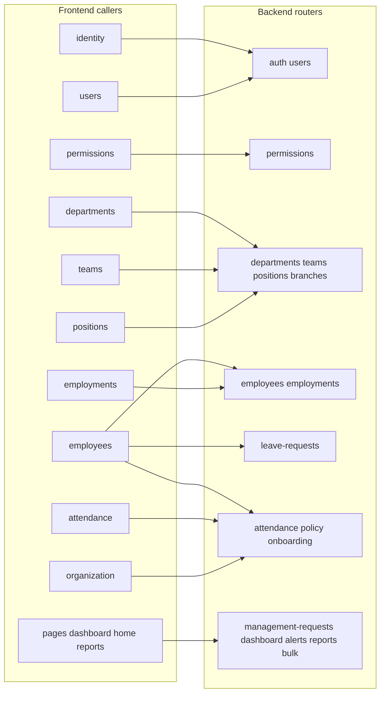

# Data relations analysis and map

**Implemented fixes (2026):** shared [`backend/src/utils/roles.js`](../backend/src/utils/roles.js); Team **`memberIds`** sync in employments; **`accessService`** uses **`isAdminRole`**, **`headId`**, **`Team.leaderId`**; **`checkScopeDepartment`** matches **`departmentId`** when names align; dashboard filters prefer **`departmentId`**; reports use shared **`canViewReports`**; **`GET /api/reports/org-consistency`**; **`employeeOrgCaches`** + onboarding create; bulk import + env gate; frontend **`modules/branches/api.js`**, **`modules/dashboard/api.js`**, **`modules/bulk/api.js`**, **`modules/reports/api.js`** (pages switched where noted); contracts gated via **`VITE_ENABLE_CONTRACTS`** ([`frontend/.env.example`](../frontend/.env.example)).

This document is split into **three separate steps** so you can read each layer without mixing concerns:

1. **Backend** — MongoDB / Mongoose relations, services, and how the API is mounted (no React).
2. **Frontend** — How the React app is organized (modules, stores, shared API helpers); no server details.
3. **Frontend ↔ Backend** — Which UI layer calls which HTTP endpoints and which backend domain that hits.

**Scope:** Architecture and relations only. No implementation snippets.

---

# Step 1 — Backend (all together)

Everything in this section is **server-side only**: data model, persistence, business services, and Express routers.

## Runtime and auth (backend)

- **Stack:** Node, Express, Mongoose on MongoDB.
- **API prefix:** Routers are mounted in `backend/src/index.js` under **`/api`**.
- **Identity:** `User` re-exports `Employee`. One collection holds login fields and HR profile.
- **JWT:** Access token payload uses `sub` as the employee document id. After `requireAuth`, `req.user` is **`{ id, email, role }`**.

## Core data relations (Mongoose)

ObjectId edges between the main HR collections:

### Legacy vs normalized (backend rules)

- **Employee** keeps string caches (`department`, `team`, `position`, `workLocation`) aligned when `departmentId`, `teamId`, `positionId`, `branchId` are set.
- **Department** still embeds legacy `teams[]` and `positions[]`; standalone **Team** and **Position** collections are the intended source of truth (`hasMigratedTeams`).
- **Team:** `members[]` (emails) vs `memberIds[]` (ObjectIds); `leaderEmail` vs `leaderId`.
- **Department head:** `head` (email) vs `headId` (ObjectId).
- **Employee** also carries `transferHistory` and `additionalAssignments` with Department / Team / Position refs.

## Satellite collections (backend)

| Collection | References / keys | Role |
|------------|-------------------|------|
| LeaveRequest | `employeeId` → Employee | Workflow; `policySnapshot`, `balanceContext`, `approvals[]` |
| Attendance | `employeeId`, `lastManagedBy` → Employee | One doc per employee per day (unique index) |
| UserPermission | `userId` → Employee | RBAC rows; unique (`userId`, `module`) |
| ManagementRequest | `departmentId` → Department | Leadership / TL requests |
| Alert | `employeeId` → Employee | Operational alerts |
| OnboardingRequest | — | Token link + metadata |
| OnboardingSubmission | `linkId` → OnboardingRequest | Applicant data; may become Employee |
| OrganizationPolicy | — | Leave rules, documents, locations, salary rules |
| AuditLog | `entityId` + `entityType` | Polymorphic audit (no Mongoose `ref`) |
| TokenBlacklist | — | Revoked JWTs |
| PasswordResetRequest | — | Reset flow |

## Cross-cutting backend services

| Service | Role |
|---------|------|
| `accessService` (`resolveEmployeeAccess`) | Scope and allowed actions for employee routes |
| `employeeOrgSync` (`syncEmployeeLeadershipAfterSave`) | Aligns Department head / Team leader with MANAGER / TEAM_LEADER roles |
| `orgResolutionService` | Enriches employee API payloads beyond raw documents |
| `auditService` | Writes AuditLog for sensitive operations |
| `leaveRequestService` / `leavePolicyService` | LeaveRequest lifecycle vs OrganizationPolicy and employee balances |
| Employments route logic | Updates Employee primary org ids and `additionalAssignments` |

## Response shaping on the backend

| Route area | Typical behavior |
|------------|------------------|
| Employees | `populate` `managerId`, `teamLeaderId`, `branchId`; enrichment via orgResolutionService |
| Teams | `populate` `departmentId` (name) |
| Positions | `populate` `departmentId`, optional `teamId` (names) |
| Attendance | `populate` `employeeId` (partial); sometimes employee `departmentId` |
| Employments | After writes, `populate` related org paths on Employee |
| Onboarding submissions | `populate` `linkId` (token) for lists |
| Leave / dashboard / reports | Often ids + embedded snapshots; less deep Employee population |

## HTTP surface (backend only)

How Express **`/api`** maps to persistence (router files under `backend/src/routes/`):

| Mount | Primary models |
|-------|----------------|
| `/api/auth`, `/api/users` | Employee, TokenBlacklist, PasswordResetRequest |
| `/api/permissions` | UserPermission |
| `/api/departments`, `/api/teams`, `/api/positions`, `/api/branches` | Department, Team, Position, Branch |
| `/api/employees` | Employee; may touch Alert, Attendance, ManagementRequest, LeaveRequest, OrganizationPolicy, UserPermission |
| `/api/employments` | Employee (assignments) |
| `/api/leave-requests` | LeaveRequest, OrganizationPolicy, Employee |
| `/api/attendance` | Attendance, Employee |
| `/api/policy` | OrganizationPolicy |
| `/api/onboarding` | OnboardingRequest, OnboardingSubmission, Employee (on approve) |
| `/api/management-requests` | ManagementRequest |
| `/api/alerts`, `/api/dashboard` | Alert; aggregates |
| `/api/reports` | Multi-model reads |
| `/api/bulk` | Bulk import |

## Create / update employee (backend resolution)

Payloads may send **names/titles** instead of ids (except branch often sends `branchId`). The employee route layer typically:

1. Resolves department **name** → `departmentId`.
2. Validates or generates **employeeCode** using department code.
3. Resolves team **name** within department → `teamId`.
4. Resolves position **title** within department → `positionId`.
5. Validates **branchId**, sets **workLocation** from branch name.

This keeps ObjectId joins correct while string caches stay compatible with older exports and UIs.

---

# Step 2 — Frontend (all together)

Everything here is **browser app only**: folders, modules, state, and how the UI talks to *abstract* “the API” without naming Mongo collections.

## Runtime and shared plumbing

- **Stack:** Vite, React.
- **Base URL:** `frontend/src/shared/api/apiBase.js` — `API_URL` from `VITE_API_URL`, default `http://localhost:5000/api`.
- **Authenticated requests:** `frontend/src/shared/api/fetchWithAuth.js` attaches Bearer tokens and refresh handling as configured.
- **Parsing:** `frontend/src/shared/api/handleApiResponse.js` normalizes success/error handling for many modules.

## Module layout (frontend internal map)

Feature code lives under `frontend/src/modules/<name>/`. Typical files:

- **`api.js`** — Functions that call `fetch` / `fetchWithAuth` against `API_URL`.
- **`store.js`** — Present for modules that centralize client state (not every module has one).

| Module | `api.js` | `store.js` | Main concerns |
|--------|----------|------------|----------------|
| `identity` | yes | yes | Login, refresh, logout, password change, current session |
| `users` | yes | no | User listing, role updates, admin password reset flows |
| `permissions` | yes | no | Per-user permission matrix |
| `departments` | yes | yes | Department CRUD client state |
| `teams` | yes | yes | Team CRUD + filters |
| `positions` | yes | yes | Position CRUD + filters |
| `employees` | yes | yes | Employees, leave requests, onboarding |
| `employments` | yes | yes | Assign / unassign |
| `attendance` | yes | yes | Attendance grid, import, bulk delete |
| `organization` | yes | no | Organization policy documents |
| `contracts` | yes | yes | **Mock API only** — no backend |
| `branches` | yes | no | **Recommended:** list branches (`GET /branches`) via `getBranchesApi`; used by employee forms |

## Frontend-only dependency picture

UI routes and pages import **stores** and/or **api** from these modules. Cross-module usage is mostly:

- Employee forms need department / team / position / branch lists → those modules’ stores or apis are consumed by employee pages.
- Attendance and employees stay separate modules but may share types or utilities under `shared/`.

**Note:** Some screens under `frontend/src/pages/` (dashboard, home, reports) call `fetchWithAuth` or `fetch` directly instead of going through a module `api.js`.

---

# Step 3 — Relation between frontend and backend

This section is only the **bridge**: which frontend entry points call which **`/api/...`** paths and which **Step 1** domain they land on.

## By module `api.js` (primary mapping)

| Frontend module | Backend mount / paths (relative to `API_URL`) | Backend domain (Step 1) |
|-----------------|-----------------------------------------------|-------------------------|
| `identity` | `/auth/login`, `/auth/refresh`, `/auth/logout`, `/auth/change-password` | auth |
| `users` | `/users`, `/users/:id/role`, `/auth/password-requests`, `/auth/reset-password` | users + auth |
| `permissions` | `/permissions/:userId` | permissions |
| `departments` | `/departments` | departments |
| `teams` | `/teams`, `?departmentId=` | teams |
| `positions` | `/positions`, query filters | positions |
| `employments` | `/employments/assign`, `/employments/unassign`, `/employments/employee/:id` | employments |
| `employees` | `/employees`, `/leave-requests` (list, balance, credit, action, cancel), `/onboarding/*` | employees, leave-requests, onboarding |
| `attendance` | `/attendance`, `/attendance/import`, `/attendance/template`, `/attendance/bulk` | attendance |
| `organization` | `/policy/documents` | policy |
| `contracts` | — | *none (mock)* |
| `branches` *(recommended module)* | `/branches` | branches |

## Page-level calls (not in module `api.js`)

These components still obey **Step 3** (they hit the same backend) but bypass the module wrapper:

| Location (frontend) | Paths used | Backend domain |
|--------------------|------------|----------------|
| Employee create / edit pages | `GET /branches` | branches |
| Dashboard page | `/management-requests`, `/dashboard/alerts`, `/dashboard/metrics` | management-requests, dashboard |
| Leadership org overview | `/bulk/template`, `/bulk/upload`, `/alerts` | bulk, alerts |
| Reports page | `/reports/summary` | reports |

## End-to-end bridge diagram

## Bridge notes and gaps

- **`userId` in URLs** (permissions, users) is the same logical id as **Employee** on the server.
- **Branches:** employee create/edit screens historically called `GET /branches` with ad-hoc `fetchWithAuth`. A dedicated **`frontend/src/modules/branches/api.js`** (e.g. `getBranchesApi` using `handleApiResponse`) keeps the bridge consistent with other domains and centralizes error handling. Wire **CreateEmployeePage** and **EditEmployeePage** to that helper.
- **Dashboard / reports / bulk** aggregates are endpoint-specific; see route files for exact models per handler.

---

# Issues, risks, and how to strengthen relations

This section lists **weak points** (bugs or design debt), **why they matter**, and **concrete improvements**. Ordered roughly by impact on data integrity and maintainability.

## 1. Team roster: `members` vs `memberIds` drift

**Issue:** The **Team** schema has legacy `members[]` (emails) and normalized `memberIds[]` (ObjectIds). **`/api/employments/assign`** (and related paths) were updating **`members`** only when moving employees between teams, not **`memberIds`**.

**Risk:** Any feature that queries or filters by `memberIds` (or populates members as documents) will be **wrong or empty** while email-based `members` looks correct. Attendance and other routes sometimes resolve scope via **Employee** queries, not `memberIds`, which hides the bug until you build team-member UIs on ids.

**Improvement:** On assign, use `$addToSet` for both `members` (email) and **`memberIds` (employee `_id`)**; on unassign / team change, `$pull` both. Optionally backfill `memberIds` from `members` with a one-off migration script.

## 2. Dual storage: string org fields vs ObjectIds on Employee

**Issue:** **Employee** keeps `department`, `team`, `position` strings alongside `departmentId`, `teamId`, `positionId`. **PUT `/employees`** updates strings first and resolves ids from **name/title** within department; **`/employments/assign`** writes ids and then strings from documents.

**Risk:** If a single code path updates **only** strings or **only** ids (bulk import, manual DB edit, future endpoint), **filters and RBAC** that still use `employee.department` or `Department.head` **strings** can diverge from ObjectId reality.

**Improvement:** (a) Add a small **server-side normalizer** (e.g. pre-save hook or shared `syncEmployeeOrgCaches(employee)` used by all write paths). (b) Gradually move **scope checks** in `accessService` / employee routes toward **departmentId** / **teamId** where possible. (c) Document “one write API” per concern for integrators.

## 3. Scope checks keyed on string department / team names

**Issue:** Helpers like **`checkScopeDepartment`** use **department name** strings. Team scope compares **`employee.team`** to allowed team **names**.

**Risk:** Rename department or team in master data without updating every employee string cache → **false 403/404** or **over-privileged** access until data is repaired.

**Improvement:** Prefer **ids** in access rules (resolve the acting user’s `departmentId` / `teamId` once, compare ObjectIds). Keep string paths only as fallback during migration.

## 4. Numeric vs string roles in middleware

**Issue:** Some routes still accept **numeric** roles (e.g. `user.role === 3` for Admin) while JWT normalization prefers **string** roles.

**Risk:** **HR_MANAGER** or other roles may be **unintentionally excluded** or duplicated logic may diverge between `requireRole` and ad-hoc checks.

**Improvement:** Centralize **one** role enum and **one** helper (`isAdmin(user)`, `canManageEmployments(user)`) used everywhere; map legacy numbers at auth boundary only.

## 5. Embedded Department `teams[]` / `positions[]` vs collections

**Issue:** **Department** still embeds legacy arrays; **Team** / **Position** collections are canonical.

**Risk:** UIs or exports reading **embedded** data show **stale** structure; migration flags (`hasMigratedTeams`) are easy to ignore.

**Improvement:** Treat **collection** reads as authoritative in APIs; stop writing embedded copies except for explicit legacy exports; add admin **“validate org consistency”** report (orphan teams, mismatched `departmentId`).

## 6. Frontend bridge inconsistency and error handling

**Issue:** Mix of **`handleApiResponse`** in module `api.js` vs raw **`fetchWithAuth` + `res.ok`** in pages (dashboard, bulk, parts of employee flows).

**Risk:** **Inconsistent** error UX and harder refactors when the API shape changes.

**Improvement:** Route all backend calls through **`modules/*/api.js`** (including **branches**, dashboard metrics if stable). Keep **page** components free of URL string construction.

## 7. Contracts module is mock-only

**Issue:** **`contracts`** store/api does not hit the backend.

**Risk:** Product confusion if the UI implies persisted contracts.

**Improvement:** Either add real **`/api/contracts`** (or link to external DMS) or hide the module behind a feature flag.

## 8. Leave and vacation: two conceptual channels

**Issue:** **LeaveRequest** is the workflow source of truth; **Employee.vacationRecords** / credits are separate.

**Risk:** Reporting “days used” can **double-count** or disagree if not clearly documented.

**Improvement:** Document in policy: **approved LeaveRequests** drive balance; vacationRecords only for **legacy/manual**; expose one **read model** for “balance snapshot” in API docs.

## 9. Bulk Excel import: destructive reset and partial relation sync

**Issue:** **`POST /api/bulk/upload`** deletes **Employee**, **Department**, **Team**, **Position**, **OrganizationPolicy**, and **Attendance**, then rebuilds org + employees from the workbook.

**Risks:**

- **`Branch` documents are not cleared or recreated** by this route. After a bulk run, the **Branch** collection can hold **stale** rows that no longer match org/employees, while the “Branches” sheet only feeds **`OrganizationPolicy.workLocations`** (governorate/city + branch name strings), not the **`Branch`** model.
- Imported employees set **`departmentId`**, **`teamId`**, **`position`** (string), **`department`** (string), but **omit `team` string** and **`positionId`** in the loop—so string/ObjectId pairs can be **half-missing** compared to UI-created employees.
- **LeaveRequest**, **Alert**, **UserPermission**, **ManagementRequest**, **Onboarding** data, etc. are **not** listed in `deleteMany`—you can get **orphan references** or inconsistent HR state after import.
- **OrganizationPolicy** is replaced with a minimal doc from the sheet; **leave policy versions** and other settings can be **wiped unintentionally**.

**Improvement:** Treat bulk as a **controlled migration**: explicit env flag, backup prompt, extend wipe list or **freeze** foreign collections; after employee row create, call the same **cache-sync** logic as `POST /employees`; import **`Branch`** rows into **`Branch`** or document that branches must be re-imported separately.

## 10. `accessService` and Team leader resolution

**Issue:** **`resolveEmployeeAccess`** builds team scope from **`Department.teams[].leaderEmail`**, **`Team.leaderEmail`**, and role **TEAM_LEADER**. It does **not** consider **`Team.leaderId`**.

**Risk:** A team updated only with **normalized `leaderId`** (no email) may leave the leader with **`scope: "self"`** instead of **team**, blocking legitimate approvals/edits.

**Improvement:** Resolve managing teams by **`leaderId`** (compare to current user’s Employee id) with **email as fallback**; align with `employeeOrgSync` output.

## 11. Department head and HR detection use `head`, not `headId`

**Issue:** **`accessService`** grants department-wide or “HR head” access using **`Department.head === user.email`** (and **`hrDept.head`**). **`headId`** is not used in these checks.

**Risk:** If **`head`** string is stale but **`headId`** is correct after a data fix, **the real head loses elevated scope**.

**Improvement:** Check **`headId`** against **Employee** id (or `head` OR `headId` match) in one helper.

## 12. Multiple code paths to create `Employee`

**Issue:** **`Employee`** documents are created from **`routes/employees.js`**, **`services/employeeService.createEmployee`** (onboarding approve and possibly others), **`routes/bulk.js`**, **`routes/auth.js`** (registration), and seed scripts.

**Risk:** Each path sets slightly **different fields** (codes, `departmentId`, caches, `syncEmployeeLeadershipAfterSave`, audit logs). **Bulk** and **onboarding** are the highest drift candidates relative to main HR CRUD.

**Improvement:** Prefer **one internal `createEmployeeRecord(payload, context)`** that all routes call, with hooks for audit and leadership sync.

## 13. Dashboard metrics filter on string `department`

**Issue:** **`GET /api/dashboard/metrics`** and **`/dashboard/alerts`** (for department scope) filter employees with **`department: userEmp.department`** (string).

**Risk:** Same as other string-based scope:** renamed departments** or **id/string mismatch** skew **headcount and payroll** on the dashboard.

**Improvement:** Filter by **`departmentId`** once the acting user’s employee record is loaded.

## 14. `OrganizationPolicy` vs `Branch` as two location models

**Issue:** **Work location** appears in **`OrganizationPolicy.workLocations`** (governorate/city + branch **strings**) and in the **`Branch`** collection (**`branchId`** on Employee).

**Risk:** UI may show **policy-derived** location lists that **do not match** active **Branch** entities; employee **branchId** can point to a branch **not** reflected in policy JSON.

**Improvement:** Pick a **primary** location model for new features (**Branch** + **`branchId`** recommended); treat policy locations as **suggestions** or migrate policy to reference **Branch ids**.

## 15. Reports gate vs `requireRole` inconsistency

**Issue:** **`reports.js`** uses **ad-hoc `canViewReports`** (`role === 3` or `ADMIN` or `HR_STAFF`). **`HR_MANAGER`** may be excluded depending on token shape, while **`accessService`** grants **HR_MANAGER** full employee scope elsewhere.

**Risk:** **HR manager** can manage employees but **not** see **reports/summary** (403), or behavior differs between environments.

**Improvement:** Reuse **`requireRole`** or the same **central role helper** as branches POST (which already lists **HR_MANAGER**).

---

# Appendix

## How this map was validated

- Mongoose `ref` fields under `backend/src/models`.
- Router mounts in `backend/src/index.js`.
- `populate(` usage under `backend/src/routes`.
- Frontend `API_URL` usage in `frontend/src/modules/*/api.js` and targeted greps in `frontend/src/pages` and employee pages.
- Additional review: **`routes/bulk.js`**, **`services/accessService.js`**, **`routes/dashboard.js`**, **`routes/reports.js`**, **`services/employeeService.js`**, **`routes/branches.js`** (for policy vs branch split and access edge cases).

## Maintenance

When you add a model, route, or module, update **Step 1**, **Step 2**, or **Step 3** respectively. Optional: copy this file to `docs/DATA_RELATIONS.md` for wider visibility.
