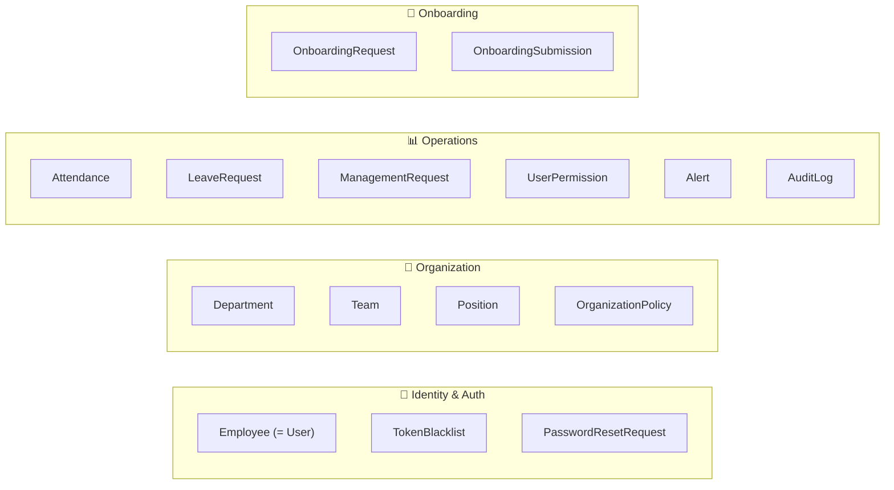
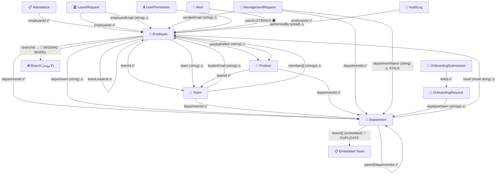

# تحليل شامل — كل الـ Schemas والعلاقات بينهم (بعد التعديلات)

---

## الجزء الأول: خريطة كل الـ Schemas

### 16 Model في النظام



---

### تفاصيل كل Schema والحقول المرتبطة

#### 1. Employee (276 سطر — الكيان المركزي)

| الحقل | النوع | الربط | الحالة |
|---|---|---|---|
| `email` | String, unique | المعرف الأساسي للربط القديم | ⚠️ يُستخدم كـ FK في كثير من الأماكن |
| `department` | String, required | ← اسم القسم (نص) | ⚠️ تكرار مع departmentId |
| `departmentId` | ObjectId → Department | المرجع الصحيح | ✅ |
| `team` | String | ← اسم الفريق (نص) | ⚠️ تكرار مع teamId |
| `teamId` | ObjectId → Team | المرجع الصحيح | ✅ |
| `position` | String, required | ← عنوان المنصب (نص) | ⚠️ تكرار مع positionId |
| `positionId` | ObjectId → Position | المرجع الصحيح | ✅ |
| `managerId` | ObjectId → Employee | المدير المباشر | ✅ |
| `teamLeaderId` | ObjectId → Employee | قائد الفريق | ✅ |
| `branchId` | ObjectId → Branch | ❌ Branch model غير موجود! | 🔴 |
| `role` | Enum String | EMPLOYEE/TEAM_LEADER/MANAGER/HR_STAFF/HR_MANAGER/ADMIN | ✅ |
| `transferHistory[].fromDepartment` | ObjectId → Department | | ✅ |
| `transferHistory[].toDepartment` | ObjectId → Department | | ✅ |
| `transferHistory[].fromDepartmentName` | String | تكرار | ⚠️ |
| `transferHistory[].toDepartmentName` | String | تكرار | ⚠️ |
| `additionalAssignments[].departmentId` | ObjectId → Department | | ✅ |
| `additionalAssignments[].teamId` | ObjectId → Team | | ✅ |
| `additionalAssignments[].positionId` | ObjectId → Position | | ✅ |

---

#### 2. Department (88 سطر)

| الحقل | النوع | الربط | الحالة |
|---|---|---|---|
| `name` | String, unique | | ✅ |
| `code` | String, unique | | ✅ |
| `head` | String | ← **email** الموظف (ليس ObjectId!) | ⚠️ |
| `teams[]` | Embedded TeamSchema | تكرار مع Team collection | 🔴 |
| `teams[].leaderEmail` | String | ← email الموظف | ⚠️ |
| `teams[].members[]` | String[] | ← emails الموظفين | ⚠️ |
| `positions[]` | Embedded | أيضاً في Position collection | ⚠️ |
| `parentDepartmentId` | ObjectId → Department | هرم الأقسام | ✅ |

---

#### 3. Team (54 سطر — Standalone Collection)

| الحقل | النوع | الربط | الحالة |
|---|---|---|---|
| `name` | String | | ✅ |
| `departmentId` | ObjectId → Department | | ✅ |
| `leaderEmail` | String | ← email الموظف (ليس ObjectId!) | ⚠️ |
| `members[]` | String[] | ← emails الموظفين (ليس ObjectIds!) | ⚠️ |

---

#### 4. Position (60 سطر)

| الحقل | النوع | الربط | الحالة |
|---|---|---|---|
| `title` | String | | ✅ |
| `departmentId` | ObjectId → Department | | ✅ |
| `teamId` | ObjectId → Team (optional) | | ✅ |

---

#### 5. Attendance (50 سطر)

| الحقل | النوع | الربط | الحالة |
|---|---|---|---|
| `employeeId` | ObjectId → Employee | | ✅ |
| `employeeCode` | String | تكرار (للبحث من Excel) | ⚠️ redundant |
| `lastManagedBy` | ObjectId → Employee | | ✅ |

---

#### 6. LeaveRequest (84 سطر)

| الحقل | النوع | الربط | الحالة |
|---|---|---|---|
| `employeeId` | ObjectId → Employee | | ✅ |
| `employeeEmail` | String | تكرار — **يتحدث الآن عند تغيير Email** ✅ | ⚠️ redundant |
| `approvals[].processedBy` | String | ← email (ليس ObjectId) | ⚠️ |

---

#### 7. ManagementRequest (43 سطر)

| الحقل | النوع | الربط | الحالة |
|---|---|---|---|
| `senderEmail` | String | ← email الموظف (ليس ObjectId!) | ⚠️ |
| `senderName` | String | تكرار | ⚠️ |
| `departmentId` | ObjectId → Department | | ✅ |
| `departmentName` | String | تكرار — لا يتحدث عند تغيير اسم القسم | 🟠 |

---

#### 8. UserPermission (17 سطر)

| الحقل | النوع | الربط | الحالة |
|---|---|---|---|
| `userId` | **String** (ليس ObjectId!) | لا يمكن populate | 🟠 |

---

#### 9. Alert (15 سطر)

| الحقل | النوع | الربط | الحالة |
|---|---|---|---|
| `employeeId` | ObjectId → Employee | | ✅ |

---

#### 10. AuditLog (35 سطر)

| الحقل | النوع | الربط | الحالة |
|---|---|---|---|
| `entityId` | ObjectId | generic — لا يوجد ref | ✅ مقصود |
| `performedBy` | String | ← email | ⚠️ |

---

#### 11. OnboardingRequest (28 سطر)

| الحقل | النوع | الربط | الحالة |
|---|---|---|---|
| `metadata.department` | String | ← اسم قسم (ليس ObjectId!) | ⚠️ |
| `metadata.position` | String | ← عنوان منصب (ليس ObjectId!) | ⚠️ |
| `metadata.team` | String | ← اسم فريق (ليس ObjectId!) | ⚠️ |

---

#### 12. OnboardingSubmission (49 سطر)

| الحقل | النوع | الربط | الحالة |
|---|---|---|---|
| `linkId` | ObjectId → OnboardingRequest | | ✅ |
| `personalData.department` | String | نسخة من metadata | ⚠️ |
| `personalData.position` | String | نسخة من metadata | ⚠️ |

---

#### 13-16. TokenBlacklist, PasswordResetRequest, OrganizationPolicy, User

| Model | علاقات | حالة |
|---|---|---|
| TokenBlacklist | لا توجد (standalone) | ✅ |
| PasswordResetRequest | `email` String — ليس ref | ⚠️ لكن مقبول |
| OrganizationPolicy | `salaryIncreaseRules[].target` = dept name أو employee ID/code | ⚠️ |
| User | re-export من Employee | ✅ backward compat |

---

## الجزء الثاني: خريطة العلاقات الكاملة



---

## الجزء الثالث: المشاكل المتبقية بعد الإصلاحات السابقة

### ✅ ما تم إصلاحه بالفعل (10 إصلاحات)

| # | الإصلاح | الملف |
|---|---|---|
| 1 | accessService يبحث في Standalone Teams | `accessService.js` ✅ |
| 2 | Transfer يمسح team/teamId/managerId | `employees.js` ✅ |
| 3 | حذف القسم يمسح Positions | `departments.js` ✅ |
| 4 | GET /departments يعمل dedup للفرق | `departments.js` ✅ |
| 5 | Team rename يستخدم الاسم القديم | `teams.js` ✅ |
| 6 | Team rename يحدث Employee.team | `teams.js` ✅ |
| 7 | Email cascade يشمل LeaveRequest/ManagementRequest | `employees.js` ✅ |
| 8 | Delete employee يستخدم ObjectId | `employees.js` ✅ |
| 9 | isPrimary: false في additionalAssignments | `employments.js` ✅ |
| 10 | roleWeight يشمل كل الأدوار | `auth.js` ✅ |

---

### 🔴 المشاكل المتبقية (8 مشاكل)

#### المشكلة #1: `branchId` يشير لـ Model غير موجود
**الملف:** `Employee.js` سطر 67
```js
branchId: { type: Schema.Types.ObjectId, ref: "Branch" },
```
**المشكلة:** لا يوجد `Branch` model في المشروع. لو حد حاول عمل `populate("branchId")` → خطأ.
**الحل:** إزالة الحقل أو إنشاء Branch model.
**الأثر:** ⚡ صغير — الحقل غير مستخدم في أي route حالياً.

---

#### المشكلة #2: `resolveAttendanceAccess` في attendance.js لا يبحث في Standalone Teams
**الملف:** `attendance.js` سطر 127
```js
const leadsTeams = await Department.find({ "teams.leaderEmail": user.email });
```
**المشكلة:** مطابقة لنفس المشكلة اللي حللناها في `accessService.js` — Team Leaders بفرق standalone لا يوصلوا.
**الحل:** أضف بحث في `Team` collection كما فعلنا في `accessService.js`.
**الأثر:** 🔴 عالي — Team Leaders لا يقدروا يشوفوا attendance فريقهم.

---

#### المشكلة #3: `attendance.js` يبحث في الأعضاء من `Department.teams[].members` فقط
**الملف:** `attendance.js` سطر 168-179
```js
const departments = await Department.find({ "teams.leaderEmail": req.user.email });
departments.forEach((d) => {
  d.teams.filter((t) => t.leaderEmail === req.user.email)
    .forEach((t) => memberEmails.push(...t.members));
});
```
**المشكلة:** أعضاء الفرق المستقلة لا يظهروا في attendance scope.
**الحل:** أضف بحث في `Team.find({ leaderEmail })` واجمع الـ members.
**الأثر:** 🔴 عالي — يكمل المشكلة #2.

---

#### المشكلة #4: `ManagementRequest.departmentName` لا يتحدث عند إعادة تسمية القسم
**الملف:** `departments.js` سطر 351-360
```js
if (isRenaming) {
  await Employee.updateMany(...); // يحدث Employee.department ✅
  // ❌ لا يحدث ManagementRequest.departmentName
}
```
**الحل:** أضف `ManagementRequest.updateMany` في block إعادة التسمية.
**الأثر:** 🟡 متوسط — بيانات عرض فقط.

---

#### المشكلة #5: `reports.js` يبحث عن فرق بدون مدير بحقل غير موجود
**الملف:** `reports.js` سطر 135
```js
const teamsWithoutManager = await Team.find({ managerEmail: null });
```
**المشكلة:** الحقل اسمه `leaderEmail` وليس `managerEmail`! هذا الاستعلام **دائماً** يرجع كل الفرق.
**الحل:** غيّر `managerEmail` إلى `leaderEmail`.
**الأثر:** 🟠 متوسط — تقرير "فرق بدون مدير" خاطئ دائماً.

---

#### المشكلة #6: `dashboard.js` يستخدم `Department.name = "HR"` بدلاً من `code`
**الملف:** `attendance.js` سطر 118
```js
const hrDept = await Department.findOne({ name: "HR" });
```
**المشكلة:** القسم يُعرَّف بالـ `code` وليس الـ `name`. لو اسم القسم "Human Resources" → HR head يفقد صلاحياته.
**الحل:** استخدم `{ code: "HR" }` مع fallback لـ `{ name: "HR" }`.
**الأثر:** 🟠 متوسط — ممكن يكسر scope الـ HR head في Attendance.

---

#### المشكلة #7: `Department.positions[]` (embedded) لا علاقة لها بـ `Position` collection
**الملفات:** `Department.js` سطر 38 + `Position.js`
```js
// Department.js — embedded positions
positions: [{ title: String, level: String, responsibility: String, members: [String] }]

// Position.js — standalone collection
{ title, level, departmentId → Department, teamId → Team }
```
**المشكلة:** يوجد **نموذجان للمنصب** — بالضبط نفس مشكلة الـ Team! الـ embedded positions في Department.positions[] لا ترتبط بالـ Position collection.
**الحل:** تقرير لحسم: هل نستخدم الـ embedded أم الـ standalone.
**الأثر:** 🟡 تصميمي — لا يسبب أخطاء حالياً لكنه مربك.

---

#### المشكلة #8: `OrganizationPolicy.salaryIncreaseRules[].target` يستخدم dept name أو employee code/id
**الملف:** `OrganizationPolicy.js` سطر 23 + `employees.js` سطر 1293-1300
```js
const byDepartment = rules.find(r => r.type === "DEPARTMENT" && r.target === dept);
// dept = employee.department (string!)
```
**المشكلة:** لو تم تغيير اسم القسم، القاعدة تصبح يتيمة. لا يوجد cascade.
**الحل:** أضف `OrganizationPolicy.salaryIncreaseRules` update عند تغيير اسم القسم.
**الأثر:** 🟡 متوسط — قاعدة الزيادة لا تنطبق بعد تغيير اسم القسم.

---

## الجزء الرابع: خطة التعديلات

### المرحلة 1 — إصلاحات فورية (بدون تغيير schema) ⚡

| # | التعديل | الملف | الأسطر | الجهد |
|---|---|---|---|---|
| A | إصلاح `resolveAttendanceAccess` — أضف Standalone Team search | [attendance.js](file:///c:/Users/COMPUMARTS/OneDrive/Desktop/my-react-app/backend/src/routes/attendance.js#L127-L131) | 127-131 | 5 أسطر |
| B | إصلاح attendance GET — أضف standalone team members | [attendance.js](file:///c:/Users/COMPUMARTS/OneDrive/Desktop/my-react-app/backend/src/routes/attendance.js#L166-L180) | 166-180 | 8 أسطر |
| C | إصلاح `managerEmail` → `leaderEmail` في reports | [reports.js](file:///c:/Users/COMPUMARTS/OneDrive/Desktop/my-react-app/backend/src/routes/reports.js#L135) | 135 | 1 سطر |
| D | إصلاح HR dept lookup في attendance | [attendance.js](file:///c:/Users/COMPUMARTS/OneDrive/Desktop/my-react-app/backend/src/routes/attendance.js#L118) | 118 | 3 أسطر |
| E | إضافة ManagementRequest.departmentName update عند rename | [departments.js](file:///c:/Users/COMPUMARTS/OneDrive/Desktop/my-react-app/backend/src/routes/departments.js#L351-L360) | 351-360 | 4 أسطر |
| F | إضافة OrganizationPolicy update عند rename department | [departments.js](file:///c:/Users/COMPUMARTS/OneDrive/Desktop/my-react-app/backend/src/routes/departments.js#L351-L360) | 351-360 | 5 أسطر |

### المرحلة 2 — تنظيف (تغيير schema بسيط) 🔧

| # | التعديل | الملف | الجهد |
|---|---|---|---|
| G | إزالة `branchId` من Employee (أو إنشاء Branch model) | Employee.js | 1 سطر |
| H | حل مشكلة `Department.positions[]` vs `Position` collection | Department.js | تصميمي |

### المرحلة 3 — Migration كبير (مستقبلي) 🏗️

| # | التعديل | الأثر |
|---|---|---|
| I | تحويل `Department.head` من email إلى ObjectId | كل الكود اللي يبحث بـ `head: email` |
| J | تحويل `Team.leaderEmail` إلى ObjectId | كل sync services |
| K | تحويل `Team.members[]` من emails إلى ObjectIds | كل member lookups |
| L | إزالة `Employee.department/team/position` (النصية) | كل filters + scopes |
| M | توحيد Team model (إزالة الـ embedded من Department) | حل المشكلة الأساسية |

---

## User Review Required

> [!IMPORTANT]
> المرحلة 1 (A-F) آمنة تماماً — لا تغير أي schema ولا تكسر أي شيء في الفرونت إند.
> هل تريد أنفذ المرحلة 1 كاملة الآن؟

> [!WARNING]
> المرحلة 3 (I-M) تحتاج **data migration script** لتحديث كل الوثائق الموجودة في قاعدة البيانات. لا يجب تنفيذها بدون backup أولاً.
