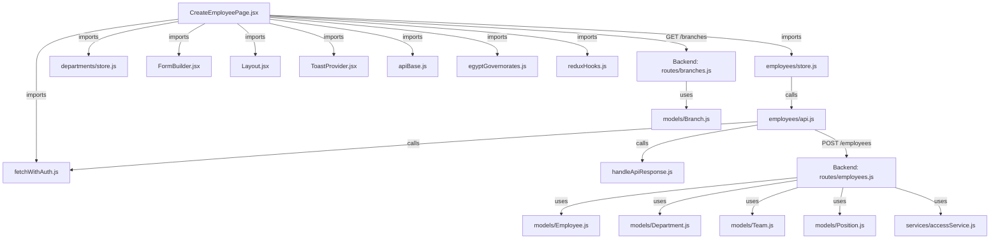

# CreateEmployeePage Deep Analysis & Bug Fix Plan

## Step 1: File Connection Map



---

## Step 2: Deep Analysis

### Frontend Files

#### [CreateEmployeePage.jsx](file:///c:/Users/COMPUMARTS/OneDrive/Desktop/my-react-app/frontend/src/modules/employees/pages/CreateEmployeePage.jsx)
- **Purpose**: Form to create a new employee with 5 sections: Personal, Contact, Job, Benefits, Insurance
- **State**: Manages `provisionedData`, `selectedGovernorate/City`, `socialInsuranceStatus`, `hasMedicalInsurance`, `branches`
- **Data loading**: On mount fetches departments (Redux thunk) and branches (direct `fetchWithAuth`)
- **Submit flow**: Destructures form values → builds nested `payload` (insurance, financial, socialInsurance) → dispatches `createEmployeeThunk` → shows provisioned password or navigates

#### [employees/store.js](file:///c:/Users/COMPUMARTS/OneDrive/Desktop/my-react-app/frontend/src/modules/employees/store.js)
- Redux slice with `createEmployeeThunk` → calls `createEmployeeApi` → `POST /api/employees`
- On fulfilled, unshifts new employee into `state.items`

#### [employees/api.js](file:///c:/Users/COMPUMARTS/OneDrive/Desktop/my-react-app/frontend/src/modules/employees/api.js)
- `createEmployeeApi()` → `fetchWithAuth(POST /employees)` → `handleApiResponse()`

#### [FormBuilder.jsx](file:///c:/Users/COMPUMARTS/OneDrive/Desktop/my-react-app/frontend/src/shared/components/FormBuilder.jsx)
- Generic form: initializes all field values to empty string, renders grid of inputs/selects
- Exposes `onChange(fieldName, value)` callback and `devDemoFill` system

### Backend Files

#### [routes/employees.js POST /](file:///c:/Users/COMPUMARTS/OneDrive/Desktop/my-react-app/backend/src/routes/employees.js#L376-L574)
- Validates required fields, checks access scope
- Auto-generates employee code from department code
- Resolves `departmentId`, `teamId`, `positionId` from names
- Spreads `...req.body` into Employee constructor, then overrides specific fields
- Returns `{ employee, userProvisioned: true, defaultPassword }`

#### [models/Employee.js](file:///c:/Users/COMPUMARTS/OneDrive/Desktop/my-react-app/backend/src/models/Employee.js)
- Has `branchId: ObjectId ref Branch` and `workLocation: String` (cache)
- Has nested sub-documents: `financial`, `socialInsurance`, `insurance`

#### [routes/branches.js](file:///c:/Users/COMPUMARTS/OneDrive/Desktop/my-react-app/backend/src/routes/branches.js)
- `GET /api/branches` returns `.lean()` (no `toJSON` transform applied → returns `_id` not `id`)

---

## Step 3: Bugs Found

### 🔴 BUG 1 — CRITICAL: `branchId` not destructured in backend POST route

**File**: [routes/employees.js:381-422](file:///c:/Users/COMPUMARTS/OneDrive/Desktop/my-react-app/backend/src/routes/employees.js#L381-L422)

The `const { ... } = req.body` destructuring at line 381-422 does **NOT** include `branchId`. However, line 515 references `branchId` directly:
```js
branchId,  // ← ReferenceError: branchId is not defined from destructuring
```

**But wait** — because line 483 spreads `...req.body` first, `branchId` from the body is included via the spread. Then line 515 tries to override it using an undefined variable `branchId`, which resolves to `undefined`, effectively **always overwriting the branchId to undefined**.

> [!CAUTION]
> This means **no employee created through the form will ever have their branch saved**. The `branchId` field selected in the form is silently discarded.

**Fix**: Add `branchId` to the destructuring at line 381-422.

---

### 🔴 BUG 2 — CRITICAL: Branch `GET /api/branches` uses `.lean()` — returns `_id` instead of `id`

**File**: [routes/branches.js:16](file:///c:/Users/COMPUMARTS/OneDrive/Desktop/my-react-app/backend/src/routes/branches.js#L16)

```js
const branches = await Branch.find().lean();
```

`.lean()` bypasses the Mongoose `toJSON` transform that maps `_id → id`. The frontend (line 100) builds options using `b.id`:
```js
branches.map((b) => ({ label: `${b.name} (${b.code}) - ${b.city||''}`, value: b.id }))
```

Since `b.id` is `undefined` for lean documents, **every branch option has `value: undefined`**, and submitting the form sends `branchId: undefined`.

> [!WARNING]
> Double failure: Even if Bug 1 were fixed, Bug 2 would still prevent any branch from being saved because the value is always `undefined`.

**Fix**: Remove `.lean()` so the `toJSON` transform is applied, OR manually map `_id` to `id`.

---

### 🟡 BUG 3 — MEDIUM: `workLocation` cache is not set from `branchId` on create

**File**: [routes/employees.js:515-516](file:///c:/Users/COMPUMARTS/OneDrive/Desktop/my-react-app/backend/src/routes/employees.js#L515-L516)

When creating an employee, the backend sets `branchId` and `workLocation` separately. The frontend sends `branchId` (an ObjectId) but the old `workLocation` field from the form (`"Cairo HQ"` etc.) is also sent. There's **no logic to look up the Branch name** and set `workLocation` from the selected branch. The frontend form no longer sends `workLocation` (it was replaced by `branchId` select), so `workLocation` ends up missing.

**Fix**: On the backend, when `branchId` is provided, look up the Branch document and set `workLocation = branch.name`.

---

### 🟡 BUG 4 — MEDIUM: `dateOfHireDummy` field sent in payload, pollutes employee data

**File**: [CreateEmployeePage.jsx:339](file:///c:/Users/COMPUMARTS/OneDrive/Desktop/my-react-app/frontend/src/modules/employees/pages/CreateEmployeePage.jsx#L339)

```js
{ name: "dateOfHireDummy", label: "Date of Hire (Reference)", type: "text", disabled: true, value: devDemoFill?.getValues()?.dateOfHire },
```

This field: 
1. The `value` prop on the field config is ignored by FormBuilder (it uses its own state)
2. The field is always empty (disabled, no source of truth)
3. `dateOfHireDummy` is included in the form `values` and passed to the backend via `...rest` spread at line 373
4. It spreads into the Employee document via `...req.body` at line 484 on the backend, polluting the document

**Fix**: Exclude `dateOfHireDummy` from payload, and clean up the line 374 cleanup list to include it.

---

### 🟡 BUG 5 — MEDIUM: Demo fill doesn't trigger `onChange` callbacks for conditional fields

**File**: [FormBuilder.jsx:47-50](file:///c:/Users/COMPUMARTS/OneDrive/Desktop/my-react-app/frontend/src/shared/components/FormBuilder.jsx#L47-L50)

When "Fill demo data" is clicked:
```js
setValues((prev) => ({ ...prev, ...patch }));
devDemoFill.afterFill?.(patch);
```

This sets values but does NOT call `onChange` for each field. So state variables like `selectedGovernorate`, `socialInsuranceStatus`, and `hasMedicalInsurance` are **not updated**.

The demo data sets `hasMedicalInsurance: "YES"` and `socialInsuranceStatus: "INSURED"`, but the conditional sections (lines 312-347) won't appear because the React state variables remain at their defaults (`"NO"` and `"NOT_INSURED"`).

**Fix**: Add `afterFill` callback in CreateEmployeePage that syncs the local state:
```js
afterFill: (patch) => {
  if (patch.governorate) setSelectedGovernorate(patch.governorate);
  if (patch.city) setSelectedCity(patch.city);
  if (patch.socialInsuranceStatus) setSocialInsuranceStatus(patch.socialInsuranceStatus);
  if (patch.hasMedicalInsurance) setHasMedicalInsurance(patch.hasMedicalInsurance);
}
```

---

### 🟢 BUG 6 — LOW: Silent error swallowing on branch fetch

**File**: [CreateEmployeePage.jsx:35](file:///c:/Users/COMPUMARTS/OneDrive/Desktop/my-react-app/frontend/src/modules/employees/pages/CreateEmployeePage.jsx#L35)

```js
} catch (err) {}
```

If the branch fetch fails (network error, 401, etc.), it's completely silenced. The user sees "— No branches found in system —" with no feedback.

**Fix**: Log the error and optionally show a toast.

---

### 🟢 BUG 7 — LOW: `HR_MANAGER` role missing from the role privilege dropdown

**File**: [CreateEmployeePage.jsx:246-258](file:///c:/Users/COMPUMARTS/OneDrive/Desktop/my-react-app/frontend/src/modules/employees/pages/CreateEmployeePage.jsx#L246-L258)

The backend `Employee.role` enum includes `HR_MANAGER`, but the frontend dropdown only has: Employee, Team Leader, Manager, HR Staff, Admin. Missing: `HR_MANAGER`. An admin cannot assign someone as HR Manager from the create page.

**Fix**: Add `HR_MANAGER` option when privileged role is creating.

---

## Step 4: Verification of Bugs

| # | Bug | Severity | Confirmed? | Root Cause |
|---|-----|----------|------------|------------|
| 1 | `branchId` not destructured → always undefined | 🔴 Critical | ✅ Line 515 uses undeclared variable, spread overwritten | Missing destructuring |
| 2 | `.lean()` skips `toJSON` transform → `b.id` is undefined | 🔴 Critical | ✅ Branch options have `value: undefined` | `.lean()` bypass |
| 3 | `workLocation` cache not synced from branch on create | 🟡 Medium | ✅ No Branch lookup on create | Missing resolution |
| 4 | `dateOfHireDummy` pollutes payload | 🟡 Medium | ✅ Not excluded from `...rest` | Missing cleanup |
| 5 | Demo fill doesn't trigger onChange for conditional UI | 🟡 Medium | ✅ `setValues` alone, no callbacks | Missing afterFill |
| 6 | Branch fetch error silently swallowed | 🟢 Low | ✅ Empty catch block | Missing error handling |
| 7 | `HR_MANAGER` role missing from dropdown | 🟢 Low | ✅ Not in options array | Missing option |

---

## Step 5: Proposed Fixes

### Fix 1 — Backend: Add `branchId` to destructuring

#### [MODIFY] [employees.js](file:///c:/Users/COMPUMARTS/OneDrive/Desktop/my-react-app/backend/src/routes/employees.js)
Add `branchId` to the `const { ... } = req.body` destructuring at line 381-422.

---

### Fix 2 — Backend: Remove `.lean()` from branches GET

#### [MODIFY] [branches.js](file:///c:/Users/COMPUMARTS/OneDrive/Desktop/my-react-app/backend/src/routes/branches.js)
Change `Branch.find().lean()` → `Branch.find()` so the `toJSON` transform applies and `id` is returned.

---

### Fix 3 — Backend: Resolve `workLocation` from Branch on create

#### [MODIFY] [employees.js](file:///c:/Users/COMPUMARTS/OneDrive/Desktop/my-react-app/backend/src/routes/employees.js)
After destructuring `branchId`, look up the Branch and set `workLocation = branch.name`.

---

### Fix 4 — Frontend: Exclude `dateOfHireDummy` from payload

#### [MODIFY] [CreateEmployeePage.jsx](file:///c:/Users/COMPUMARTS/OneDrive/Desktop/my-react-app/frontend/src/modules/employees/pages/CreateEmployeePage.jsx)
Add `dateOfHireDummy` to the destructured exclusion list at line 352. Add it to the date-cleanup loop at line 374.

---

### Fix 5 — Frontend: Add `afterFill` callback to sync conditional state

#### [MODIFY] [CreateEmployeePage.jsx](file:///c:/Users/COMPUMARTS/OneDrive/Desktop/my-react-app/frontend/src/modules/employees/pages/CreateEmployeePage.jsx)
Add `afterFill` to `devDemoFill` memo.

---

### Fix 6 — Frontend: Log branch fetch errors

#### [MODIFY] [CreateEmployeePage.jsx](file:///c:/Users/COMPUMARTS/OneDrive/Desktop/my-react-app/frontend/src/modules/employees/pages/CreateEmployeePage.jsx)
Add `console.error` in the catch block.

---

### Fix 7 — Frontend: Add `HR_MANAGER` role option

#### [MODIFY] [CreateEmployeePage.jsx](file:///c:/Users/COMPUMARTS/OneDrive/Desktop/my-react-app/frontend/src/modules/employees/pages/CreateEmployeePage.jsx)
Add `{ label: "HR Manager", value: "HR_MANAGER" }` to the privileged role options.

---

## Verification Plan

### Automated Tests
- Restart backend server and attempt to create a new employee with a branch selected
- Verify the employee document in DB has `branchId` set and `workLocation` matches branch name
- Verify demo fill button shows insurance sections correctly

### Manual Verification
- Browser: open Create Employee page, select a branch, fill form, submit
- Check Network tab for payload correctness
- Check DB record for `branchId` and `workLocation` fields
