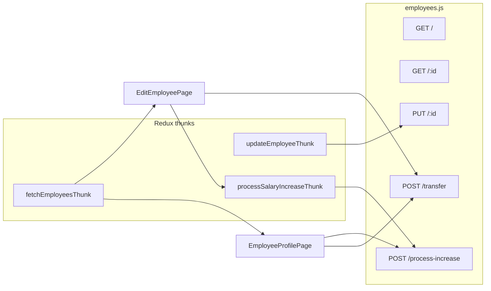

# Analysis: employee API routes and profile/edit pages

## 1. [backend/src/routes/employees.js](backend/src/routes/employees.js)

**Role:** Express router mounted at `/api/employees` for CRUD and related operations. Access is unified through [`resolveEmployeeAccess`](backend/src/services/accessService.js) with scopes `all` | `department` | `team` | `self` and actions like `view`, `create`, `edit`, `delete`.

**Endpoints (high level):**

| Area | Behavior |
|------|----------|
| **GET /** | Rich filters (salary review window, hire dates, ID expiry, transfers, department, status, salary range, manager→departments, location, search). Optional pagination (`page`/`limit`). Scope narrows the Mongo query (`intersectDepartmentFilter`, team `$or`, or self email). Populates `managerId` / `teamLeaderId`. |
| **GET /:id** | Single document; same scope rules as list. |
| **POST /** | Create; requires `fullName`, `email`, `department`, `position`. Generates `employeeCode` if omitted; sets `departmentId` / `teamId` / `positionId` from names; default password via `hashPassword`; `nextReviewDate` = one year after hire. Department scope cannot create outside allowed departments; team/self cannot create. |
| **PUT /:id** | Full patch: org fields with dual `departmentId`/`teamId`/`positionId` sync; role rules (privileged roles only for `scope === "all"`); vacationRecords validation; termination clears leadership in `Department`/`Team` and sets `isActive`; `syncEmployeeLeadershipAfterSave`; email change cascades to org references; audit via `detectChanges` / `createAuditLog`. **`nextReviewDate`** is only applied from body when `access.scope === "all"`; otherwise hire-date change still recalculates review date server-side. |
| **POST /:id/transfer** | Moves department, optional position/salary/code, append `transferHistory`, optional reset of `nextReviewDate` from transfer date. Blocked for team/self scope. |
| **DELETE /:id** | Policy + scope checks; blocks if open `ManagementRequest`; clears head/leader refs; deletes employee and related `UserPermission`, `Attendance`, `Alert`, `ManagementRequest`; clears `managerId`/`teamLeaderId` on others; audit. |
| **POST /:id/process-increase** | Restricted to `ADMIN`, `HR_MANAGER`, `HR_STAFF` (not using the same scope object as other routes—role check only). Uses `OrganizationPolicy` rules for default %; updates `salaryHistory`, `financial.baseSalary`, rolls `nextReviewDate` one year from effective date. |

**Helpers:** `optionalDate`, `addOneYear`, `checkScopeDepartment`, `intersectDepartmentFilter`.

---

## 2. [frontend/src/modules/employees/pages/EmployeeProfilePage.jsx](frontend/src/modules/employees/pages/EmployeeProfilePage.jsx)

**Role:** Read-oriented **profile** UI with tabs: overview, documents, transfer history, salary history, vacations, attendance. Data comes from **Redux** `state.employees.items` keyed by route param `employeeId` (must match stored `item.id`).

**Data loading:** On mount, dispatches `fetchEmployeesThunk` and `fetchDepartmentsThunk` if empty; loads org policy for document requirements via `getDocumentRequirementsApi`. Attendance is fetched lazily when the attendance tab is active (`GET /attendance/employee/:employeeId` via `fetchWithAuth`).

**Actions:**

- **Admin/HR-style:** “Manage” dropdown (ADMIN or HR_MANAGER): transfer → `POST .../employees/:id/transfer`, salary increase → `POST .../process-increase`, terminate → `updateEmployeeThunk` with status + termination fields. Uses `fetchWithAuth` for transfer/salary; refetches employees after transfer/salary success.
- **Vacations:** HR roles can add/remove rows; persists with `updateEmployeeThunk` and `serializeVacationRecords` (dates as `YYYY-MM-DD`), aligned with backend vacation validation.
- **Password reset:** Modal + `POST /auth/reset-password` with `fetchWithAuth`.

**UX / data caveat:** If the user opens a deep link to a profile **before** the employees list is loaded, `employee` may be missing briefly and the page shows “Employee not found.” There is no dedicated `GET /employees/:id` fetch for this page—it depends on the list being populated.

**Alignment with backend:** Transfer and process-increase match the routes above. Termination uses generic `PUT` semantics (`status`, `terminationDate`, `terminationReason`), which triggers backend termination side effects when status is TERMINATED/RESIGNED.

---

## 3. [frontend/src/modules/employees/pages/EditEmployeePage.jsx](frontend/src/modules/employees/pages/EditEmployeePage.jsx)

**Role:** **Form-heavy edit** screen: `FormBuilder` with sections (personal, contact, job/admin read-only fields for structure, benefits, social insurance). Tabs: **profile** vs **transfer_history** (read-only timeline).

**Data:** Same pattern—employee from `employees.find` by `employeeId`; loads departments and org policy (work locations + document requirements). `resolveBranchesFromPolicy` drives work-location dropdown options.

**Actions:**

- **Save:** Builds nested `insurance`, `financial`, `socialInsurance`, merges `documentChecklist`, strips UI-only fields, and dispatches `updateEmployeeThunk`. If hire date changes vs previous employee, client computes a **string** `nextReviewDate` one year ahead and sends it—backend will honor explicit `nextReviewDate` only for **`scope === "all"`**; for other scopes, hire change still updates `nextReviewDate` via `addOneYear` on the server, so behavior remains consistent for review scheduling.
- **Transfer / salary:** `handleTransfer` uses raw `fetch` + `Authorization: Bearer ${accessToken}` (not `fetchWithAuth`); **does not** call `fetchEmployeesThunk` after success (unlike profile page), so the Redux store may stay stale until a full list refresh.
- **Salary increase:** Uses `processSalaryIncreaseThunk` and navigates to `/employees` on success.
- **Password reset:** ADMIN only; raw `fetch` with bearer token (parallel to profile’s `fetchWithAuth`).

**Intentional constraints in UI:** Department, team, position, employee code, base salary, and next review (disabled field) reflect “use Manage for structural/salary changes” for admins; structural moves go through transfer modal.

---

## 4. Cross-cutting comparison

- **Profile** emphasizes display, compliance banners (ID expiry, salary cycle), attendance, and admin workflows with **store refresh** after transfer/salary.
- **Edit** emphasizes field-level updates and document checklist; transfer/salary paths are similar but **transfer omits post-success refetch** and uses **manual fetch** instead of `fetchWithAuth` (functionally equivalent if token is valid).

---

## 5. File list clarification

- **`employees.js`** was referenced twice in your message—it is a single file; analysis above covers it once.
- **`EmployeeeProfilePage.jsx`** does not exist; the actual file is **`EmployeeProfilePage.jsx`**.

No edits, writes, or deletes were performed—this is analysis only.
