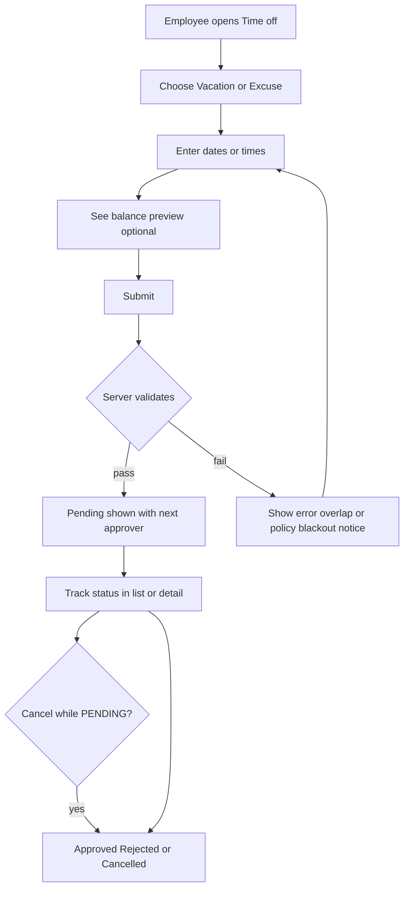
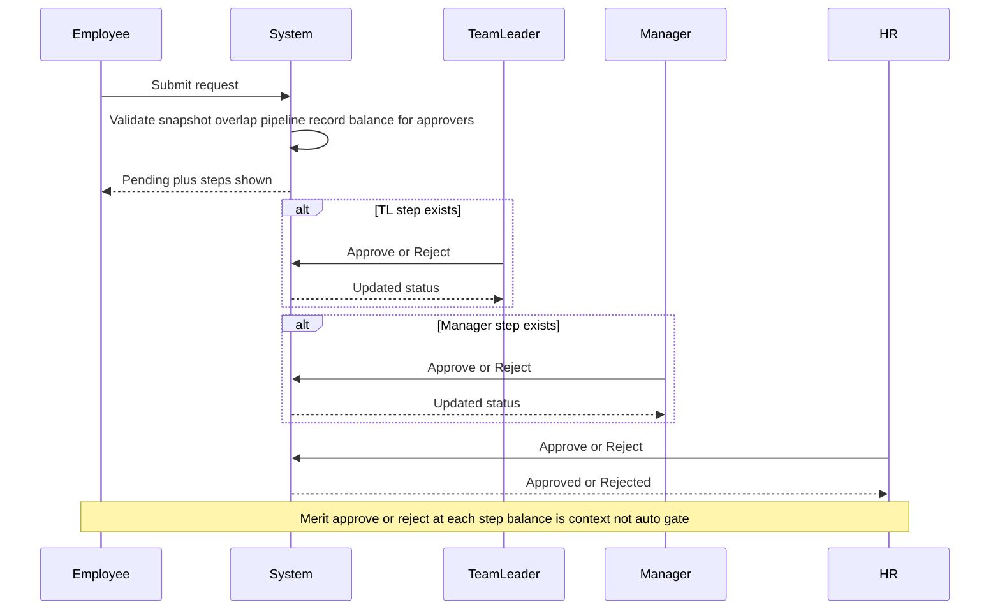
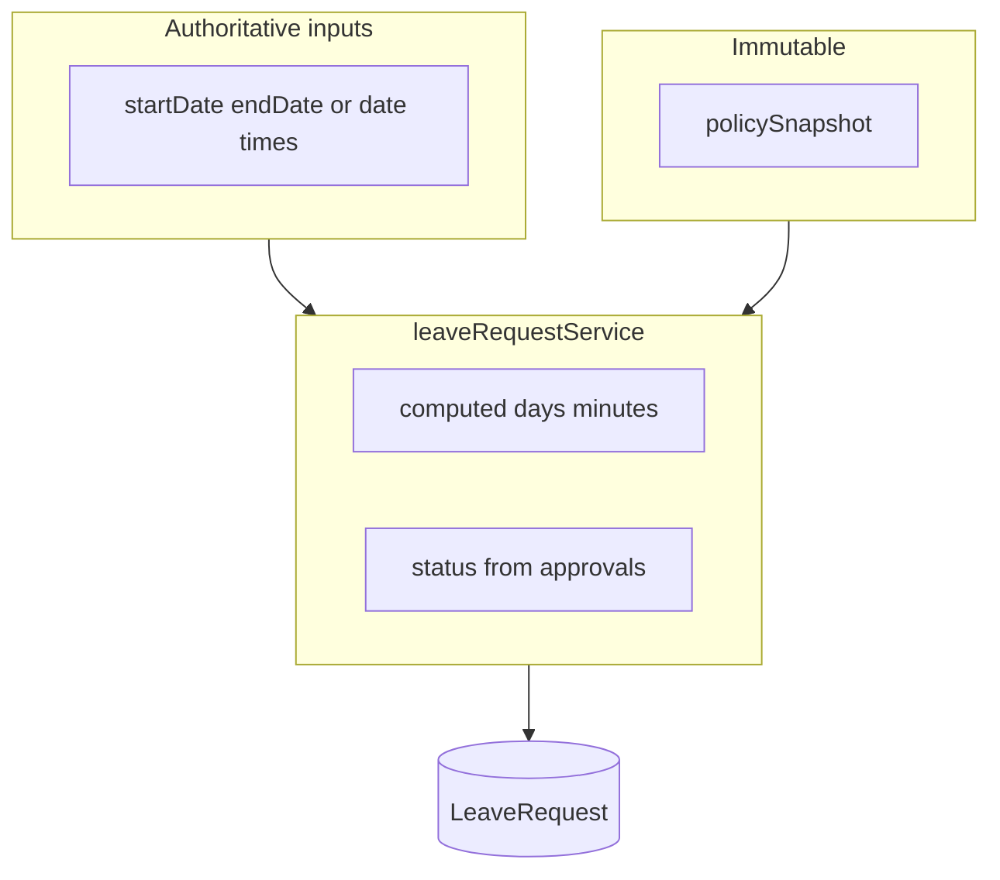

# Vacations and Excuses Module — Planning (Revised, Implementation-Ready)

**Status:** Planning only — **do not implement** until explicitly approved.

This module extends the existing system across:

- **Organization policy** configuration (versioned leave policies)
- **Multi-step approval** workflows (sequential, pipeline precomputed at creation)
- **New `LeaveRequest`** collection — **single source of truth**

**Verdict (architecture):** Solid; remaining risks are **edge-case and consistency** — addressed below.

---

## 1) Core principles

### Single source of truth

- **All** vacation and excuse data that drives balances, history, and approvals lives in **`LeaveRequest`** only.
- **`Employee.vacationRecords`** (and any **`excuseRecords`** if present) are **not authoritative**. They may be deprecated and/or **derived/cached views** for display only — **never** the ledger for balance math.

### Approval model (high level)

- **Sequential roles:** Team Leader → Manager → HR, with **pipeline resolved at request creation** (see §6).
- **HR is always required** as the final step in the stored pipeline (never “skipped” as a role class).

### Policy versioning

- Policies are **versioned**, not silently overwritten.

```js
leavePolicies: [
  {
    version: Number,
    effectiveFrom: Date,
    effectiveTo: Date | null,
    vacationRules: { /* ... */ },
    excuseRules: { /* ... */ },
  },
]
```

- **Active policy** for a date is resolved by **`effectiveFrom`** / **`effectiveTo`** (and version ordering where needed).
- Each **`LeaveRequest`** stores a **mandatory, immutable `policySnapshot`** (see §10).

---

## 2) Organization policy — قواعد الإجازات والأذونات

**Storage:** [`OrganizationPolicy`](backend/src/models/OrganizationPolicy.js) extended with **`leavePolicies`**, exposed via [`organizationPolicy.js`](backend/src/routes/organizationPolicy.js).

### Vacation rules (`vacationRules`)

- Annual entitlement; accrual yearly or monthly (prorated); eligibility; booking; leave types (self vs HR-only); carry-over; half-day support.

### Excuse rules (`excuseRules`)

- Minute limits; eligibility; **rounding** policy.
- **Storage:** timestamps in **UTC**.
- **Logic:** all validation and duration math use the **company timezone** (see §5).

---

## 3) `LeaveRequest` model — authoritative vs computed fields

**Name:** `LeaveRequest` (collection e.g. `leaverequests`).

### Authoritative (persisted) — raw inputs only

**Vacation**

- `startDate`, `endDate` (no persisted **`days`** as source of truth)

**Excuse**

- `date`, `startTime`, `endTime` (no persisted **`minutes`** as source of truth)

### Computed (service layer — not source of truth)

- **`days`** (vacation): derived from `startDate` / `endDate`, **`policySnapshot`**, and company TZ rules (half-day, rounding, etc.).
- **`minutes`** (excuse): derived from `startTime` / `endTime` and rounding rules.

**Rule:** `days` and **`minutes` must never be treated as authoritative.** They are computed in **`leaveRequestService`** (and related helpers). Optional: cache `computed.days` / `computed.minutes` (or top-level mirrors) **only** for performance — must always be **re-derivable** from raw fields + snapshot.

### Other core fields

```text
employeeId,
kind: "VACATION" | "EXCUSE",
leaveType,           // vacation type when kind === VACATION

status: "PENDING" | "APPROVED" | "REJECTED" | "CANCELLED",

approvals: [ /* precomputed pipeline, ordered — see §6 */ ],

policySnapshot,      // REQUIRED, immutable after create — see §10
submittedAt
```

---

## 4) Single source for `status` (avoid mismatch with `approvals[]`)

**Problem:** `LeaveRequest.status` vs `approvals[].status` can drift if updated independently.

**Rules:**

- **`LeaveRequest.status`** is a **stored field** but MUST be **updated exclusively** inside **`leaveRequestService`** (and any internal helpers it calls). **Direct mutation of `status` outside the service is forbidden** (no raw updates from routes or other modules).

- **Derivation logic (service-only):**
  - **REJECTED** → if **any** approval step is **REJECTED**
  - **APPROVED** → if **all required** steps in the pipeline are **APPROVED**
  - **PENDING** → otherwise (still steps to complete)
  - **CANCELLED** → set only via cancel flow (employee/HR per rules)

After each approve/reject action, the service **recomputes** top-level `status` from the `approvals` array so it always reflects the pipeline.

---

## 5) Timezone strategy (unified)

**Problem:** Mixed TZ usage causes inconsistent `days` / overlap checks.

**Rules:**

- **Persist** request boundaries in **UTC** (or store ISO instants consistently — choose one convention and document it in code).
- **All business logic** (overlap, duration in days/minutes, blackout windows, “same day” for excuses) runs in the **company timezone** (e.g. `Asia/Cairo`). Store **`companyTimezone`** on policy (or org/tenant config) so it is single-sourced.
- **UI** may display in user local timezone **if desired**, but **validation and balances** use **company timezone** unless product explicitly changes this later.

---

## 6) Approval flow resolution (explicit skip logic + precomputed pipeline)

**Problem:** “Skip if missing” was underspecified.

**Rules — resolved at request creation time:**

1. Build the list of steps in order: **TEAM_LEADER** (if role exists for this employee’s context) → **MANAGER** (if exists) → **HR** (**always** included as final step).
2. If a role **does not exist** in the org (e.g. no team leader): **omit that step from the pipeline** — do **not** insert a row and mark it approved; it is **not present**.
3. **`approvals`** array is **precomputed and stored in order** at creation. Each row: `role`, `status: PENDING` initially, etc.
4. Processing advances **only the first** `PENDING` step in order.

**Multi-role ambiguity (same user, multiple hats):**

- If the acting user qualifies for **more than one** step, they may **act only once per request**.
- They process the **earliest pending step** that applies to them; later steps they might also qualify for wait until unlocked by progression (or another actor).

---

## 7) Overlap rules (explicit)

**Blocking default:** overlap checks include **APPROVED** and **PENDING** requests (pending blocks new overlapping requests).

| Pair | Allowed? |
|------|----------|
| Vacation vs Vacation | **No** overlap (same employee) |
| Excuse vs Excuse | **No** overlap if **time ranges** overlap (same day + intersecting intervals) |
| Vacation vs Excuse | **No** mixed overlap (treat as conflict if any calendar time intersects) |

Edge cases (midnight spans, half-days) resolved using **company timezone** + **`policySnapshot`**.

---

## 8) Balance reservation behavior

**Problem:** Unclear whether pending consumes balance.

**Rule:** **Pending requests reserve balance (soft reservation).**

```text
Available balance =
  entitlement
  - approved consumption
  - pending reservation
```

- **Reject** or **cancel** (pending) **releases** the reserved amount.
- **Approved** moves from “pending reservation” to “approved consumption” (no double-count).

Vacation uses **days** (computed); excuses use **minutes** (computed) against separate quotas per policy.

### Balance does **not** auto-reject at submit (final decision is human)

**Rule:** Whether the employee’s **balance is positive, negative, or zero**, the **create request** (`POST /leave-requests`) **must not** be rejected **solely** because of insufficient or negative balance.

- **Balance** is still **computed and stored on the request** (for transparency, reporting, and approver context) and **soft reservation** (§8) may still apply for **forecasting**, but it is **not** a hard gate that blocks submission.
- **Final approve / reject** is decided by **Team Leader**, **Manager**, and **HR** in order (§6): they see the request, **including balance context** (and projected impact), and **choose** to approve or reject with a reason where required.
- **Automatic** validation still may **reject** create for: **overlap** (§7), **blackout / notice / policy-eligibility** rules encoded in policy (unless you also want those as warnings only—default here keeps **overlap** as hard block; clarify in implementation if blackouts should be soft).

---

## 9) Business logic placement

**All enforcement** in **`leaveRequestService`** / **`leavePolicyService`**; routes only parse input and call services.

Includes: overlap, **balance computation and reservation (informational + soft reserve, not submit gate)**, duration computation, status sync, cancel, pipeline advancement, multi-role resolution.

---

## 10) `policySnapshot` — locked structure

**Problem:** “Full relevant slice” was too vague.

**Rule:** `policySnapshot` must include **every field required** to:

- **Validate** the request (eligibility, notice, blackout, type allowed, limits)
- **Calculate balance** (entitlement slice, accrual, carry-over rules in effect)
- **Calculate duration** (`days` / `minutes`) — rounding, half-day, company TZ identifier

**Immutable:** once the `LeaveRequest` document is created, **`policySnapshot` must not change** (reject updates on that path).

---

## 11) API design

| Method | Path | Purpose |
|--------|------|--------|
| POST | `/api/leave-requests` | Create (pipeline + snapshot built in service) |
| GET | `/api/leave-requests` | List + pagination + filters + role visibility |
| POST | `/api/leave-requests/:id/action` | `{ "action": "APPROVE" \| "REJECT", "comment": "..." }` |
| POST | `/api/leave-requests/:id/cancel` | Cancel per auth rules |

### Reject comment — **API-level enforcement**

- **`REJECT`** requires a **non-empty** `comment` (after trim).
- Requests without a valid comment **fail validation** (4xx) before business logic.

**Mount:** [`backend/src/index.js`](backend/src/index.js) — `app.use("/api/leave-requests", leaveRequestsRouter)`.

---

## 12) Authorization (unchanged intent)

| Actor | Capabilities |
|-------|----------------|
| **Employee** | Create; view own |
| **Team Leader** | Approve when step applies (direct team); **substantive decision** with balance context |
| **Manager** | Approve when step applies (department); **substantive decision** with balance context |
| **HR** | Final step + override + cancel approved; **substantive decision** with balance context |

**Balance:** Submit is **not** rejected only for low/negative/zero balance; **TL / Manager / HR** approve or reject.

---

## User flows — operational walkthrough

This section describes what **each user type does in the UI** (and what the system does in the background) end to end. Screen names are illustrative (`Time off`, `Approvals`, `Organization rules`).

### A) Employee — submit and track

1. **Open** the time-off area (e.g. **Time off** / **My requests** from the dashboard or employee section).
2. **Choose** request type: **Vacation** (date range + leave type) or **Excuse** (date + start/end time).
3. **See** non-binding **preview**: current balance (positive, negative, or zero), computed **days** or **minutes** (from API or client preview — server is authoritative on submit).
4. **Submit** → backend validates **overlap** (§7), **policy** (blackout, notice, type allowed, etc.), builds **pipeline** (§6) and **immutable `policySnapshot`** (§10), and records **balance context** — **does not reject** solely because balance is insufficient or negative (§8).
5. **Outcomes:**
   - **Success:** request appears as **Pending**; employee sees **ordered approval steps** (who is next: TL → Manager → HR as applicable). **Final decision** is **not** automatic: **Team Leader → Manager → HR** each **approve or reject** (reject with comment where required).
   - **Error:** e.g. **overlap**, or hard **policy** violations (blackout, notice, invalid type) — **not** “insufficient balance” as the only reason.
6. **While pending:** employee can **open** the request detail; **cancel** only if still **PENDING** (releases reservation).
7. **After final approval:** request moves to **Approved**; it shows in **history** and counts toward used balance.
8. **If any step rejects:** status **Rejected**; employee sees reason (**comment**); no balance consumed for that request (reservation released).



### B) Team Leader — first-line approval (when in pipeline)

1. **Open** **Approvals** / **Team queue** (requests where the **first pending** step is **TEAM_LEADER** and the employee is in their team).
2. **Review** request summary (employee, dates/times, computed duration, **balance before/after impact**, policy context). **You decide** approve or reject — balance does not auto-decide.
3. **Action:**
   - **Approve** → step completes; **next** step becomes active (Manager or HR per pipeline).
   - **Reject** → must enter **non-empty comment** → request becomes **Rejected**; employee notified (if notifications exist).
4. If the TL is **also** Manager/HR on the same person: they still **act once** on the **earliest pending** step for that request (§6).

### C) Department Manager — second-line approval (when in pipeline)

1. **Open** **Approvals** / **Department queue** when their step is **next** (after TL approved or TL step omitted).
2. Same **Approve** / **Reject with comment** as TL; sees **balance** and **final say** together with TL and HR (sequential).
3. After approval, if **HR** is still in the pipeline, the request moves to **HR’s queue**.

### D) HR — final approval and exceptions

1. **Open** **HR queue** for requests whose **next pending** step is **HR** (always present in pipeline per §6).
2. **Review** full context including **balance**; **Approve** or **Reject** (comment on reject). **Approve** → request becomes **Approved**; balance moves from **pending reservation** to **consumed** (per §8).
3. **Reject** → **comment required** → **Rejected**; reservation released.
4. **Cancel approved** (authorized path): HR can **cancel** an already **Approved** request per product rules (e.g. reversal); service updates balances and status to **Cancelled** (or a dedicated “revoked” policy if you add it later).



### E) Admin — configure rules (separate from daily approvals)

1. **Open** **Organization rules** (existing [`OrganizationRulesPage`](frontend/src/modules/organization/pages/OrganizationRulesPage.jsx) pattern).
2. **Edit** versioned **`leavePolicies`**: vacation rules, excuse rules, **company timezone**, effective dates.
3. **Save** → future requests resolve the active policy by date; **existing `LeaveRequest`** documents keep their **immutable `policySnapshot`**.

### F) End-to-end summary (one glance)

| Who | Primary screens | Main actions |
|-----|-----------------|--------------|
| **Employee** | My requests, New request | Submit, view status/history, cancel if pending |
| **Team Leader** | Approvals queue | Approve or reject (with comment); **decides with balance visible** |
| **Manager** | Approvals queue | Same |
| **HR** | HR approvals queue | Final approve/reject; cancel approved if allowed; **decides with balance visible** |
| **Admin** | Organization rules | Edit `leavePolicies`, timezone, versions |

---

## 13) Optional but strongly recommended (non-blocking)

### A) Idempotent actions

- Approve/reject/cancel actions should be **idempotent**: repeating the same completed action **must not** change state or create side effects (return success / no-op as appropriate).

### B) Audit fields on `LeaveRequest`

- `createdBy` (submitter user id or email)
- `lastUpdatedAt`
- `lastUpdatedBy`

---

## 14) Frontend scope

- **Admin:** Versioned `leavePolicies` + **company timezone** surfaced in policy UI.
- **Employee:** Submit raw dates/times only; **duration** shown from server response or preview computed client-side **non-authoritative**.
- **Approvers:** Queues; reject UI **blocks submit** without comment.

---

## 15) Migration strategy

- **`Employee.vacationRecords`:** `source: "LEGACY"`; no retroactive enforcement.
- Optional: disable HR direct edit or override permission only.

---

## 16) Post-MVP enhancements

- Attachments; public holidays; notifications; date suggestions; balance preview; client suggestions on overlap.

---

## 17) Files that would change (planning only)

| Area | What would change |
|------|-------------------|
| [`OrganizationPolicy.js`](backend/src/models/OrganizationPolicy.js) | `leavePolicies[]`; add **`companyTimezone`** (or separate org settings model if preferred). |
| [`LeaveRequest.js`](backend/src/models/LeaveRequest.js) (new) | Raw fields only; optional `computed` cache; **`policySnapshot` schema**; **`approvals`** ordered pipeline; audit fields (optional); **no authoritative `days`/`minutes`**. |
| [`leavePolicyService.js`](backend/src/services/leavePolicyService.js) (new) | Resolve active version; build **immutable snapshot**; TZ helpers. |
| [`leaveRequestService.js`](backend/src/services/leaveRequestService.js) (new) | **Only** mutator of `status`; compute days/minutes; overlap matrix §7; balance §8; create pipeline §6; idempotency §13A. |
| [`leaveRequests.js`](backend/src/routes/leaveRequests.js) (new) | Thin routes; **reject comment validation**; delegate all logic. |
| [`organizationPolicy.js`](backend/src/routes/organizationPolicy.js) | Persist `leavePolicies` + TZ. |
| [`employees.js`](backend/src/routes/employees.js) | Restrict LEGACY vacation edits if product requires. |
| [`index.js`](backend/src/index.js) | Mount leave-requests router. |
| Frontend org + employees modules | Policy UI, leave UI, queues, validation mirrors API. |

---

## 18) Diagram



---

**This document is planning only.** Implementation starts only after you **explicitly approve** this plan.
