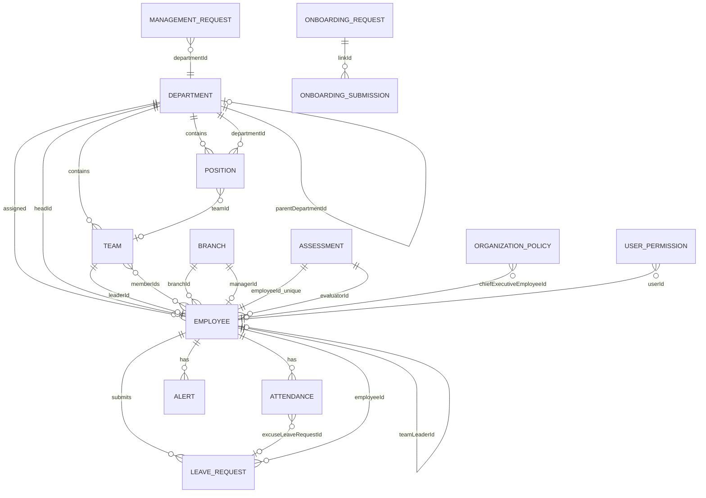
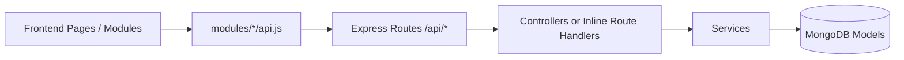
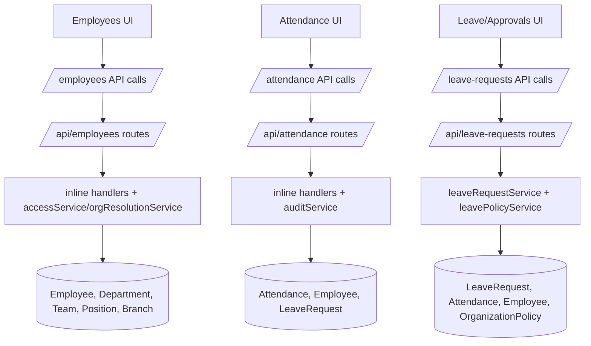

 # DATA_MAP

## Scope

Deep architectural mapping across:

- `backend/src/models`
- `backend/src/routes`
- `backend/src/controllers`
- `backend/src/services`
- `frontend/src/modules/*/api.js`
- `frontend/src/pages`
- `frontend/src/shared`
- Frontend call pattern scans and backend controller model-import scans

---

## 1) Backend Analysis

### 1.1 Entity Relationship Map (ERD)

### 1.2 Entity Notes (Models)

- `Employee`: core identity + employment record; references `Branch`, `Department`, `Team`, `Position`, plus self refs (`managerId`, `teamLeaderId`).
- `Department`: organizational node with optional self hierarchy (`parentDepartmentId`) and `headId`.
- `Team`: belongs to department, has `leaderId`, many members (`memberIds`), and legacy embedded membership data.
- `Position`: normalized position entity tied to department (+ optional team).
- `Attendance`: day-level attendance, references employee and optional leave request used as excuse.
- `LeaveRequest`: leave workflow entity with approvals and policy snapshots.
- `Assessment`: one document per employee containing evaluation history entries.
- `Branch`: location branch; optional manager reference.
- `OrganizationPolicy`: org-level HR policy (documents, leave, work locations, rules).
- `ManagementRequest`: request flow tied to department.
- `Alert`: event/notification entity associated with employees.
- `Permission` (`UserPermission`): explicit user permission matrix keyed by employee.
- Other support models: `AuditLog`, `TokenBlacklist`, `OnboardingRequest`, `OnboardingSubmission`, `PasswordResetRequest`, `User` (alias of `Employee`).

### 1.3 Route Registry (Method + Path)

Base API prefixes are mounted in `backend/src/index.js`.

| Method | Full Route | Route File | Handler |
|---|---|---|---|
| POST | `/api/auth/login` | `backend/src/routes/auth.js` | inline auth handler |
| POST | `/api/auth/refresh` | `backend/src/routes/auth.js` | inline auth handler |
| POST | `/api/auth/logout` | `backend/src/routes/auth.js` | inline auth handler |
| POST | `/api/auth/register` | `backend/src/routes/auth.js` | inline auth handler |
| POST | `/api/auth/change-password` | `backend/src/routes/auth.js` | inline auth handler |
| POST | `/api/auth/forgot-password` | `backend/src/routes/auth.js` | inline auth handler |
| GET | `/api/auth/password-requests` | `backend/src/routes/auth.js` | inline auth handler |
| POST | `/api/auth/reset-password` | `backend/src/routes/auth.js` | inline auth handler |
| PUT | `/api/auth/:id/status` | `backend/src/routes/auth.js` | inline auth handler |
| GET | `/api/users` | `backend/src/routes/users.js` | inline users handler |
| POST | `/api/users` | `backend/src/routes/users.js` | inline users handler |
| PUT | `/api/users/:id/role` | `backend/src/routes/users.js` | inline users handler |
| GET | `/api/permissions/:userId` | `backend/src/routes/permissions.js` | inline permissions handler |
| POST | `/api/permissions/:userId` | `backend/src/routes/permissions.js` | inline permissions handler |
| PUT | `/api/permissions/:userId` | `backend/src/routes/permissions.js` | inline permissions handler |
| DELETE | `/api/permissions/:userId/:permissionId` | `backend/src/routes/permissions.js` | inline permissions handler |
| DELETE | `/api/permissions/:userId` | `backend/src/routes/permissions.js` | inline permissions handler |
| GET | `/api/departments` | `backend/src/routes/departments.js` | inline departments handler |
| GET | `/api/departments/:id` | `backend/src/routes/departments.js` | inline departments handler |
| POST | `/api/departments` | `backend/src/routes/departments.js` | inline departments handler |
| PUT | `/api/departments/:id` | `backend/src/routes/departments.js` | inline departments handler |
| DELETE | `/api/departments/:id` | `backend/src/routes/departments.js` | inline departments handler |
| GET | `/api/teams` | `backend/src/routes/teams.js` | inline teams handler |
| GET | `/api/teams/:id` | `backend/src/routes/teams.js` | inline teams handler |
| POST | `/api/teams` | `backend/src/routes/teams.js` | inline teams handler |
| PUT | `/api/teams/:id` | `backend/src/routes/teams.js` | inline teams handler |
| DELETE | `/api/teams/:id` | `backend/src/routes/teams.js` | inline teams handler |
| GET | `/api/positions` | `backend/src/routes/positions.js` | inline positions handler |
| GET | `/api/positions/:id` | `backend/src/routes/positions.js` | inline positions handler |
| POST | `/api/positions` | `backend/src/routes/positions.js` | inline positions handler |
| PUT | `/api/positions/:id` | `backend/src/routes/positions.js` | inline positions handler |
| DELETE | `/api/positions/:id` | `backend/src/routes/positions.js` | inline positions handler |
| GET | `/api/employees` | `backend/src/routes/employees.js` | inline employees handler |
| GET | `/api/employees/:id` | `backend/src/routes/employees.js` | inline employees handler |
| POST | `/api/employees` | `backend/src/routes/employees.js` | inline employees handler |
| PUT | `/api/employees/:id` | `backend/src/routes/employees.js` | inline employees handler |
| POST | `/api/employees/:id/transfer` | `backend/src/routes/employees.js` | inline employees handler |
| POST | `/api/employees/:id/process-increase` | `backend/src/routes/employees.js` | inline employees handler |
| DELETE | `/api/employees/:id` | `backend/src/routes/employees.js` | inline employees handler |
| POST | `/api/employments/assign` | `backend/src/routes/employments.js` | inline employments handler |
| DELETE | `/api/employments/unassign` | `backend/src/routes/employments.js` | inline employments handler |
| GET | `/api/employments/employee/:employeeId` | `backend/src/routes/employments.js` | inline employments handler |
| GET | `/api/attendance` | `backend/src/routes/attendance.js` | inline attendance handler |
| GET | `/api/attendance/employee/:id` | `backend/src/routes/attendance.js` | inline attendance handler |
| POST | `/api/attendance` | `backend/src/routes/attendance.js` | inline attendance handler |
| GET | `/api/attendance/template` | `backend/src/routes/attendance.js` | inline attendance handler |
| PUT | `/api/attendance/:id` | `backend/src/routes/attendance.js` | inline attendance handler |
| DELETE | `/api/attendance/bulk` | `backend/src/routes/attendance.js` | inline attendance handler |
| DELETE | `/api/attendance/:id` | `backend/src/routes/attendance.js` | inline attendance handler |
| POST | `/api/attendance/import` | `backend/src/routes/attendance.js` | inline attendance handler |
| GET | `/api/reports/summary` | `backend/src/routes/reports.js` | inline reports handler |
| GET | `/api/reports/organizations` | `backend/src/routes/reports.js` | inline reports handler |
| GET | `/api/reports/org-consistency` | `backend/src/routes/reports.js` | inline reports handler |
| POST | `/api/management-requests` | `backend/src/routes/managementRequests.js` | inline management handler |
| GET | `/api/management-requests` | `backend/src/routes/managementRequests.js` | inline management handler |
| PATCH | `/api/management-requests/:id` | `backend/src/routes/managementRequests.js` | inline management handler |
| POST | `/api/onboarding/generate` | `backend/src/routes/onboarding.js` | inline onboarding handler |
| GET | `/api/onboarding/verify/:token` | `backend/src/routes/onboarding.js` | inline onboarding handler |
| POST | `/api/onboarding/submit/:token` | `backend/src/routes/onboarding.js` | inline onboarding handler |
| GET | `/api/onboarding/links` | `backend/src/routes/onboarding.js` | inline onboarding handler |
| PATCH | `/api/onboarding/links/:id/stop` | `backend/src/routes/onboarding.js` | inline onboarding handler |
| DELETE | `/api/onboarding/links/:id` | `backend/src/routes/onboarding.js` | inline onboarding handler |
| GET | `/api/onboarding/submissions` | `backend/src/routes/onboarding.js` | inline onboarding handler |
| PATCH | `/api/onboarding/submissions/:id` | `backend/src/routes/onboarding.js` | inline onboarding handler |
| GET | `/api/alerts` | `backend/src/routes/alerts.js` | inline alerts handler |
| GET | `/api/alerts/salary-increase-summary` | `backend/src/routes/alerts.js` | inline alerts handler |
| GET | `/api/dashboard/alerts` | `backend/src/routes/dashboard.js` | inline dashboard handler |
| GET | `/api/dashboard/metrics` | `backend/src/routes/dashboard.js` | inline dashboard handler |
| GET | `/api/policy/documents` | `backend/src/routes/organizationPolicy.js` | inline policy handler |
| PUT | `/api/policy/documents` | `backend/src/routes/organizationPolicy.js` | inline policy handler |
| POST | `/api/leave-requests` | `backend/src/routes/leaveRequests.js` | inline leave handler |
| GET | `/api/leave-requests` | `backend/src/routes/leaveRequests.js` | inline leave handler |
| GET | `/api/leave-requests/balance` | `backend/src/routes/leaveRequests.js` | inline leave handler |
| POST | `/api/leave-requests/balance-credit` | `backend/src/routes/leaveRequests.js` | inline leave handler |
| POST | `/api/leave-requests/balance-credit/bulk` | `backend/src/routes/leaveRequests.js` | inline leave handler |
| GET | `/api/leave-requests/:id` | `backend/src/routes/leaveRequests.js` | inline leave handler |
| POST | `/api/leave-requests/:id/action` | `backend/src/routes/leaveRequests.js` | inline leave handler |
| POST | `/api/leave-requests/:id/cancel` | `backend/src/routes/leaveRequests.js` | inline leave handler |
| GET | `/api/bulk/template` | `backend/src/routes/bulk.js` | inline bulk handler |
| POST | `/api/bulk/upload` | `backend/src/routes/bulk.js` | inline bulk handler |
| GET | `/api/branches` | `backend/src/routes/branches.js` | controller wrapper |
| POST | `/api/branches` | `backend/src/routes/branches.js` | controller wrapper |
| PUT | `/api/branches/:id` | `backend/src/routes/branches.js` | controller wrapper |
| DELETE | `/api/branches/:id` | `backend/src/routes/branches.js` | controller wrapper |
| GET | `/api/assessments/eligibility/:employeeId` | `backend/src/routes/assessments.js` | `getAssessmentEligibility` |
| POST | `/api/assessments` | `backend/src/routes/assessments.js` | `createAssessment` |
| GET | `/api/assessments/employee/:id` | `backend/src/routes/assessments.js` | `getEmployeeAssessments` |

### 1.4 Controllers -> Routes -> Models

| Controller File | Function | Route(s) | Models Used |
|---|---|---|---|
| `backend/src/controllers/assessmentController.js` | `createAssessment` | `POST /api/assessments` | `Assessment`, `Employee` |
| `backend/src/controllers/assessmentController.js` | `getEmployeeAssessments` | `GET /api/assessments/employee/:id` | `Assessment`, `Employee` |
| `backend/src/controllers/assessmentController.js` | `getAssessmentEligibility` | `GET /api/assessments/eligibility/:employeeId` | `Employee` |

### 1.5 Services as Logic Layer (Controller/Route <-> Model)

| Service File | Key Exports | Called From | Models Touched |
|---|---|---|---|
| `backend/src/services/accessService.js` | `resolveEmployeeAccess` | `employees` + `dashboard` routes | `Employee`, `Department`, `Team` |
| `backend/src/services/assessmentAccessService.js` | `canAssessEmployee`, `employeeOnTeamRoster` | `assessmentController` | `Employee`, `Department`, `Team` |
| `backend/src/services/auditService.js` | `createAuditLog`, `detectChanges` | `employees` + `attendance` routes | `AuditLog` |
| `backend/src/services/employeeOrgCaches.js` | `syncEmployeeOrgCaches` | `employeeService`, `bulk` route flow | `Department`, `Team`, `Position`, `Branch` |
| `backend/src/services/employeeOrgSync.js` | leadership and sync helpers | `employees` + `departments` flows | `Employee`, `Department`, `Team` |
| `backend/src/services/employeeService.js` | `createEmployee` | onboarding processing | `Employee`, `Department` |
| `backend/src/services/leavePolicyService.js` | leave policy resolution helpers | `leaveRequestService` | `OrganizationPolicy` |
| `backend/src/services/leaveRequestService.js` | leave CRUD + approvals + balance | `leaveRequests` routes | `LeaveRequest`, `Employee`, `Department`, `Team`, `Attendance` |
| `backend/src/services/orgResolutionService.js` | org merge/resolve/enrichment | `departments`, `employees`, `employments`, `assessmentAccessService` | `Department`, `Team`, `Position`, `Employee` |

---

## 2) Frontend Analysis

### 2.1 `frontend/src/modules/*/api.js` API Call Map

| Frontend API File | Function | Method | Endpoint | Purpose |
|---|---|---:|---|---|
| `frontend/src/modules/employees/api.js` | `getEmployeesApi` | GET | `/employees` | Employee listing/filtering |
| same | `createEmployeeApi` | POST | `/employees` | Create employee |
| same | `updateEmployeeApi` | PUT | `/employees/:id` | Update employee |
| same | `getEmployeeByIdApi` | GET | `/employees/:id` | Employee profile fetch |
| same | `transferEmployeeApi` | POST | `/employees/:id/transfer` | Employee transfer |
| same | `processSalaryIncreaseApi` | POST | `/employees/:id/process-increase` | Salary increase workflow |
| same | `deleteEmployeeApi` | DELETE | `/employees/:id` | Delete employee |
| same | `listLeaveRequestsApi` | GET | `/leave-requests` | Leave requests list |
| same | `getLeaveBalanceApi` | GET | `/leave-requests/balance` | Leave balance |
| same | `postLeaveBalanceCreditApi` | POST | `/leave-requests/balance-credit` | Manual leave credits |
| same | `postLeaveBalanceCreditBulkApi` | POST | `/leave-requests/balance-credit/bulk` | Bulk leave credits |
| same | `createLeaveRequestApi` | POST | `/leave-requests` | Submit leave request |
| same | `leaveRequestActionApi` | POST | `/leave-requests/:id/action` | Approve/reject leave |
| same | `cancelLeaveRequestApi` | POST | `/leave-requests/:id/cancel` | Cancel leave |
| same | `generateOnboardingApi` | POST | `/onboarding/generate` | Generate onboarding link |
| same | `verifyOnboardingTokenApi` | GET | `/onboarding/verify/:token` | Verify onboarding token |
| same | `submitOnboardingApi` | POST | `/onboarding/submit/:token` | Submit onboarding data |
| same | `getOnboardingLinksApi` | GET | `/onboarding/links` | List onboarding links |
| same | `stopOnboardingLinkApi` | PATCH | `/onboarding/links/:id/stop` | Stop onboarding link |
| same | `deleteOnboardingLinkApi` | DELETE | `/onboarding/links/:id` | Delete onboarding link |
| same | `getOnboardingSubmissionsApi` | GET | `/onboarding/submissions` | List submissions |
| same | `processOnboardingSubmissionApi` | PATCH | `/onboarding/submissions/:id` | Process submission |
| same | `getEmployeeAssessmentsApi` | GET | `/assessments/employee/:employeeId` | Load assessments |
| same | `createAssessmentApi` | POST | `/assessments` | Submit assessment |
| same | `getAssessmentEligibilityApi` | GET | `/assessments/eligibility/:employeeId` | Access check |
| `frontend/src/modules/attendance/api.js` | `getAttendanceApi` | GET | `/attendance` | Attendance list |
| same | `getEmployeeAttendanceApi` | GET | `/attendance/employee/:employeeId` | Employee attendance |
| same | `getTodayAttendanceApi` | GET | `/attendance?todayOnly=true` | Daily attendance |
| same | `createAttendanceApi` | POST | `/attendance` | Create attendance |
| same | `updateAttendanceApi` | PUT | `/attendance/:id` | Update attendance |
| same | `deleteAttendanceApi` | DELETE | `/attendance/:id` | Delete attendance |
| same | `deleteAttendanceBulkApi` | DELETE | `/attendance/bulk` | Bulk delete |
| same | `importAttendanceApi` | POST | `/attendance/import` | Import attendance |
| same | `downloadAttendanceTemplateApi` | GET | `/attendance/template` | Template download |
| `frontend/src/modules/departments/api.js` | `getDepartmentsApi` | GET | `/departments` | Department list |
| same | `createDepartmentApi` | POST | `/departments` | Create department |
| same | `updateDepartmentApi` | PUT | `/departments/:id` | Update department |
| same | `deleteDepartmentApi` | DELETE | `/departments/:departmentId` | Delete department |
| `frontend/src/modules/teams/api.js` | `getTeamsApi` | GET | `/teams` | Team list |
| same | `getTeamApi` | GET | `/teams/:teamId` | Team details |
| same | `createTeamApi` | POST | `/teams` | Create team |
| same | `updateTeamApi` | PUT | `/teams/:id` | Update team |
| same | `deleteTeamApi` | DELETE | `/teams/:teamId` | Delete team |
| `frontend/src/modules/positions/api.js` | `getPositionsApi` | GET | `/positions` | Position list |
| same | `getPositionApi` | GET | `/positions/:positionId` | Position details |
| same | `createPositionApi` | POST | `/positions` | Create position |
| same | `updatePositionApi` | PUT | `/positions/:id` | Update position |
| same | `deletePositionApi` | DELETE | `/positions/:positionId` | Delete position |
| `frontend/src/modules/employments/api.js` | `assignEmploymentApi` | POST | `/employments/assign` | Assign employment |
| same | `unassignEmploymentApi` | DELETE | `/employments/unassign` | Unassign employment |
| same | `getEmployeeAssignmentsApi` | GET | `/employments/employee/:employeeId` | Assignment history |
| `frontend/src/modules/permissions/api.js` | `getUserPermissionsApi` | GET | `/permissions/:userId` | Read permissions |
| same | `replaceUserPermissionsApi` | PUT | `/permissions/:userId` | Replace permissions |
| same | `deleteUserPermissionsApi` | DELETE | `/permissions/:userId` | Remove permissions |
| `frontend/src/modules/users/api.js` | `getUsersApi` | GET | `/users` | Users list |
| same | `createUserApi` | POST | `/users` | Create user |
| same | `updateUserRoleApi` | PUT | `/users/:userId/role` | Role update |
| same | `getPasswordRequestsApi` | GET | `/auth/password-requests` | Password request queue |
| same | `forceResetPasswordApi` | POST | `/auth/reset-password` | Force password reset |
| `frontend/src/modules/identity/api.js` | `loginApi` | POST | `/auth/login` | Sign in |
| same | `refreshTokenApi` | POST | `/auth/refresh` | Refresh token |
| same | `logoutApi` | POST | `/auth/logout` | Sign out |
| same | `changePasswordApi` | POST | `/auth/change-password` | Change own password |
| same | `forgotPasswordApi` | POST | `/auth/forgot-password` | Request reset |
| `frontend/src/modules/dashboard/api.js` | `getDashboardAlertsApi` | GET | `/dashboard/alerts` | Dashboard alerts |
| same | `getDashboardMetricsApi` | GET | `/dashboard/metrics` | Dashboard KPIs |
| same | `listManagementRequestsApi` | GET | `/management-requests` | Request list |
| same | `createManagementRequestApi` | POST | `/management-requests` | Create request |
| same | `updateManagementRequestStatusApi` | PATCH | `/management-requests/:id` | Update request |
| `frontend/src/modules/reports/api.js` | `getReportsSummaryApi` | GET | `/reports/summary` | Summary report |
| same | `getOrgConsistencyApi` | GET | `/reports/org-consistency` | Consistency report |
| `frontend/src/modules/organization/api.js` | `getDocumentRequirementsApi` | GET | `/policy/documents` | Read policy docs |
| same | `updateDocumentRequirementsApi` | PUT | `/policy/documents` | Update policy docs |
| `frontend/src/modules/branches/api.js` | `getBranchesApi` | GET | `/branches` | Branch list |
| `frontend/src/modules/bulk/api.js` | `downloadBulkTemplateApi` | GET | `/bulk/template` | Download template |
| same | `uploadBulkFileApi` | POST | `/bulk/upload` | Upload bulk file |
| same | `getAlertsFeedApi` | GET | `/alerts` | Alerts feed |
| `frontend/src/modules/contracts/api.js` | `createContractApi` | mock | none (local delay) | Local mock contract create |

### 2.2 `frontend/src/pages` -> API Service Usage

| Page File | API Services Used |
|---|---|
| `frontend/src/pages/dashboard/DashboardPage.jsx` | `teams/api`, `dashboard/api`, `attendance/api` |
| `frontend/src/pages/home/LeadershipOrgOverview.jsx` | `bulk/api` |
| `frontend/src/pages/reports/ReportsPage.jsx` | `reports/api` |
| `frontend/src/pages/admin/UsersAdminPage.jsx` | `users/api`, `departments/api`, `employees/api`, `permissions/api` |
| `frontend/src/pages/admin/PasswordRequestsPage.jsx` | `users/api` |
| `frontend/src/pages/dashboard/DashboardAlerts.jsx` | no direct API import (presentational) |
| `frontend/src/pages/home/HomePage.jsx` | no direct module API import (uses store/thunks) |
| `frontend/src/pages/OrganizationStructure/OrganizationStructurePage.jsx` | no direct module API import (uses store/thunks) |
| `frontend/src/pages/login/LoginPage.jsx` | no direct API import (re-export wrapper) |

### 2.3 `frontend/src/shared` Components and Data Dependencies

| Shared File | Role | Data Dependency |
|---|---|---|
| `frontend/src/shared/api/fetchWithAuth.js` | Authenticated fetch wrapper | Redux identity tokens + refresh thunk |
| `frontend/src/shared/api/handleApiResponse.js` | Unified API response/error parser | Depends on `Response` payload conventions |
| `frontend/src/shared/api/apiBase.js` | API base URL builder | `VITE_API_URL` |
| `frontend/src/shared/routing/RequireRole.jsx` | Route guard | `identity.currentUser` (role/flags) |
| `frontend/src/shared/routing/RequireAdminOrHrHead.jsx` | Role + department-aware route guard | `identity`, `departments` store |
| `frontend/src/shared/hooks/reduxHooks.js` | Typed/select hooks wrapper | Redux store context |
| `frontend/src/shared/components/FormBuilder.jsx` | Dynamic form engine | Schema props + select options |
| `frontend/src/shared/components/DataTable.jsx` | Generic table | Data props (rows/columns/search) |
| `frontend/src/shared/components/SearchableSelect.jsx` | Select with filtering | Options + selected value props |
| `frontend/src/shared/components/ErrorBoundary.jsx` | Global error capture | React runtime errors + env mode |
| `frontend/src/shared/components/ToastProvider.jsx` | Toast state provider | React context + local state |
| `frontend/src/shared/utils/mergeDepartmentTeams.js` | Normalizes team data | Department/team payload structures |
| `frontend/src/shared/utils/policyWorkLocationBranches.js` | Policy location normalization | Organization policy payloads |
| `frontend/src/shared/utils/workLocations.js` | Work location options derivation | Policy and branch lists |
| `frontend/src/shared/utils/departmentMembership.js` | Membership checks | Employee + department data |

---

## 3) Grep-Style Scans (`rg`)

### 3.1 Frontend fetch/axios/api patterns

- `axios`: no matches found in `frontend/src`.
- Primary call patterns:
  - `fetchWithAuth(...)` in module API files and selected pages.
  - native `fetch(...)` in auth/public flows (`identity/api.js`, onboarding token endpoints, password/transfer edge flows).
- Major files with request patterns:
  - `frontend/src/modules/employees/api.js`
  - `frontend/src/modules/attendance/api.js`
  - `frontend/src/modules/dashboard/api.js`
  - `frontend/src/modules/users/api.js`
  - `frontend/src/modules/identity/api.js`
  - `frontend/src/shared/api/fetchWithAuth.js`

### 3.2 Backend controller model imports

Detected direct model imports in `backend/src/controllers`:

- `backend/src/controllers/assessmentController.js`
  - `Assessment`, `Employee`

All other route handlers are mostly inline inside `backend/src/routes/*.js` and import models/services there.

---

## 4) Data Flow Diagram (Frontend -> API -> Route -> Controller -> Model)

### Key Paths (High-Impact)

---

## 5) CRUD Registry

| Entity | Operation | Route | Controller/Handler | Frontend File |
|---|---|---|---|---|
| Employee | Create | `POST /api/employees` | inline `routes/employees.js` | `frontend/src/modules/employees/api.js` |
| Employee | Read list | `GET /api/employees` | inline `routes/employees.js` | `frontend/src/modules/employees/api.js` |
| Employee | Read one | `GET /api/employees/:id` | inline `routes/employees.js` | `frontend/src/modules/employees/api.js` |
| Employee | Update | `PUT /api/employees/:id` | inline `routes/employees.js` | `frontend/src/modules/employees/api.js` |
| Employee | Delete | `DELETE /api/employees/:id` | inline `routes/employees.js` | `frontend/src/modules/employees/api.js` |
| Employee | Transfer | `POST /api/employees/:id/transfer` | inline `routes/employees.js` | `frontend/src/modules/employees/api.js` |
| Employee | Process increase | `POST /api/employees/:id/process-increase` | inline `routes/employees.js` | `frontend/src/modules/employees/api.js` |
| Attendance | Create | `POST /api/attendance` | inline `routes/attendance.js` | `frontend/src/modules/attendance/api.js` |
| Attendance | Read list | `GET /api/attendance` | inline `routes/attendance.js` | `frontend/src/modules/attendance/api.js` |
| Attendance | Read by employee | `GET /api/attendance/employee/:id` | inline `routes/attendance.js` | `frontend/src/modules/attendance/api.js` |
| Attendance | Update | `PUT /api/attendance/:id` | inline `routes/attendance.js` | `frontend/src/modules/attendance/api.js` |
| Attendance | Delete | `DELETE /api/attendance/:id` | inline `routes/attendance.js` | `frontend/src/modules/attendance/api.js` |
| Attendance | Bulk delete | `DELETE /api/attendance/bulk` | inline `routes/attendance.js` | `frontend/src/modules/attendance/api.js` |
| Attendance | Import | `POST /api/attendance/import` | inline `routes/attendance.js` | `frontend/src/modules/attendance/api.js` |
| LeaveRequest | Create | `POST /api/leave-requests` | inline `routes/leaveRequests.js` -> `leaveRequestService.createLeaveRequest` | `frontend/src/modules/employees/api.js` |
| LeaveRequest | Read list | `GET /api/leave-requests` | inline `routes/leaveRequests.js` -> `leaveRequestService.listLeaveRequests` | `frontend/src/modules/employees/api.js` |
| LeaveRequest | Read one | `GET /api/leave-requests/:id` | inline `routes/leaveRequests.js` -> `leaveRequestService.getLeaveRequestById` | frontend leave/employee flows |
| LeaveRequest | Action | `POST /api/leave-requests/:id/action` | inline `routes/leaveRequests.js` -> `leaveRequestService.applyLeaveRequestAction` | `frontend/src/modules/employees/api.js` |
| LeaveRequest | Cancel | `POST /api/leave-requests/:id/cancel` | inline `routes/leaveRequests.js` -> `leaveRequestService.cancelLeaveRequest` | `frontend/src/modules/employees/api.js` |
| Assessment | Create | `POST /api/assessments` | `assessmentController.createAssessment` | `frontend/src/modules/employees/api.js` |
| Assessment | Read employee | `GET /api/assessments/employee/:id` | `assessmentController.getEmployeeAssessments` | `frontend/src/modules/employees/api.js` |
| Assessment | Eligibility | `GET /api/assessments/eligibility/:employeeId` | `assessmentController.getAssessmentEligibility` | `frontend/src/modules/employees/api.js` |
| Department | Create/Read/Update/Delete | `/api/departments` (+id) | inline `routes/departments.js` | `frontend/src/modules/departments/api.js` |
| Team | Create/Read/Update/Delete | `/api/teams` (+id) | inline `routes/teams.js` | `frontend/src/modules/teams/api.js` |
| Position | Create/Read/Update/Delete | `/api/positions` (+id) | inline `routes/positions.js` | `frontend/src/modules/positions/api.js` |
| Permission | Read/Replace/Delete | `/api/permissions/:userId` | inline `routes/permissions.js` | `frontend/src/modules/permissions/api.js` |
| User | Create/List/Role update | `/api/users`, `/api/users/:id/role` | inline `routes/users.js` | `frontend/src/modules/users/api.js` |
| Onboarding | Generate/Verify/Submit/List/Process | `/api/onboarding/*` | inline `routes/onboarding.js` | `frontend/src/modules/employees/api.js` |
| ManagementRequest | Create/List/Patch | `/api/management-requests*` | inline `routes/managementRequests.js` | `frontend/src/modules/dashboard/api.js` |
| OrganizationPolicy | Read/Update docs | `/api/policy/documents` | inline `routes/organizationPolicy.js` | `frontend/src/modules/organization/api.js` |
| Report | Read summary/consistency | `/api/reports/*` | inline `routes/reports.js` | `frontend/src/modules/reports/api.js` |
| Branch | Read/Create/Update/Delete | `/api/branches` (+id) | `routes/branches.js` handlers | `frontend/src/modules/branches/api.js` |
| Bulk | Template + upload | `/api/bulk/*` | inline `routes/bulk.js` | `frontend/src/modules/bulk/api.js` |
| Alert | Feed + salary summary | `/api/alerts*` | inline `routes/alerts.js` | `frontend/src/modules/bulk/api.js`, dashboard views |

---

## 6) File Connection Guide (Frontend -> Backend Endpoint)

| Frontend File | Backend Endpoint Dependencies |
|---|---|
| `frontend/src/modules/employees/api.js` | `/api/employees*`, `/api/leave-requests*`, `/api/onboarding*`, `/api/assessments*`, `/api/auth/reset-password` |
| `frontend/src/modules/attendance/api.js` | `/api/attendance*` |
| `frontend/src/modules/departments/api.js` | `/api/departments*` |
| `frontend/src/modules/teams/api.js` | `/api/teams*` |
| `frontend/src/modules/positions/api.js` | `/api/positions*` |
| `frontend/src/modules/employments/api.js` | `/api/employments*` |
| `frontend/src/modules/permissions/api.js` | `/api/permissions*` |
| `frontend/src/modules/users/api.js` | `/api/users*`, `/api/auth/password-requests`, `/api/auth/reset-password` |
| `frontend/src/modules/identity/api.js` | `/api/auth/login`, `/api/auth/refresh`, `/api/auth/logout`, `/api/auth/change-password`, `/api/auth/forgot-password` |
| `frontend/src/modules/dashboard/api.js` | `/api/dashboard/*`, `/api/management-requests*` |
| `frontend/src/modules/reports/api.js` | `/api/reports/summary`, `/api/reports/org-consistency` |
| `frontend/src/modules/organization/api.js` | `/api/policy/documents` |
| `frontend/src/modules/branches/api.js` | `/api/branches` |
| `frontend/src/modules/bulk/api.js` | `/api/bulk/template`, `/api/bulk/upload`, `/api/alerts` |
| `frontend/src/pages/dashboard/DashboardPage.jsx` | via `dashboard/api`, `teams/api`, `attendance/api` |
| `frontend/src/pages/home/LeadershipOrgOverview.jsx` | via `bulk/api` (`/api/bulk*`, `/api/alerts`) |
| `frontend/src/pages/reports/ReportsPage.jsx` | via `reports/api` (`/api/reports/summary`) |
| `frontend/src/pages/admin/UsersAdminPage.jsx` | via `users/api`, `employees/api`, `departments/api`, `permissions/api` |
| `frontend/src/pages/admin/PasswordRequestsPage.jsx` | via `users/api` auth password routes |

---

## 7) Structural Notes / Risks

- Several duplicate path variants with slash/backslash representation appear in git status (likely Windows path normalization artifacts). Confirm no true duplicated files before merge.
- Most backend business logic is in route files + services, with only a subset extracted into dedicated controller files.

