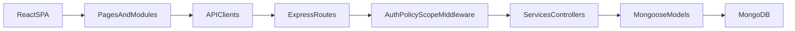

## Project Documentation

This document is the code-derived master reference for `my-react-app`. It replaces the older narrative documentation with a repo-wide architectural inventory, feature map, API contract map, data model catalog, component tree, and an explicit list of known gaps.

## 1. Project Overview

### Purpose
This repository implements an HRMS-style platform for:

- employee records and lifecycle management
- organization structure management
- onboarding
- attendance tracking and Excel import
- leave and excuse workflows
- payroll runs and advance management
- assessments and bonus approvals
- user roles, page permissions, and HR templates
- reports, alerts, and management requests

### Stack

| Layer | Technology |
| --- | --- |
| Frontend | React, Vite, Redux Toolkit, React Router, Tailwind-style utility classes, fetch-based API clients |
| Backend | Node.js, Express, Mongoose, MongoDB |
| Auth | JWT access + refresh tokens, token blacklist, authz version invalidation |
| Data | MongoDB collections via Mongoose schemas |
| Tooling | npm, Vitest on frontend, script-based smoke tests and seeders on backend |

### Architecture Pattern

- Frontend: routed SPA with mixed module-based and top-level page organization.
- Backend: Express route modules, middleware-driven auth/policy enforcement, selective service layer, Mongoose models.
- Authorization: backend policy engine in `backend/src/services/authorizationPolicyService.js`, mirrored by frontend access helpers in `frontend/src/shared/utils/accessControl.js`.
- Persistence: MongoDB-only; no SQL/ORM layer outside Mongoose.



### Runtime Entry Points

- Frontend app shell: `frontend/src/main.jsx`
- Frontend router: `frontend/src/app/router/routes.jsx`
- Frontend store: `frontend/src/app/store/index.js`
- Backend bootstrap: `backend/src/index.js`
- Backend DB connection: `backend/src/config/db.js`

## 2. Repository Structure Dictionary

### Root

| Path | Role |
| --- | --- |
| `package.json` | Root orchestration manifest; delegates tests to frontend and backend packages. |
| `package-lock.json` | Root npm lockfile. |
| `DOCUMENTATION.md` | Master architecture and feature reference. |
| `GETTING_STARTED.md` | Local setup/runbook; partially stale relative to current runtime config. |
| `QUICK_REFERENCE.md` | Older operator cheat sheet; partially stale relative to the current module surface. |
| `docker-compose.yml` | Local MongoDB service definition. |
| `.gitignore` | Root ignore policy. |
| `connectionTest.mjs` | One-off connectivity check script. |

### Backend Top Level

| Path | Role |
| --- | --- |
| `backend/package.json` | Backend scripts and dependencies for server startup, seeding, smoke tests, and exports. |
| `backend/package-lock.json` | Backend npm lockfile. |
| `backend/.env.example` | Example backend env file; currently stale for Mongo variable naming. |
| `backend/README.md` | Backend guide; stale versus current code and route surface. |
| `backend/SECURITY.md` | Security and permission notes; useful but partly stale. |

### Backend Source Root

| Path | Role |
| --- | --- |
| `backend/src/index.js` | Express bootstrap, CORS, security, route mounts, 404, and error middleware. |
| `backend/src/analyzeEmployeeData.js` | Local Excel inspection helper for employee data. |
| `backend/src/clearDatabase.js` | Destructive database reset and minimal bootstrap script. |
| `backend/src/createSimpleExcelTemplate.mjs` | Simple attendance import workbook generator. |
| `backend/src/seedAttendanceDemo.js` | Demo attendance seeder. |
| `backend/src/seedUsers.js` | Seed script for departments, teams, positions, employees, and accounts. |
| `backend/src/testAttendanceImport.js` | Manual attendance import smoke helper. |
| `backend/src/testRealAttendance.js` | Workbook parsing validation helper. |
| `backend/src/verifyAttendanceImport.js` | Login + upload verification helper for attendance import. |

### Backend Config

| Path | Role |
| --- | --- |
| `backend/src/config/db.js` | MongoDB connection helper using `process.env.MONGO_URI`. |

### Backend Controllers

| Path | Role |
| --- | --- |
| `backend/src/controllers/assessmentController.js` | Controller layer for assessment creation, reminders, eligibility, and bonus approvals. |

### Backend Middleware

| Path | Role |
| --- | --- |
| `backend/src/middleware/asyncHandler.js` | Async Express wrapper. |
| `backend/src/middleware/auth.js` | JWT auth, password hashing/verification, token refresh, logout blacklist, and `requireAuth`. |
| `backend/src/middleware/enforcePolicy.js` | Policy gate using `can()` plus audit logging of auth decisions. |
| `backend/src/middleware/enforceScope.js` | Scope-aware employee target guard. |
| `backend/src/middleware/errorMiddleware.js` | Global error normalization middleware. |
| `backend/src/middleware/permissions.js` | Older module/action permission middleware; legacy beside newer policy engine. |
| `backend/src/middleware/rbac.js` | Role/HR-head/admin helpers. |
| `backend/src/middleware/requireCeoOrAdmin.js` | Specialized CEO/admin gate for partner updates. |
| `backend/src/middleware/security.js` | Helmet headers and rate limiters. |
| `backend/src/middleware/validation.js` | Request validators for auth, permissions, and related inputs. |

### Backend Models

| Path | Role |
| --- | --- |
| `backend/src/models/Alert.js` | Persistent operational alert record. |
| `backend/src/models/Assessment.js` | Employee assessment history and bonus workflow state. |
| `backend/src/models/Attendance.js` | Daily attendance row with leave and deduction metadata. |
| `backend/src/models/AuditLog.js` | Audit trail of changes and decisions. |
| `backend/src/models/Branch.js` | Branch/location master record. |
| `backend/src/models/CompanyHoliday.js` | Company, department, or employee holiday ranges. |
| `backend/src/models/Department.js` | Department definition with legacy embedded teams/positions. |
| `backend/src/models/Employee.js` | Core employee + account + org placement + payroll profile. |
| `backend/src/models/EmployeeAdvance.js` | Salary advance/loan record. |
| `backend/src/models/LeaveRequest.js` | Leave and excuse workflow record. |
| `backend/src/models/ManagementRequest.js` | Internal management request workflow. |
| `backend/src/models/OnboardingRequest.js` | Temporary onboarding link/token record. |
| `backend/src/models/OnboardingSubmission.js` | Submitted onboarding data pending review. |
| `backend/src/models/OrganizationPolicy.js` | Central HR/payroll/attendance policy document. |
| `backend/src/models/PageAccessOverride.js` | Per-user page override record. |
| `backend/src/models/PasswordResetRequest.js` | Password reset request queue. |
| `backend/src/models/PayrollRecord.js` | Per-employee payroll line item. |
| `backend/src/models/PayrollRun.js` | Payroll batch header. |
| `backend/src/models/Permission.js` | Legacy per-user module permission row. |
| `backend/src/models/Position.js` | Standalone position definition. |
| `backend/src/models/Team.js` | Standalone team definition with leader/member links. |
| `backend/src/models/TokenBlacklist.js` | Revoked JWT list. |
| `backend/src/models/User.js` | Compatibility alias exporting `Employee` as `User`. |

### Backend Modules

| Path | Role |
| --- | --- |
| `backend/src/modules/alerts/index.js` | Alert generation engine for ID expiry, salary increase, transfer, and similar signals. |

### Backend Routes

| Path | Role |
| --- | --- |
| `backend/src/routes/advances.js` | Dedicated employee advance request/review API. |
| `backend/src/routes/alerts.js` | Alerts feed and salary increase summary. |
| `backend/src/routes/assessments.js` | Assessment routes delegating to controller handlers. |
| `backend/src/routes/attendance.js` | Attendance CRUD, import, analysis, export, and deduction routing. |
| `backend/src/routes/auth.js` | Login, refresh, logout, password, account state, and password request endpoints. |
| `backend/src/routes/branches.js` | Branch CRUD. |
| `backend/src/routes/bulk.js` | Destructive Excel-driven rebuild import and template download. |
| `backend/src/routes/dashboard.js` | Dashboard summary endpoints. |
| `backend/src/routes/departments.js` | Department CRUD and migration-aware org reconciliation. |
| `backend/src/routes/employees.js` | Employee CRUD, transfer, salary increase, and scoped reads. |
| `backend/src/routes/employments.js` | Assignment endpoints for employee org placement. |
| `backend/src/routes/holidays.js` | Holiday CRUD. |
| `backend/src/routes/leaveRequests.js` | Leave workflow API. |
| `backend/src/routes/managementRequests.js` | Internal request API. |
| `backend/src/routes/onboarding.js` | Onboarding link, token verification, submission, and review API. |
| `backend/src/routes/organizationPolicy.js` | Organization policy and partner API. |
| `backend/src/routes/payroll.js` | Payroll runs, records, exports, config, and legacy advance routes. |
| `backend/src/routes/permissions.js` | Permissions, page overrides, HR templates, and previews. |
| `backend/src/routes/positions.js` | Position CRUD. |
| `backend/src/routes/reports.js` | Summary and org consistency reporting. |
| `backend/src/routes/teams.js` | Team CRUD. |
| `backend/src/routes/users.js` | Account and role management on top of `Employee`. |

### Backend Services

| Path | Role |
| --- | --- |
| `backend/src/services/accessService.js` | Legacy employee access scope resolver. |
| `backend/src/services/assessmentAccessService.js` | Assessment eligibility rules. |
| `backend/src/services/attendanceAnalysisService.js` | Monthly attendance analysis engine. |
| `backend/src/services/auditService.js` | Audit record writer and object diffing. |
| `backend/src/services/authorizationPolicyService.js` | Core policy engine, page catalog, templates, and access simulation. |
| `backend/src/services/authzVersionService.js` | JWT invalidation version bump helper. |
| `backend/src/services/chiefExecutiveService.js` | CEO policy lookup and protection rules. |
| `backend/src/services/employeeOrgCaches.js` | Denormalized employee org cache synchronization. |
| `backend/src/services/employeeOrgSync.js` | Leadership role synchronization across employees/departments/teams. |
| `backend/src/services/employeeService.js` | Shared employee creation flow. |
| `backend/src/services/leavePolicyService.js` | Leave policy, fiscal month, and excuse entitlement utilities. |
| `backend/src/services/leaveRequestService.js` | Main leave creation, approval, cancel, and balance logic. |
| `backend/src/services/orgResolutionService.js` | Merge legacy/normalized org structures and enrich employee reporting. |
| `backend/src/services/payrollComputationService.js` | Payroll computation and record update engine. |
| `backend/src/services/roleDataMigrationService.js` | Legacy role normalization migration helper. |
| `backend/src/services/scopeService.js` | Scope expansion and target employee resolution. |

### Backend Utils and Validators

| Path | Role |
| --- | --- |
| `backend/src/utils/ApiError.js` | Operational API error classes. |
| `backend/src/utils/attendanceClockParse.js` | Attendance clock parsing helper. |
| `backend/src/utils/attendanceTimingCore.js` | Attendance timing and late-tier logic. |
| `backend/src/utils/employeePrivacySanitizer.js` | Sensitive employee field redaction. |
| `backend/src/utils/excuseAttendance.js` | Excuse/late coverage helper logic. |
| `backend/src/utils/isHolidayForEmployee.js` | Holiday applicability check. |
| `backend/src/utils/mongoTransactions.js` | Transaction capability detection. |
| `backend/src/utils/monthlyReportPublicDto.js` | Safe monthly-report DTO shaping. |
| `backend/src/utils/orgPolicyWorkingDays.js` | Attendance/payroll working-day normalization. |
| `backend/src/utils/policyWorkLocations.js` | Legacy/current work-location normalization. |
| `backend/src/utils/roles.js` | Canonical role constants and helpers. |
| `backend/src/utils/weeklyRestDays.js` | Rest-day normalization. |
| `backend/src/validators/assessmentValidators.js` | Joi validation for assessment payloads. |

### Backend Scripts

| Path | Role |
| --- | --- |
| `backend/scripts/access-scope-matrix-smoke.mjs` | Scope visibility smoke test. |
| `backend/scripts/attendance-tiers-smoke.mjs` | Attendance late-tier math smoke test. |
| `backend/scripts/authz-matrix-smoke.mjs` | Authorization matrix smoke test. |
| `backend/scripts/backfill-use-default-reporting.js` | Default-reporting backfill migration. |
| `backend/scripts/export-test-sheets.mjs` | Workbook exporter for payroll and assessment outputs. |
| `backend/scripts/fix-db-integrity.js` | Integrity repair and diagnostics script. |
| `backend/scripts/full-api-smoke.mjs` | End-to-end API smoke test. |
| `backend/scripts/generateTemplate.js` | HRMS import workbook generator. |
| `backend/scripts/leave-visibility-smoke.mjs` | Leave visibility smoke test. |
| `backend/scripts/normalize-legacy-roles.mjs` | Legacy role normalization migration. |
| `backend/scripts/org-invariants-smoke.mjs` | Organization invariant smoke test. |
| `backend/scripts/page-overrides-smoke.mjs` | Page override smoke test. |
| `backend/scripts/permission-smoke.mjs` | Permissions smoke test. |
| `backend/scripts/seed-real-data.js` | Realistic demo dataset seeder. |
| `backend/scripts/validate-page-policy-map.mjs` | Frontend route vs backend page policy validation. |
| `backend/scripts/write-hrms-data-workbook.mjs` | HRMS-shaped workbook writer for imports/testing. |

### Frontend Top Level

| Path | Role |
| --- | --- |
| `frontend/package.json` | Frontend scripts and dependencies. |
| `frontend/package-lock.json` | Frontend npm lockfile. |
| `frontend/.env` | Live frontend env pointing to `http://localhost:5001/api`. |
| `frontend/.env.example` | Example frontend env; stale on API port. |
| `frontend/vite.config.js` | Vite config and `/api` proxy to backend. |
| `frontend/eslint.config.js` | Frontend lint config. |
| `frontend/postcss.config.js` | PostCSS config. |
| `frontend/tailwind.config.js` | Tailwind scan/theme config. |
| `frontend/components.json` | UI generator/config metadata. |
| `frontend/README.md` | Template Vite README; not representative of the app. |
| `frontend/docs/access-matrix.md` | Route/access notes for frontend policy alignment. |
| `frontend/docs/mode-role-contract.md` | Mode/role UI behavior contract. |
| `frontend/docs/policy-contract.md` | Cross-layer permission policy contract. |

### Frontend App / Layout / Main

| Path | Role |
| --- | --- |
| `frontend/src/main.jsx` | Frontend bootstrap. |
| `frontend/src/app/providers/AppProviders.jsx` | Redux + toast + error boundary wrapper. |
| `frontend/src/app/router/AppRouter.jsx` | Browser router mount. |
| `frontend/src/app/router/routes.jsx` | Master route tree. |
| `frontend/src/app/store/index.js` | Redux store registration. |
| `frontend/src/layouts/authLayout/AuthLayout.jsx` | Public auth shell. |
| `frontend/src/layouts/dashboardLayout/DashboardLayout.jsx` | Older dashboard shell. |
| `frontend/src/layouts/dashboardLayout/DashboardLayoutEnhanced.jsx` | Active authenticated shell with nav, breadcrumb, and mode handling. |

### Frontend Top-Level Pages

| Path | Role |
| --- | --- |
| `frontend/src/pages/login/LoginPage.jsx` | Re-export shim for identity login page. |
| `frontend/src/pages/home/HomePage.jsx` | Personal home dashboard. |
| `frontend/src/pages/home/LeadershipOrgOverview.jsx` | Leadership analytics page with bulk tools; appears orphaned. |
| `frontend/src/pages/dashboard/DashboardPage.jsx` | Main management dashboard. |
| `frontend/src/pages/dashboard/DashboardAlerts.jsx` | Dashboard alert summary component. |
| `frontend/src/pages/admin/PasswordRequestsPage.jsx` | Password reset request admin page. |
| `frontend/src/pages/admin/UsersAdminPage.jsx` | User and permissions administration page. |
| `frontend/src/pages/OrganizationStructure/OrganizationStructurePage.jsx` | Org structure overview page. |
| `frontend/src/pages/reports/ReportsPage.jsx` | Reports page for summary/warnings. |

### Frontend Modules

| Path | Role |
| --- | --- |
| `frontend/src/modules/index.jsx` | Aggregates module route arrays; gates contracts behind env flag. |
| `frontend/src/modules/identity/api.js` | Auth API client. |
| `frontend/src/modules/identity/store.js` | Identity Redux slice and thunks. |
| `frontend/src/modules/identity/pages/LoginPage.jsx` | Live login page. |
| `frontend/src/modules/identity/pages/ForgotPasswordPage.jsx` | Forgot-password request page. |
| `frontend/src/modules/identity/pages/ChangePasswordPage.jsx` | Password change page. |
| `frontend/src/modules/identity/pages/WelcomePage.jsx` | Token-based onboarding page. |
| `frontend/src/modules/identity/pages/demoLoginpage.jsx` | Legacy/demo login page; not part of live routing. |
| `frontend/src/modules/employees/api.js` | Employee, onboarding, leave, assessment, and bonus API surface. |
| `frontend/src/modules/employees/store.js` | Employees Redux slice and thunks. |
| `frontend/src/modules/employees/routes.jsx` | Employee feature route registration and legacy redirects. |
| `frontend/src/modules/employees/styles/leaveTheme.css` | Leave UI styles. |
| `frontend/src/modules/employees/pages/EmployeesListPage.jsx` | Active employee directory page. |
| `frontend/src/modules/employees/pages/EmployeesListPageEnhanced.jsx` | Alternate employee list implementation; not actively routed. |
| `frontend/src/modules/employees/pages/CreateEmployeePage.jsx` | Employee creation page. |
| `frontend/src/modules/employees/pages/EditEmployeePage.jsx` | Employee edit page. |
| `frontend/src/modules/employees/pages/EmployeeProfilePage.jsx` | Employee profile page. |
| `frontend/src/modules/employees/pages/OnboardingApprovalsPage.jsx` | Onboarding review page. |
| `frontend/src/modules/employees/pages/TimeOffPage.jsx` | Personal time-off page. |
| `frontend/src/modules/employees/pages/LeaveApprovalsPage.jsx` | Leave approval page. |
| `frontend/src/modules/employees/pages/BonusApprovalsPage.jsx` | Bonus approval page. |
| `frontend/src/modules/employees/pages/BulkLeaveBalanceCreditPage.jsx` | Older bulk leave credit page superseded by `/leave-operations`. |
| `frontend/src/modules/employees/components/TransferModal.jsx` | Employee transfer modal. |
| `frontend/src/modules/employees/components/LeaveBalanceCreditModal.jsx` | Single-employee leave credit modal. |
| `frontend/src/modules/employees/components/LeaveBalanceCreditHistory.jsx` | Leave credit history viewer. |
| `frontend/src/modules/employees/components/SalaryIncreaseModal.jsx` | Salary increase modal. |
| `frontend/src/modules/employees/components/TerminateEmployeeModal.jsx` | Termination modal. |
| `frontend/src/modules/employees/components/ManualVacationRecordsModal.jsx` | Manual vacation/excuse records modal. |
| `frontend/src/modules/employees/components/SubmitAssessmentModal.jsx` | Assessment entry modal. |
| `frontend/src/modules/employees/components/leave/LeaveSurface.jsx` | Shared leave section container. |
| `frontend/src/modules/employees/components/leave/LeaveSectionHeader.jsx` | Shared leave section header. |
| `frontend/src/modules/employees/components/leave/LeaveStatusPill.jsx` | Shared leave status badge. |
| `frontend/src/modules/employees/components/leave/ApprovalTimeline.jsx` | Leave approval timeline. |
| `frontend/src/modules/employees/utils/evaluationAccess.js` | Client-side assessment eligibility helpers. |
| `frontend/src/modules/employees/utils/leaveFormatters.js` | Leave date and amount formatting helpers. |
| `frontend/src/modules/attendance/api.js` | Attendance API client. |
| `frontend/src/modules/attendance/store.js` | Attendance Redux slice and thunks. |
| `frontend/src/modules/attendance/routes.jsx` | Attendance route registration. |
| `frontend/src/modules/attendance/pages/AttendancePage.jsx` | Attendance operations page. |
| `frontend/src/modules/attendance/utils.js` | Attendance UI helpers. |
| `frontend/src/modules/attendance/utils.test.js` | Attendance utility tests. |
| `frontend/src/modules/organization/api.js` | Policy, holiday, and partner API client. |
| `frontend/src/modules/organization/pages/OrganizationRulesPage.jsx` | Organization rules editor. |
| `frontend/src/modules/organization/pages/LeaveOperationsPage.jsx` | Leave operations hub. |
| `frontend/src/modules/organization/pages/HolidaysPage.jsx` | Holiday CRUD page. |
| `frontend/src/modules/departments/api.js` | Department API client. |
| `frontend/src/modules/departments/store.js` | Department Redux slice and thunks. |
| `frontend/src/modules/departments/routes.jsx` | Department route registration. |
| `frontend/src/modules/departments/pages/DepartmentsListPage.jsx` | Department directory page. |
| `frontend/src/modules/departments/pages/CreateDepartmentPage.jsx` | Department creation page. |
| `frontend/src/modules/departments/pages/EditDepartmentPage.jsx` | Department edit page. |
| `frontend/src/modules/departments/pages/DepartmentStructurePage.jsx` | Department structure detail page. |
| `frontend/src/modules/teams/api.js` | Team API client. |
| `frontend/src/modules/teams/store.js` | Team Redux slice and thunks. |
| `frontend/src/modules/teams/routes.jsx` | Team route registration. |
| `frontend/src/modules/teams/pages/TeamsListPage.jsx` | Team directory page. |
| `frontend/src/modules/teams/pages/CreateTeamPage.jsx` | Team creation page. |
| `frontend/src/modules/teams/pages/EditTeamPage.jsx` | Team edit page. |
| `frontend/src/modules/positions/api.js` | Position API client. |
| `frontend/src/modules/positions/store.js` | Position Redux slice and thunks. |
| `frontend/src/modules/positions/routes.jsx` | Position route registration. |
| `frontend/src/modules/positions/pages/PositionsListPage.jsx` | Position directory page. |
| `frontend/src/modules/positions/pages/CreatePositionPage.jsx` | Position creation page. |
| `frontend/src/modules/positions/pages/EditPositionPage.jsx` | Position edit page. |
| `frontend/src/modules/contracts/api.js` | Mock contract API using delay only. |
| `frontend/src/modules/contracts/store.js` | Minimal contracts Redux slice. |
| `frontend/src/modules/contracts/routes.jsx` | Feature-flagged contract routes. |
| `frontend/src/modules/contracts/pages/CreateContractPage.jsx` | Contract creation page with no backend persistence. |
| `frontend/src/modules/employments/api.js` | Employment assignment API client. |
| `frontend/src/modules/employments/store.js` | Employment assignment Redux slice and thunks. |
| `frontend/src/modules/employments/routes.jsx` | Employment route registration. |
| `frontend/src/modules/employments/pages/AssignEmploymentPage.jsx` | Assignment page. |
| `frontend/src/modules/payroll/api.js` | Payroll and advances API client. |
| `frontend/src/modules/payroll/routes.jsx` | Payroll and advances route registration. |
| `frontend/src/modules/payroll/pages/PayrollRunsPage.jsx` | Payroll run list/create page. |
| `frontend/src/modules/payroll/pages/PayrollRunDetailPage.jsx` | Payroll run detail page. |
| `frontend/src/modules/payroll/pages/AdvancesPage.jsx` | Advances page. |
| `frontend/src/modules/payroll/components/PayrollHelpPanel.jsx` | Payroll guidance panel. |
| `frontend/src/modules/payroll/components/EmployeePayrollCalculationModal.jsx` | Payroll line-item details/editor modal. |
| `frontend/src/modules/payroll/usePayrollDecimalPlaces.js` | Payroll decimal precision hook. |
| `frontend/src/modules/payroll/payrollVerification.js` | Client-side payroll formula mirror and verification helpers. |
| `frontend/src/modules/payroll/payrollVerification.test.js` | Payroll verification tests. |
| `frontend/src/modules/users/api.js` | Users/password admin API client. |
| `frontend/src/modules/permissions/api.js` | Permissions/page override/admin API client. |
| `frontend/src/modules/dashboard/api.js` | Dashboard and management requests API client. |
| `frontend/src/modules/bulk/api.js` | Bulk template/upload and alerts feed API client. |
| `frontend/src/modules/branches/api.js` | Branch list API client. |
| `frontend/src/modules/reports/api.js` | Reports API client. |

### Frontend Shared and Utility Files

| Path | Role |
| --- | --- |
| `frontend/src/shared/components/Layout.jsx` | Standard page header and container shell. |
| `frontend/src/shared/components/DataTable.jsx` | Reusable table with sorting/search/expansion support. |
| `frontend/src/shared/components/Form.jsx` | Low-level form primitives. |
| `frontend/src/shared/components/FormBuilder.jsx` | Schema-style form renderer. |
| `frontend/src/shared/components/Filters.jsx` | Reusable filter bar shell. |
| `frontend/src/shared/components/Modal.jsx` | Modal shell. |
| `frontend/src/shared/components/ConfirmDialog.jsx` | Confirmation dialog patterns. |
| `frontend/src/shared/components/ToastProvider.jsx` | Toast provider and hook. |
| `frontend/src/shared/components/ErrorBoundary.jsx` | Error boundary. |
| `frontend/src/shared/components/Pagination.jsx` | Pagination controls. |
| `frontend/src/shared/components/Breadcrumb.jsx` | Breadcrumb renderer. |
| `frontend/src/shared/components/SearchableSelect.jsx` | Searchable dropdown input. |
| `frontend/src/shared/components/EmptyState.jsx` | Empty-state helpers. |
| `frontend/src/shared/components/Skeleton.jsx` | Loading placeholders. |
| `frontend/src/shared/components/EntityBadges.jsx` | Status/role/entity badge helpers. |
| `frontend/src/shared/components/index.js` | Shared component barrel file. |
| `frontend/src/shared/routing/RequireRole.jsx` | Base role guard. |
| `frontend/src/shared/routing/RequireDashboardAccess.jsx` | Dashboard route guard. |
| `frontend/src/shared/routing/RequireOrganizationsAccess.jsx` | Organizations route guard. |
| `frontend/src/shared/routing/RequireDepartmentsAccess.jsx` | Department read guard. |
| `frontend/src/shared/routing/RequireDepartmentsManage.jsx` | Department manage guard. |
| `frontend/src/shared/routing/RequireEmployeeRead.jsx` | Employee read guard. |
| `frontend/src/shared/routing/RequireEmployeeManage.jsx` | Employee manage guard. |
| `frontend/src/shared/routing/RequireLeaveApprover.jsx` | Leave approvals guard. |
| `frontend/src/shared/routing/RequireBonusApprover.jsx` | Bonus approvals guard. |
| `frontend/src/shared/routing/RequireAttendanceAccess.jsx` | Attendance guard. |
| `frontend/src/shared/routing/RequirePayrollManager.jsx` | Payroll guard. |
| `frontend/src/shared/routing/RequireAdvancesAccess.jsx` | Advances guard. |
| `frontend/src/shared/routing/RequireReportsView.jsx` | Reports guard. |
| `frontend/src/shared/routing/RequireHolidayRead.jsx` | Holiday read guard. |
| `frontend/src/shared/routing/RequireLeaveOperationsAccess.jsx` | Leave operations guard. |
| `frontend/src/shared/routing/RequireOrganizationRulesManage.jsx` | Organization rules guard. |
| `frontend/src/shared/routing/RequirePermissionsManager.jsx` | Permissions admin guard. |
| `frontend/src/shared/routing/RequirePasswordRequestsAccess.jsx` | Password requests guard. |
| `frontend/src/shared/routing/RequireOnboardingAccess.jsx` | Onboarding admin guard. |
| `frontend/src/shared/routing/RequireAdminOrHrHead.jsx` | Older specialized guard; not the main live permissions path. |
| `frontend/src/shared/utils/accessControl.js` | Frontend page-access helper matrix. |
| `frontend/src/shared/utils/accessControl.parity.test.js` | Policy parity tests. |
| `frontend/src/shared/utils/accessControl.leaveApprovals.test.js` | Leave approvals access tests. |
| `frontend/src/shared/utils/departmentMembership.js` | Department membership normalization. |
| `frontend/src/shared/utils/mergeDepartmentTeams.js` | Embedded vs standalone team merge logic. |
| `frontend/src/shared/utils/employeeFormLanguages.js` | Employee language form conversion. |
| `frontend/src/shared/utils/workLocations.js` | Policy work location helpers. |
| `frontend/src/shared/utils/policyWorkLocationBranches.js` | Branch/work-location editor conversion helpers. |
| `frontend/src/shared/utils/lateTierTimeFormat.js` | Late-tier formatting helpers. |
| `frontend/src/shared/utils/lateTierDeductionPreview.js` | Late-tier deduction previews. |
| `frontend/src/shared/utils/password.js` | Temporary password generation. |
| `frontend/src/shared/utils/id.js` | ID helper. |
| `frontend/src/shared/utils/skillsFromText.js` | Skill parsing helper. |
| `frontend/src/shared/api/apiBase.js` | Shared frontend API base constant. |
| `frontend/src/shared/api/apiBase.test.js` | API base normalization tests. |
| `frontend/src/shared/api/fetchWithAuth.js` | Shared authenticated fetch wrapper with token refresh logic. |
| `frontend/src/shared/api/handleApiResponse.js` | Shared response/error parser. |
| `frontend/src/shared/api/mockApi.js` | Mock API delay helper. |
| `frontend/src/shared/data/egyptGovernorates.js` | Static governorate/city dataset. |
| `frontend/src/shared/hooks/reduxHooks.js` | Redux hook wrappers. |
| `frontend/src/lib/utils.js` | `cn()` className merge helper. |
| `frontend/src/components/ui/button.jsx` | Reusable button primitive. |

## 3. Feature Index and End-to-End Maps

### Feature: Authentication and Identity

Purpose: login, refresh, logout, change password, forgot password, token-based onboarding entry, and session persistence.

#### Backend

- Files: `backend/src/routes/auth.js`, `backend/src/middleware/auth.js`, `backend/src/services/authzVersionService.js`, `backend/src/models/Employee.js`, `backend/src/models/TokenBlacklist.js`, `backend/src/models/PasswordResetRequest.js`
- Routes:
  - `POST /api/auth/login`
  - `POST /api/auth/refresh`
  - `POST /api/auth/logout`
  - `POST /api/auth/change-password`
  - `POST /api/auth/forgot-password`
  - `GET /api/auth/password-requests`
  - `POST /api/auth/reset-password`
  - `PUT /api/auth/:id/status`
- Controller: inline handlers in `backend/src/routes/auth.js`
- Service / middleware functions:
  - `requireAuth()` validates access token and hydrates `req.user`.
  - `generateAccessToken()` signs access JWT.
  - `generateRefreshToken()` signs refresh JWT.
  - `verifyRefreshToken()` validates refresh token and reloads employee.
  - `logout()` blacklists token.
  - `hashPassword()` hashes password.
  - `verifyPassword()` verifies password hash.
  - `bumpAuthzVersion()` invalidates existing sessions when auth/account state changes.
- Model / DB:
  - `Employee`
  - `TokenBlacklist`
  - `PasswordResetRequest`

#### Frontend

- Files: `frontend/src/modules/identity/api.js`, `frontend/src/modules/identity/store.js`, `frontend/src/modules/identity/pages/LoginPage.jsx`, `frontend/src/modules/identity/pages/ForgotPasswordPage.jsx`, `frontend/src/modules/identity/pages/ChangePasswordPage.jsx`, `frontend/src/modules/identity/pages/WelcomePage.jsx`, `frontend/src/shared/api/fetchWithAuth.js`, `frontend/src/shared/api/handleApiResponse.js`, `frontend/src/app/router/routes.jsx`
- Components:
  - `LoginPage`
  - `ForgotPasswordPage`
  - `ChangePasswordPage`
  - `WelcomePage`
- API calls:
  - `loginApi()` -> `POST /api/auth/login`
  - `refreshTokenApi()` -> `POST /api/auth/refresh`
  - `logoutApi()` -> `POST /api/auth/logout`
  - `changePasswordApi()` -> `POST /api/auth/change-password`
  - `forgotPasswordApi()` -> `POST /api/auth/forgot-password`
  - `verifyOnboardingTokenApi()` -> `GET /api/onboarding/verify/:token`
  - `submitOnboardingApi()` -> `POST /api/onboarding/submit/:token`
- State management:
  - `identityReducer`
  - `loginThunk`, `refreshTokenThunk`, `logoutThunk`, `changePasswordThunk`
  - localStorage persistence in `identity/store.js`

### Feature: User Administration and Permissions

Purpose: account creation, role updates, password request handling, HR templates, page access overrides, and policy previews.

#### Backend

- Files: `backend/src/routes/users.js`, `backend/src/routes/permissions.js`, `backend/src/services/authorizationPolicyService.js`, `backend/src/services/auditService.js`, `backend/src/services/chiefExecutiveService.js`, `backend/src/models/Employee.js`, `backend/src/models/Permission.js`, `backend/src/models/PageAccessOverride.js`
- Routes:
  - `GET /api/users`
  - `PUT /api/users/:id/role`
  - `POST /api/users`
  - `POST /api/permissions/simulate`
  - `GET /api/permissions/page-catalog`
  - `POST /api/permissions/resolve-preview`
  - `GET /api/permissions/page-overrides/:userId`
  - `PUT /api/permissions/page-overrides/:userId`
  - `GET /api/permissions/:userId`
  - `POST /api/permissions/:userId`
  - `PUT /api/permissions/:userId`
  - `DELETE /api/permissions/:userId/:permissionId`
  - `DELETE /api/permissions/:userId`
  - `PUT /api/permissions/hr-templates/:userId`
- Service functions:
  - `can()` computes policy decisions.
  - `simulateAccess()` simulates one decision.
  - `simulatePageCatalogAccess()` computes effective page access.
  - `createAuditLog()` records permission/admin changes.
  - `bumpAuthzVersion()` invalidates stale JWTs after role/permission changes.
- Model / DB:
  - `Employee`
  - `UserPermission`
  - `PageAccessOverride`
  - `AuditLog`

#### Frontend

- Files: `frontend/src/pages/admin/UsersAdminPage.jsx`, `frontend/src/pages/admin/PasswordRequestsPage.jsx`, `frontend/src/modules/users/api.js`, `frontend/src/modules/permissions/api.js`, `frontend/src/shared/routing/RequirePermissionsManager.jsx`, `frontend/src/shared/routing/RequirePasswordRequestsAccess.jsx`, `frontend/src/shared/utils/accessControl.js`
- Components:
  - `UsersAdminPage`
  - `PasswordRequestsPage`
  - `Modal`
- API calls:
  - `getUsersApi()` -> `GET /api/users`
  - `updateUserRoleApi()` -> `PUT /api/users/:id/role`
  - `createUserApi()` -> `POST /api/users`
  - `getPasswordRequestsApi()` -> `GET /api/auth/password-requests`
  - `forceResetPasswordApi()` -> `POST /api/auth/reset-password`
  - `getPageCatalogApi()` -> `GET /api/permissions/page-catalog`
  - `getPageOverridesApi()` -> `GET /api/permissions/page-overrides/:userId`
  - `updatePageOverridesApi()` -> `PUT /api/permissions/page-overrides/:userId`
  - `resolvePagePreviewApi()` -> `POST /api/permissions/resolve-preview`
  - `updateHrTemplatesApi()` -> `PUT /api/permissions/hr-templates/:userId`
- State management:
  - local component state for admin screens
  - `identity.currentUser`
  - page guards via `accessControl.js`

### Feature: Employees

Purpose: list, create, edit, view, transfer, terminate, and process salary increases for employees.

#### Backend

- Files: `backend/src/routes/employees.js`, `backend/src/services/scopeService.js`, `backend/src/services/orgResolutionService.js`, `backend/src/services/employeeOrgSync.js`, `backend/src/services/auditService.js`, `backend/src/utils/employeePrivacySanitizer.js`, `backend/src/models/Employee.js`, `backend/src/models/Department.js`, `backend/src/models/Team.js`, `backend/src/models/Position.js`, `backend/src/models/Branch.js`, `backend/src/models/LeaveRequest.js`, `backend/src/models/ManagementRequest.js`, `backend/src/models/Attendance.js`, `backend/src/models/Alert.js`, `backend/src/models/Permission.js`
- Routes:
  - `GET /api/employees`
  - `GET /api/employees/me`
  - `GET /api/employees/:id`
  - `POST /api/employees`
  - `PUT /api/employees/:id`
  - `POST /api/employees/:id/transfer`
  - `DELETE /api/employees/:id`
  - `POST /api/employees/:id/process-increase`
- Service functions:
  - `resolveEmployeeScopeIds()`
  - `resolveTargetEmployee()`
  - `enrichEmployeeForResponse()`
  - `enrichEmployeesForResponse()`
  - `syncEmployeeLeadershipAfterSave()`
  - `detectChanges()`
  - `createAuditLog()`
  - `sanitizeEmployeeApiPayload()`
  - `sanitizeEnrichedEmployeeList()`
- Model / DB:
  - `Employee`
  - related `Department`, `Team`, `Position`, `Branch`, `Attendance`, `LeaveRequest`, `ManagementRequest`, `Alert`, `UserPermission`

#### Frontend

- Files: `frontend/src/modules/employees/routes.jsx`, `frontend/src/modules/employees/api.js`, `frontend/src/modules/employees/store.js`, `frontend/src/modules/employees/pages/EmployeesListPage.jsx`, `frontend/src/modules/employees/pages/CreateEmployeePage.jsx`, `frontend/src/modules/employees/pages/EditEmployeePage.jsx`, `frontend/src/modules/employees/pages/EmployeeProfilePage.jsx`, `frontend/src/modules/employees/components/TransferModal.jsx`, `frontend/src/modules/employees/components/SalaryIncreaseModal.jsx`, `frontend/src/modules/employees/components/TerminateEmployeeModal.jsx`
- Components:
  - `EmployeesListPage`
  - `CreateEmployeePage`
  - `EditEmployeePage`
  - `EmployeeProfilePage`
  - `TransferModal`
  - `SalaryIncreaseModal`
  - `TerminateEmployeeModal`
- API calls:
  - `getEmployeesApi()`
  - `createEmployeeApi()`
  - `updateEmployeeApi()`
  - `getEmployeeByIdApi()`
  - `getMyEmployeeProfileApi()`
  - `processSalaryIncreaseApi()`
  - `transferEmployeeApi()`
  - `deleteEmployeeApi()`
- State management:
  - `employeesReducer`
  - `fetchEmployeesThunk`, `createEmployeeThunk`, `updateEmployeeThunk`, `deleteEmployeeThunk`, `processSalaryIncreaseThunk`
  - local UI state in pages for filters, tabs, modals, branch/team selections

### Feature: Onboarding

Purpose: generate onboarding links, accept onboarding submissions, and approve/reject them into full employee records.

#### Backend

- Files: `backend/src/routes/onboarding.js`, `backend/src/services/employeeService.js`, `backend/src/services/employeeOrgCaches.js`, `backend/src/models/OnboardingRequest.js`, `backend/src/models/OnboardingSubmission.js`, `backend/src/models/Employee.js`
- Routes:
  - `POST /api/onboarding/generate`
  - `GET /api/onboarding/verify/:token`
  - `POST /api/onboarding/submit/:token`
  - `GET /api/onboarding/links`
  - `PATCH /api/onboarding/links/:id/stop`
  - `GET /api/onboarding/submissions`
  - `PATCH /api/onboarding/submissions/:id`
  - `DELETE /api/onboarding/links/:id`
- Service functions:
  - `createEmployee()`
  - `syncEmployeeOrgCaches()`
- Model / DB:
  - `OnboardingRequest`
  - `OnboardingSubmission`
  - `Employee`

#### Frontend

- Files: `frontend/src/modules/identity/pages/WelcomePage.jsx`, `frontend/src/modules/employees/pages/OnboardingApprovalsPage.jsx`, `frontend/src/modules/employees/api.js`, `frontend/src/shared/routing/RequireOnboardingAccess.jsx`
- Components:
  - `WelcomePage`
  - `OnboardingApprovalsPage`
- API calls:
  - `generateOnboardingApi()`
  - `verifyOnboardingTokenApi()`
  - `submitOnboardingApi()`
  - `getOnboardingLinksApi()`
  - `stopOnboardingLinkApi()`
  - `deleteOnboardingLinkApi()`
  - `getOnboardingSubmissionsApi()`
  - `processOnboardingSubmissionApi()`
- State management:
  - local page state
  - route protection via `RequireOnboardingAccess`

### Feature: Departments

Purpose: create, edit, list, and inspect departments and their leadership/legacy embedded structures.

#### Backend

- Files: `backend/src/routes/departments.js`, `backend/src/services/employeeOrgSync.js`, `backend/src/services/orgResolutionService.js`, `backend/src/models/Department.js`, `backend/src/models/Employee.js`, `backend/src/models/Team.js`, `backend/src/models/Position.js`, `backend/src/models/ManagementRequest.js`, `backend/src/models/OrganizationPolicy.js`
- Routes:
  - `GET /api/departments`
  - `GET /api/departments/:id`
  - `POST /api/departments`
  - `PUT /api/departments/:id`
  - `DELETE /api/departments/:id`
- Service functions:
  - `syncDepartmentHeadRoles()`
  - `syncTeamLeaderRolesFromDepartmentTeams()`
  - `syncEmployeesWithDepartment()`
  - `getMergedTeamsForDepartment()`
- Model / DB:
  - `Department`
  - related `Employee`, `Team`, `Position`, `ManagementRequest`, `OrganizationPolicy`

#### Frontend

- Files: `frontend/src/modules/departments/api.js`, `frontend/src/modules/departments/store.js`, `frontend/src/modules/departments/routes.jsx`, `frontend/src/modules/departments/pages/DepartmentsListPage.jsx`, `frontend/src/modules/departments/pages/CreateDepartmentPage.jsx`, `frontend/src/modules/departments/pages/EditDepartmentPage.jsx`, `frontend/src/modules/departments/pages/DepartmentStructurePage.jsx`
- Components:
  - `DepartmentsListPage`
  - `CreateDepartmentPage`
  - `EditDepartmentPage`
  - `DepartmentStructurePage`
- API calls:
  - `getDepartmentsApi()`
  - `createDepartmentApi()`
  - `updateDepartmentApi()`
  - `deleteDepartmentApi()`
- State management:
  - `departmentsReducer`
  - local page state for forms and structure rendering

### Feature: Teams

Purpose: manage standalone teams and their leader/member associations.

#### Backend

- Files: `backend/src/routes/teams.js`, `backend/src/models/Team.js`, `backend/src/models/Department.js`, `backend/src/models/Employee.js`
- Routes:
  - `GET /api/teams`
  - `GET /api/teams/:id`
  - `POST /api/teams`
  - `PUT /api/teams/:id`
  - `DELETE /api/teams/:id`
- Model / DB:
  - `Team`
  - `Department`
  - `Employee`

#### Frontend

- Files: `frontend/src/modules/teams/api.js`, `frontend/src/modules/teams/store.js`, `frontend/src/modules/teams/routes.jsx`, `frontend/src/modules/teams/pages/TeamsListPage.jsx`, `frontend/src/modules/teams/pages/CreateTeamPage.jsx`, `frontend/src/modules/teams/pages/EditTeamPage.jsx`
- Components:
  - `TeamsListPage`
  - `CreateTeamPage`
  - `EditTeamPage`
- API calls:
  - `getTeamsApi()`
  - `getTeamApi()`
  - `createTeamApi()`
  - `updateTeamApi()`
  - `deleteTeamApi()`
- State management:
  - `teamsReducer`
  - `fetchTeamsThunk`, `fetchTeamThunk`, `createTeamThunk`, `updateTeamThunk`, `deleteTeamThunk`

### Feature: Positions

Purpose: manage standalone positions that belong to departments and optional teams.

#### Backend

- Files: `backend/src/routes/positions.js`, `backend/src/models/Position.js`, `backend/src/models/Department.js`, `backend/src/models/Team.js`, `backend/src/models/Employee.js`
- Routes:
  - `GET /api/positions`
  - `GET /api/positions/:id`
  - `POST /api/positions`
  - `PUT /api/positions/:id`
  - `DELETE /api/positions/:id`
- Model / DB:
  - `Position`
  - `Department`
  - `Team`
  - `Employee`

#### Frontend

- Files: `frontend/src/modules/positions/api.js`, `frontend/src/modules/positions/store.js`, `frontend/src/modules/positions/routes.jsx`, `frontend/src/modules/positions/pages/PositionsListPage.jsx`, `frontend/src/modules/positions/pages/CreatePositionPage.jsx`, `frontend/src/modules/positions/pages/EditPositionPage.jsx`
- Components:
  - `PositionsListPage`
  - `CreatePositionPage`
  - `EditPositionPage`
- API calls:
  - `getPositionsApi()`
  - `getPositionApi()`
  - `createPositionApi()`
  - `updatePositionApi()`
  - `deletePositionApi()`
- State management:
  - `positionsReducer`

### Feature: Employments / Assignments

Purpose: assign and unassign employees to departments, teams, and positions.

#### Backend

- Files: `backend/src/routes/employments.js`, `backend/src/models/Employee.js`, `backend/src/models/Department.js`, `backend/src/models/Team.js`, `backend/src/models/Position.js`, `backend/src/services/orgResolutionService.js`
- Routes:
  - `POST /api/employments/assign`
  - `DELETE /api/employments/unassign`
  - `GET /api/employments/employee/:employeeId`
- Service functions:
  - `enrichEmployeesForResponse()`
- Model / DB:
  - `Employee`
  - `Department`
  - `Team`
  - `Position`

#### Frontend

- Files: `frontend/src/modules/employments/api.js`, `frontend/src/modules/employments/store.js`, `frontend/src/modules/employments/routes.jsx`, `frontend/src/modules/employments/pages/AssignEmploymentPage.jsx`
- Components:
  - `AssignEmploymentPage`
- API calls:
  - `assignEmploymentApi()`
  - `getEmployeeAssignmentsApi()`
  - `unassignEmploymentApi()`
- State management:
  - `employmentsReducer`

### Feature: Organization Policy and Partners

Purpose: manage document requirements, work locations, leave rules, attendance rules, salary increase rules, payroll config, chief executive, and partners.

#### Backend

- Files: `backend/src/routes/organizationPolicy.js`, `backend/src/services/chiefExecutiveService.js`, `backend/src/utils/policyWorkLocations.js`, `backend/src/utils/orgPolicyWorkingDays.js`, `backend/src/utils/weeklyRestDays.js`, `backend/src/utils/attendanceTimingCore.js`, `backend/src/models/OrganizationPolicy.js`, `backend/src/models/Employee.js`
- Routes:
  - `GET /api/policy/documents`
  - `PUT /api/policy/documents`
  - `GET /api/policy/partners`
  - `POST /api/policy/partners`
  - `PUT /api/policy/partners/:partnerId`
  - `DELETE /api/policy/partners/:partnerId`
- Service functions:
  - `getChiefExecutivePolicy()`
  - `getChiefExecutiveId()`
  - `isChiefExecutiveUser()`
  - `assertNotCurrentChiefExecutive()`
- Model / DB:
  - `OrganizationPolicy`
  - `Employee`

#### Frontend

- Files: `frontend/src/modules/organization/api.js`, `frontend/src/modules/organization/pages/OrganizationRulesPage.jsx`, `frontend/src/shared/utils/policyWorkLocationBranches.js`, `frontend/src/shared/routing/RequireOrganizationRulesManage.jsx`
- Components:
  - `OrganizationRulesPage`
- API calls:
  - `getDocumentRequirementsApi()`
  - `updateDocumentRequirementsApi()`
  - `getPartnersApi()`
  - `createPartnerApi()`
  - `updatePartnerApi()`
  - `deletePartnerApi()`
- State management:
  - local page state
  - `identity.currentUser`

### Feature: Attendance

Purpose: CRUD attendance records, import Excel, export monthly reports, and manage partial-excuse deduction sources.

#### Backend

- Files: `backend/src/routes/attendance.js`, `backend/src/services/attendanceAnalysisService.js`, `backend/src/services/scopeService.js`, `backend/src/services/auditService.js`, `backend/src/services/leavePolicyService.js`, `backend/src/utils/attendanceClockParse.js`, `backend/src/utils/attendanceTimingCore.js`, `backend/src/utils/excuseAttendance.js`, `backend/src/utils/isHolidayForEmployee.js`, `backend/src/utils/monthlyReportPublicDto.js`, `backend/src/models/Attendance.js`, `backend/src/models/LeaveRequest.js`, `backend/src/models/OrganizationPolicy.js`, `backend/src/models/CompanyHoliday.js`, `backend/src/models/Employee.js`
- Routes:
  - `GET /api/attendance`
  - `GET /api/attendance/me`
  - `GET /api/attendance/employee/:id`
  - `POST /api/attendance`
  - `GET /api/attendance/template`
  - `GET /api/attendance/monthly-report`
  - `GET /api/attendance/monthly-report/export`
  - `PUT /api/attendance/:id`
  - `PATCH /api/attendance/:id/deduction-source`
  - `DELETE /api/attendance/bulk`
  - `DELETE /api/attendance/:id`
  - `POST /api/attendance/import`
- Service functions:
  - `computeMonthlyAnalysis()`
  - `createAuditLog()`
  - `resolveTargetEmployee()`
  - attendance timing and leave-coverage helpers inside route/util layer
- Model / DB:
  - `Attendance`
  - `LeaveRequest`
  - `OrganizationPolicy`
  - `CompanyHoliday`
  - `Employee`

#### Frontend

- Files: `frontend/src/modules/attendance/api.js`, `frontend/src/modules/attendance/store.js`, `frontend/src/modules/attendance/routes.jsx`, `frontend/src/modules/attendance/pages/AttendancePage.jsx`, `frontend/src/modules/attendance/utils.js`
- Components:
  - `AttendancePage`
  - `DataTable`
- API calls:
  - `getAttendanceApi()`
  - `getEmployeeAttendanceApi()`
  - `getMyAttendanceApi()`
  - `getTodayAttendanceApi()`
  - `createAttendanceApi()`
  - `updateAttendanceApi()`
  - `updateAttendanceDeductionSourceApi()`
  - `deleteAttendanceApi()`
  - `deleteAttendanceBulkApi()`
  - `importAttendanceApi()`
  - `getMonthlyReportApi()`
  - `downloadMonthlyReportExcelApi()`
  - `downloadAttendanceTemplateApi()`
- State management:
  - `attendanceReducer`
  - `employeesReducer` for linked employee data

### Feature: Leave and Time Off

Purpose: create, list, approve, cancel, directly record, and audit leave and excuse requests, including balance credits.

#### Backend

- Files: `backend/src/routes/leaveRequests.js`, `backend/src/services/leaveRequestService.js`, `backend/src/services/leavePolicyService.js`, `backend/src/models/LeaveRequest.js`, `backend/src/models/Employee.js`, `backend/src/models/Attendance.js`, `backend/src/models/AuditLog.js`, `backend/src/models/OrganizationPolicy.js`
- Routes:
  - `POST /api/leave-requests`
  - `GET /api/leave-requests`
  - `GET /api/leave-requests/balance`
  - `GET /api/leave-requests/mine`
  - `POST /api/leave-requests/balance-credit`
  - `POST /api/leave-requests/balance-credit/bulk`
  - `GET /api/leave-requests/:id`
  - `GET /api/leave-requests/:id/history`
  - `POST /api/leave-requests/:id/action`
  - `POST /api/leave-requests/:id/record-direct`
  - `POST /api/leave-requests/:id/cancel`
- Service functions:
  - `createLeaveRequest()`
  - `listLeaveRequests()`
  - `getLeaveBalanceSnapshot()`
  - `addAnnualLeaveCredit()`
  - `addAnnualLeaveCreditBulk()`
  - `applyLeaveRequestAction()`
  - `recordLeaveRequestDirect()`
  - `cancelLeaveRequest()`
  - `getLeaveRequestById()`
- Model / DB:
  - `LeaveRequest`
  - `Employee`
  - `Attendance`
  - `AuditLog`
  - `OrganizationPolicy`

#### Frontend

- Files: `frontend/src/modules/employees/api.js`, `frontend/src/modules/employees/pages/TimeOffPage.jsx`, `frontend/src/modules/employees/pages/LeaveApprovalsPage.jsx`, `frontend/src/modules/organization/pages/LeaveOperationsPage.jsx`, `frontend/src/modules/employees/components/leave/*`
- Components:
  - `TimeOffPage`
  - `LeaveApprovalsPage`
  - `LeaveOperationsPage`
  - `PersonalTimeOffSection`
  - `ApprovalTimeline`
  - `LeaveStatusPill`
- API calls:
  - `listLeaveRequestsApi()`
  - `listMyLeaveRequestsApi()`
  - `getLeaveBalanceApi()`
  - `postLeaveBalanceCreditApi()`
  - `postLeaveBalanceCreditBulkApi()`
  - `createLeaveRequestApi()`
  - `leaveRequestActionApi()`
  - `directRecordLeaveRequestApi()`
  - `cancelLeaveRequestApi()`
  - `getLeaveRequestHistoryApi()`
  - `getLeaveRequestByIdApi()`
- State management:
  - mostly local state
  - `identity.currentUser`
  - `employeesReducer` when on-behalf flows need employee selection

### Feature: Holidays

Purpose: manage holiday ranges for company, department, or employee scope.

#### Backend

- Files: `backend/src/routes/holidays.js`, `backend/src/models/CompanyHoliday.js`, `backend/src/models/Department.js`, `backend/src/models/Employee.js`
- Routes:
  - `GET /api/holidays`
  - `POST /api/holidays`
  - `PUT /api/holidays/:id`
  - `DELETE /api/holidays/:id`
- Model / DB:
  - `CompanyHoliday`

#### Frontend

- Files: `frontend/src/modules/organization/api.js`, `frontend/src/modules/organization/pages/HolidaysPage.jsx`, `frontend/src/modules/organization/pages/LeaveOperationsPage.jsx`
- Components:
  - `HolidaysPage`
- API calls:
  - `getHolidaysApi()`
  - `createHolidayApi()`
  - `updateHolidayApi()`
  - `deleteHolidayApi()`
- State management:
  - local page state

### Feature: Payroll Runs

Purpose: create payroll runs, compute records, finalize runs, repair totals, inspect employee records, and export reports.

#### Backend

- Files: `backend/src/routes/payroll.js`, `backend/src/services/payrollComputationService.js`, `backend/src/services/attendanceAnalysisService.js`, `backend/src/services/auditService.js`, `backend/src/models/PayrollRun.js`, `backend/src/models/PayrollRecord.js`, `backend/src/models/EmployeeAdvance.js`, `backend/src/models/OrganizationPolicy.js`, `backend/src/models/Employee.js`
- Routes:
  - `GET /api/payroll/runs`
  - `POST /api/payroll/runs`
  - `GET /api/payroll/runs/:id`
  - `POST /api/payroll/runs/:id/compute`
  - `POST /api/payroll/runs/:id/finalize`
  - `POST /api/payroll/runs/:id/repair-totals`
  - `DELETE /api/payroll/runs/:id`
  - `GET /api/payroll/runs/:id/records`
  - `PATCH /api/payroll/runs/:runId/records/:recordId`
  - `GET /api/payroll/me/history`
  - `GET /api/payroll/employees/:employeeId/history`
  - `GET /api/payroll/runs/:id/payment-list`
  - `GET /api/payroll/runs/:id/insurance-report`
  - `GET /api/payroll/runs/:id/tax-report`
  - `GET /api/payroll/runs/:id/export/:type`
  - `GET /api/payroll/config`
- Service functions:
  - `resolvePayrollConfig()`
  - `computePayrollRun()`
  - `finalizePayrollRun()`
  - `repairPayrollRunTotals()`
  - `updatePayrollRecordManually()`
  - `computePayrollLineFromInputs()`
- Model / DB:
  - `PayrollRun`
  - `PayrollRecord`
  - `EmployeeAdvance`
  - `OrganizationPolicy`
  - `Employee`

#### Frontend

- Files: `frontend/src/modules/payroll/api.js`, `frontend/src/modules/payroll/routes.jsx`, `frontend/src/modules/payroll/pages/PayrollRunsPage.jsx`, `frontend/src/modules/payroll/pages/PayrollRunDetailPage.jsx`, `frontend/src/modules/payroll/components/PayrollHelpPanel.jsx`, `frontend/src/modules/payroll/components/EmployeePayrollCalculationModal.jsx`, `frontend/src/modules/payroll/usePayrollDecimalPlaces.js`, `frontend/src/modules/payroll/payrollVerification.js`
- Components:
  - `PayrollRunsPage`
  - `PayrollRunDetailPage`
  - `PayrollHelpPanel`
  - `EmployeePayrollCalculationModal`
- API calls:
  - `getPayrollRunsApi()`
  - `getPayrollRunApi()`
  - `createPayrollRunApi()`
  - `computePayrollRunApi()`
  - `finalizePayrollRunApi()`
  - `repairPayrollRunTotalsApi()`
  - `deletePayrollRunApi()`
  - `getPayrollRecordsApi()`
  - `updatePayrollRecordApi()`
  - `getPaymentListApi()`
  - `getInsuranceReportApi()`
  - `getTaxReportApi()`
  - `downloadPayrollExcelApi()`
  - `getEmployeePayrollHistoryApi()`
  - `getMyPayrollHistoryApi()`
  - `getPayrollConfigApi()`
- State management:
  - local page state only
  - `identity.currentUser`

### Feature: Advances

Purpose: request, approve, reject, cancel, and inspect employee salary advances.

#### Backend

- Files: `backend/src/routes/advances.js`, `backend/src/routes/payroll.js`, `backend/src/models/EmployeeAdvance.js`, `backend/src/models/Employee.js`
- Routes:
  - `GET /api/advances`
  - `GET /api/advances/mine`
  - `POST /api/advances/request`
  - `POST /api/advances`
  - `PUT /api/advances/:id/approve`
  - `DELETE /api/advances/:id`
  - `GET /api/advances/:id`
  - legacy routes under `/api/payroll/advances/*`
- Model / DB:
  - `EmployeeAdvance`

#### Frontend

- Files: `frontend/src/modules/payroll/api.js`, `frontend/src/modules/payroll/pages/AdvancesPage.jsx`, `frontend/src/shared/routing/RequireAdvancesAccess.jsx`
- Components:
  - `AdvancesPage`
  - `CreateAdvanceModal`
  - `ApproveModal`
- API calls:
  - `getAdvancesApi()`
  - `getMyAdvancesApi()`
  - `getAdvanceApi()`
  - `createAdvanceApi()`
  - `approveAdvanceApi()`
  - `cancelAdvanceApi()`
- State management:
  - local page state
  - `identity.currentUser`

### Feature: Assessments and Bonus Approvals

Purpose: submit employee assessments, view eligibility/reminders, and process bonus approvals.

#### Backend

- Files: `backend/src/routes/assessments.js`, `backend/src/controllers/assessmentController.js`, `backend/src/services/assessmentAccessService.js`, `backend/src/models/Assessment.js`, `backend/src/models/Employee.js`
- Routes:
  - `GET /api/assessments/eligibility/:employeeId`
  - `GET /api/assessments/pending`
  - `GET /api/assessments/reminders`
  - `GET /api/assessments/bonus-approvals`
  - `POST /api/assessments/:employeeId/assessment/:assessmentId/approve-bonus`
  - `POST /api/assessments/:employeeId/assessment/:assessmentId/reject-bonus`
  - `POST /api/assessments`
  - `GET /api/assessments/employee/:id`
- Controller functions:
  - `createAssessment()`
  - `getEmployeeAssessments()`
  - `getAssessmentEligibility()`
  - `getPendingAssessments()`
  - `getAssessmentReminders()`
  - `getBonusApprovals()`
  - `approveBonus()`
  - `rejectBonus()`
- Service functions:
  - `canAssessEmployee()`
- Model / DB:
  - `Assessment`
  - `Employee`

#### Frontend

- Files: `frontend/src/modules/employees/api.js`, `frontend/src/modules/employees/components/SubmitAssessmentModal.jsx`, `frontend/src/modules/employees/pages/BonusApprovalsPage.jsx`, `frontend/src/modules/employees/utils/evaluationAccess.js`, `frontend/src/pages/dashboard/DashboardPage.jsx`
- Components:
  - `SubmitAssessmentModal`
  - `BonusApprovalsPage`
- API calls:
  - `getEmployeeAssessmentsApi()`
  - `createAssessmentApi()`
  - `getAssessmentEligibilityApi()`
  - `getPendingAssessmentsApi()`
  - `getAssessmentRemindersApi()`
  - `getBonusApprovalsApi()`
  - `approveBonusApi()`
  - `rejectBonusApi()`
- State management:
  - local page state

### Feature: Dashboard and Alerts

Purpose: show management dashboards, operational summaries, and alert counts by role.

#### Backend

- Files: `backend/src/routes/dashboard.js`, `backend/src/routes/alerts.js`, `backend/src/modules/alerts/index.js`, `backend/src/models/Alert.js`, `backend/src/models/Employee.js`, `backend/src/models/Assessment.js`
- Routes:
  - `GET /api/dashboard/alerts`
  - `GET /api/dashboard/metrics`
  - `GET /api/alerts`
  - `GET /api/alerts/salary-increase-summary`
- Service functions:
  - `generateAlerts()`
  - `createAlertIfNotExists()`
  - `logTransferAlert()`
  - `resolveAlertsForEmployee()`
- Model / DB:
  - `Alert`
  - `Employee`
  - `Assessment`

#### Frontend

- Files: `frontend/src/pages/dashboard/DashboardPage.jsx`, `frontend/src/pages/dashboard/DashboardAlerts.jsx`, `frontend/src/modules/dashboard/api.js`, `frontend/src/modules/bulk/api.js`, `frontend/src/pages/home/LeadershipOrgOverview.jsx`
- Components:
  - `DashboardPage`
  - `DashboardAlerts`
  - `LeadershipOrgOverview` (not actively routed)
- API calls:
  - `getDashboardAlertsApi()`
  - `getDashboardMetricsApi()`
  - `getAlertsFeedApi()`
- State management:
  - mixed Redux + local state on dashboard
  - local state on orphaned leadership page

### Feature: Management Requests

Purpose: employees/leaders submit internal requests; management/HR review and process them.

#### Backend

- Files: `backend/src/routes/managementRequests.js`, `backend/src/models/ManagementRequest.js`, `backend/src/models/Department.js`
- Routes:
  - `POST /api/management-requests`
  - `GET /api/management-requests`
  - `PATCH /api/management-requests/:id`
- Model / DB:
  - `ManagementRequest`
  - `Department`

#### Frontend

- Files: `frontend/src/modules/dashboard/api.js`, `frontend/src/pages/dashboard/DashboardPage.jsx`
- Components:
  - `DashboardPage`
- API calls:
  - `listManagementRequestsApi()`
  - `createManagementRequestApi()`
  - `updateManagementRequestStatusApi()`
- State management:
  - local page state

### Feature: Reports

Purpose: show high-level summary metrics and organization consistency warnings.

#### Backend

- Files: `backend/src/routes/reports.js`, `backend/src/models/Department.js`, `backend/src/models/Team.js`, `backend/src/models/Position.js`, `backend/src/models/Employee.js`
- Routes:
  - `GET /api/reports/summary`
  - `GET /api/reports/organizations`
  - `GET /api/reports/org-consistency`
- Model / DB:
  - `Department`
  - `Team`
  - `Position`
  - `Employee`

#### Frontend

- Files: `frontend/src/modules/reports/api.js`, `frontend/src/pages/reports/ReportsPage.jsx`, `frontend/src/pages/OrganizationStructure/OrganizationStructurePage.jsx`
- Components:
  - `ReportsPage`
  - `OrganizationStructurePage`
- API calls:
  - `getReportsSummaryApi()`
  - `getOrgConsistencyApi()` exported but not used by `ReportsPage`
- State management:
  - local page state on `ReportsPage`
  - Redux on `OrganizationStructurePage`

### Feature: Branches

Purpose: manage physical branches and employee work locations.

#### Backend

- Files: `backend/src/routes/branches.js`, `backend/src/models/Branch.js`, `backend/src/models/Employee.js`
- Routes:
  - `GET /api/branches`
  - `POST /api/branches`
  - `PUT /api/branches/:id`
  - `DELETE /api/branches/:id`
- Model / DB:
  - `Branch`
  - `Employee`

#### Frontend

- Files: `frontend/src/modules/branches/api.js`, `frontend/src/modules/employees/pages/CreateEmployeePage.jsx`, `frontend/src/modules/employees/pages/EditEmployeePage.jsx`
- Components:
  - branch selection is embedded in employee forms
- API calls:
  - `getBranchesApi()`
- State management:
  - local state in employee pages only

### Feature: Bulk Import

Purpose: download workbook template and perform destructive org rebuild from Excel.

#### Backend

- Files: `backend/src/routes/bulk.js`, `backend/src/models/Employee.js`, `backend/src/models/Department.js`, `backend/src/models/Team.js`, `backend/src/models/Position.js`, `backend/src/models/OrganizationPolicy.js`, `backend/src/models/Attendance.js`, `backend/src/models/Branch.js`, `backend/src/services/employeeOrgCaches.js`
- Routes:
  - `GET /api/bulk/template`
  - `POST /api/bulk/upload`
- Service functions:
  - `syncEmployeeOrgCaches()`
- Model / DB:
  - destructive rebuild touches `Employee`, `Department`, `Team`, `Position`, `OrganizationPolicy`, `Attendance`, `Branch`

#### Frontend

- Files: `frontend/src/modules/bulk/api.js`, `frontend/src/pages/home/LeadershipOrgOverview.jsx`
- Components:
  - `LeadershipOrgOverview`
- API calls:
  - `downloadBulkTemplateApi()`
  - `uploadBulkFileApi()`
- State management:
  - local state in orphaned page

### Feature: Contracts

Purpose: feature-flagged contract creation UI only.

#### Backend

- Files: none
- Routes: none
- Controller / service / model: none

#### Frontend

- Files: `frontend/src/modules/contracts/api.js`, `frontend/src/modules/contracts/store.js`, `frontend/src/modules/contracts/routes.jsx`, `frontend/src/modules/contracts/pages/CreateContractPage.jsx`
- Components:
  - `CreateContractPage`
- API calls:
  - `createContractApi()` -> mocked delay only
- State management:
  - `contractsReducer`

## 4. API Reference

All backend APIs are mounted under `/api`.

### Auth

| Method | URL | Request Body | Response Shape |
| --- | --- | --- | --- |
| POST | `/api/auth/login` | `{ email, password }` | `{ accessToken, refreshToken, user }` |
| POST | `/api/auth/refresh` | `{ refreshToken }` | `{ accessToken, refreshToken, user }` |
| POST | `/api/auth/logout` | none | `{ message }` |
| POST | `/api/auth/register` | employee/account creation fields | created employee/account summary |
| POST | `/api/auth/change-password` | `{ currentPassword, newPassword }` | `{ message }` |
| POST | `/api/auth/forgot-password` | `{ email }` | generic `{ message }` |
| GET | `/api/auth/password-requests` | none | `{ items }` or list of pending requests |
| POST | `/api/auth/reset-password` | `{ targetEmail or userId, newPassword }` | `{ message }` |
| PUT | `/api/auth/:id/status` | `{ isActive or status }` | updated employee/account summary |

### Users and Permissions

| Method | URL | Request Body | Response Shape |
| --- | --- | --- | --- |
| GET | `/api/users` | none | list of account-bearing employees |
| PUT | `/api/users/:id/role` | `{ role }` | updated user summary |
| POST | `/api/users` | existing employee + role/password payload | created account summary |
| POST | `/api/permissions/simulate` | policy simulation input | single decision result |
| GET | `/api/permissions/page-catalog` | none | page catalog array |
| POST | `/api/permissions/resolve-preview` | draft role/template/override payload | effective page access preview |
| GET | `/api/permissions/page-overrides/:userId` | none | page override rows |
| PUT | `/api/permissions/page-overrides/:userId` | override array | saved override rows |
| GET | `/api/permissions/:userId` | none | legacy module permission rows |
| POST | `/api/permissions/:userId` | one module permission row | upserted permission |
| PUT | `/api/permissions/:userId` | full permission list | replacement result |
| DELETE | `/api/permissions/:userId/:permissionId` | none | delete confirmation |
| DELETE | `/api/permissions/:userId` | none | delete confirmation |
| PUT | `/api/permissions/hr-templates/:userId` | `{ hrTemplates, hrLevel }` | updated employee summary |

### Organization

| Method | URL | Request Body | Response Shape |
| --- | --- | --- | --- |
| GET | `/api/departments` | none | department list |
| GET | `/api/departments/:id` | none | department detail |
| POST | `/api/departments` | department payload | created department |
| PUT | `/api/departments/:id` | department payload | updated department |
| DELETE | `/api/departments/:id` | none | delete confirmation |
| GET | `/api/teams` | optional query filters | team list |
| GET | `/api/teams/:id` | none | team detail |
| POST | `/api/teams` | team payload | created team |
| PUT | `/api/teams/:id` | team payload | updated team |
| DELETE | `/api/teams/:id` | none | delete confirmation |
| GET | `/api/positions` | optional query filters | position list |
| GET | `/api/positions/:id` | none | position detail |
| POST | `/api/positions` | position payload | created position |
| PUT | `/api/positions/:id` | position payload | updated position |
| DELETE | `/api/positions/:id` | none | delete confirmation |
| POST | `/api/employments/assign` | assignment payload | updated employee with assignments |
| DELETE | `/api/employments/unassign` | employee/assignment target payload | updated employee with assignments |
| GET | `/api/employments/employee/:employeeId` | none | primary + additional assignments |
| GET | `/api/branches` | none | branch list |
| POST | `/api/branches` | branch payload | created branch |
| PUT | `/api/branches/:id` | branch payload | updated branch |
| DELETE | `/api/branches/:id` | none | delete confirmation |
| GET | `/api/policy/documents` | none | organization policy document |
| PUT | `/api/policy/documents` | organization policy document payload | saved policy document |
| GET | `/api/policy/partners` | none | partner list |
| POST | `/api/policy/partners` | partner payload | saved partner |
| PUT | `/api/policy/partners/:partnerId` | partner payload | updated partner |
| DELETE | `/api/policy/partners/:partnerId` | none | delete confirmation |
| GET | `/api/holidays` | optional `year` and `month` query | holiday list |
| POST | `/api/holidays` | holiday payload | created holiday |
| PUT | `/api/holidays/:id` | holiday payload | updated holiday |
| DELETE | `/api/holidays/:id` | none | delete confirmation |

### Employees and Onboarding

| Method | URL | Request Body | Response Shape |
| --- | --- | --- | --- |
| GET | `/api/employees` | optional filters/query | paginated or filtered employee list |
| GET | `/api/employees/me` | none | current employee profile |
| GET | `/api/employees/:id` | none | employee detail |
| POST | `/api/employees` | employee payload | created employee |
| PUT | `/api/employees/:id` | employee payload | updated employee |
| POST | `/api/employees/:id/transfer` | transfer payload | updated transferred employee |
| DELETE | `/api/employees/:id` | none | delete confirmation |
| POST | `/api/employees/:id/process-increase` | salary increase payload | updated employee |
| POST | `/api/onboarding/generate` | onboarding seed metadata | created onboarding link |
| GET | `/api/onboarding/verify/:token` | none | token validity + prefilled metadata |
| POST | `/api/onboarding/submit/:token` | onboarding form payload | created submission |
| GET | `/api/onboarding/links` | none | onboarding links |
| PATCH | `/api/onboarding/links/:id/stop` | none | updated link |
| GET | `/api/onboarding/submissions` | none | onboarding submissions |
| PATCH | `/api/onboarding/submissions/:id` | approval/rejection payload | processed submission result |
| DELETE | `/api/onboarding/links/:id` | none | delete confirmation |

### Leave, Attendance, Assessments

| Method | URL | Request Body | Response Shape |
| --- | --- | --- | --- |
| POST | `/api/leave-requests` | leave/excuse payload | created leave request |
| GET | `/api/leave-requests` | optional queue/mine/employee filters | leave request list |
| GET | `/api/leave-requests/balance` | optional employee query | leave balance snapshot |
| GET | `/api/leave-requests/mine` | optional filters | current user leave request list |
| POST | `/api/leave-requests/balance-credit` | `{ employeeId, days, reason }` | credit result + updated balance |
| POST | `/api/leave-requests/balance-credit/bulk` | bulk credit payload | batch credit result |
| GET | `/api/leave-requests/:id` | none | leave request detail |
| GET | `/api/leave-requests/:id/history` | none | audit history list |
| POST | `/api/leave-requests/:id/action` | approval action payload | updated leave request |
| POST | `/api/leave-requests/:id/record-direct` | direct record payload | updated leave request |
| POST | `/api/leave-requests/:id/cancel` | `{ reason }` | cancelled request |
| GET | `/api/attendance` | optional filters/query | attendance list |
| GET | `/api/attendance/me` | none | current user attendance rows |
| GET | `/api/attendance/employee/:id` | none | employee attendance rows |
| POST | `/api/attendance` | attendance payload | created attendance row |
| GET | `/api/attendance/template` | none | Excel file download |
| GET | `/api/attendance/monthly-report` | `year`, `month`, optional filters | monthly analysis JSON |
| GET | `/api/attendance/monthly-report/export` | `year`, `month`, optional filters | Excel file download |
| PUT | `/api/attendance/:id` | attendance update payload | updated attendance row |
| PATCH | `/api/attendance/:id/deduction-source` | deduction routing payload | updated attendance row |
| DELETE | `/api/attendance/bulk` | `{ ids }` | delete result |
| DELETE | `/api/attendance/:id` | none | delete result |
| POST | `/api/attendance/import` | multipart file upload | import summary |
| GET | `/api/assessments/eligibility/:employeeId` | none | `{ canAssess, reasons? }` |
| GET | `/api/assessments/pending` | optional period filters | pending assessment list |
| GET | `/api/assessments/reminders` | none | reminder summary |
| GET | `/api/assessments/bonus-approvals` | none | pending bonus approvals |
| POST | `/api/assessments/:employeeId/assessment/:assessmentId/approve-bonus` | none | updated assessment state |
| POST | `/api/assessments/:employeeId/assessment/:assessmentId/reject-bonus` | `{ reason }` | updated assessment state |
| POST | `/api/assessments` | assessment payload | created/updated assessment |
| GET | `/api/assessments/employee/:id` | none | assessment document |

### Dashboard, Alerts, Reports, Payroll, Advances, Bulk

| Method | URL | Request Body | Response Shape |
| --- | --- | --- | --- |
| GET | `/api/dashboard/alerts` | none | dashboard alert summary |
| GET | `/api/dashboard/metrics` | none | dashboard metrics summary |
| GET | `/api/alerts` | none | alert feed |
| GET | `/api/alerts/salary-increase-summary` | none | salary increase summary |
| POST | `/api/management-requests` | request payload | created request |
| GET | `/api/management-requests` | optional filters | request list |
| PATCH | `/api/management-requests/:id` | status/action payload | updated request |
| GET | `/api/reports/summary` | none | summary cards + warnings |
| GET | `/api/reports/organizations` | none | org chart-style summary |
| GET | `/api/reports/org-consistency` | none | org consistency diagnostics |
| GET | `/api/payroll/runs` | optional year/month filters | payroll run list |
| POST | `/api/payroll/runs` | run payload | created run |
| GET | `/api/payroll/runs/:id` | none | payroll run detail |
| POST | `/api/payroll/runs/:id/compute` | none | computed run summary |
| POST | `/api/payroll/runs/:id/finalize` | none | finalized run summary |
| POST | `/api/payroll/runs/:id/repair-totals` | none | repaired run summary |
| DELETE | `/api/payroll/runs/:id` | none | delete confirmation |
| GET | `/api/payroll/runs/:id/records` | none | payroll record list |
| PATCH | `/api/payroll/runs/:runId/records/:recordId` | overrides payload | updated record + run totals |
| GET | `/api/payroll/me/history` | none | current employee payroll history |
| GET | `/api/payroll/employees/:employeeId/history` | none | employee payroll history |
| GET | `/api/payroll/runs/:id/payment-list` | none | payment list report |
| GET | `/api/payroll/runs/:id/insurance-report` | none | insurance report |
| GET | `/api/payroll/runs/:id/tax-report` | none | tax report |
| GET | `/api/payroll/runs/:id/export/:type` | none | Excel file download |
| GET | `/api/payroll/config` | none | payroll config snapshot |
| GET | `/api/advances` | optional filters | advance list |
| GET | `/api/advances/mine` | none | current user advance list |
| POST | `/api/advances/request` | request payload | created pending request |
| POST | `/api/advances` | approved/direct advance payload | created advance |
| PUT | `/api/advances/:id/approve` | approval/rejection payload | updated advance |
| DELETE | `/api/advances/:id` | none | delete or cancel result |
| GET | `/api/advances/:id` | none | advance detail |
| GET | `/api/bulk/template` | none | workbook download |
| POST | `/api/bulk/upload` | multipart file upload | destructive import summary |

## 5. Data Models

### Employee

- Purpose: main HR/personnel record plus account/auth data.
- Fields:
  - Auth/account: `passwordHash:String`, `role:String`, `hrLevel:String`, `hrTemplates:[String]`, `requirePasswordChange:Boolean`, `isActive:Boolean`, `authzVersion:Number`
  - Identity: `fullName:String`, `email:String`, `employeeCode:String`, `dateOfBirth:Date`, `gender:String`, `maritalStatus:String`, `nationality:String`, `idNumber:String`
  - Org cache: `position:String`, `department:String`, `team:String`, `workLocation:String`
  - Org refs: `departmentId:ObjectId`, `teamId:ObjectId`, `positionId:ObjectId`, `branchId:ObjectId`
  - Reporting: `managerId:ObjectId`, `teamLeaderId:ObjectId`, `useDefaultReporting:Boolean`
  - Employment: `dateOfHire:Date`, `nextReviewDate:Date`, `employmentType:String`, `status:String`
  - Finance: `financial.baseSalary:Number`, `financial.paymentMethod:String`
  - Insurance: `socialInsurance.status:String`
  - Leave history: `vacationRecords[]`
  - Documents: `documentChecklist[]`
  - Additional structure: `transferHistory[]`, `additionalAssignments[]`
- Relationships:
  - self refs to `Employee`
  - refs to `Branch`, `Department`, `Team`, `Position`

### Department

- Purpose: department master record.
- Fields:
  - `name:String`
  - `code:String`
  - `head:String`
  - `headId:ObjectId`
  - `headTitle:String`
  - `headResponsibility:String`
  - `description:String`
  - `type:String`
  - `status:String`
  - legacy `positions:[...]`
  - legacy `teams:[...]`
  - `location:String`
  - `budget:Number`
  - `requiredDocuments:[{ name, isMandatory }]`
  - `hasMigratedTeams:Boolean`
  - `parentDepartmentId:ObjectId`
- Relationships:
  - `headId -> Employee`
  - `parentDepartmentId -> Department`

### Team

- Purpose: standalone team record.
- Fields:
  - `name:String`
  - `leaderEmail:String`
  - `leaderId:ObjectId`
  - `leaderTitle:String`
  - `leaderResponsibility:String`
  - `description:String`
  - `positions:[{ title, level, responsibility }]`
  - `members:[String]`
  - `memberIds:[ObjectId]`
  - `status:String`
- Relationships:
  - `departmentId -> Department`
  - `leaderId -> Employee`
  - `memberIds -> Employee[]`

### Position

- Purpose: standalone job position.
- Fields:
  - `title:String`
  - `level:String`
  - `responsibility:String`
  - `description:String`
  - `status:String`
  - `departmentId:ObjectId`
  - `teamId:ObjectId|null`
- Relationships:
  - `departmentId -> Department`
  - `teamId -> Team`

### Branch

- Purpose: branch/location master data.
- Fields:
  - `name:String`
  - `code:String`
  - `insuranceNumber:String`
  - `location:[String]`
  - `city:String`
  - `country:String`
  - `status:String`
  - `managerId:ObjectId`
- Relationships:
  - `managerId -> Employee`

### UserPermission

- Purpose: legacy per-user module permission row.
- Fields:
  - `userId:ObjectId`
  - `module:String`
  - `actions:[String]`
  - `scope:String`
- Relationships:
  - `userId -> Employee`

### PageAccessOverride

- Purpose: per-user page override.
- Fields:
  - `userId:ObjectId`
  - `pageId:String`
  - `level:String`
  - `source:String`
  - `updatedBy:String`
- Relationships:
  - `userId -> Employee`

### TokenBlacklist

- Purpose: revoked access token storage.
- Fields:
  - `token:String`
  - `expiresAt:Date`

### PasswordResetRequest

- Purpose: password reset queue item.
- Fields:
  - `email:String`
  - `status:String`

### AuditLog

- Purpose: audit trail.
- Fields:
  - `entityType:String`
  - `entityId:ObjectId`
  - `operation:String`
  - `changes:Mixed`
  - `previousValues:Mixed`
  - `newValues:Mixed`
  - `reason:String`
  - `performedBy:String`
  - `performedAt:Date`
  - `ipAddress:String`
  - `userAgent:String`

### Attendance

- Purpose: one employee/day attendance record.
- Fields:
  - `employeeId:ObjectId`
  - `employeeCode:String`
  - `date:Date`
  - `checkIn:String`
  - `checkOut:String`
  - `status:String`
  - `onApprovedLeave:Boolean`
  - `originalStatus:String`
  - `unpaidLeave:Boolean`
  - `excessExcuse:Boolean`
  - `excessExcuseFraction:Number`
  - `totalHours:Number`
  - `excusedMinutes:Number`
  - `excuseOverageMinutes:Number`
  - `requiresDeductionDecision:Boolean`
  - `deductionSource:String`
  - `deductionValueType:String`
  - `deductionValue:Number`
  - `rawPunches:Number`
  - `remarks:String`
  - `leaveRequestId:ObjectId`
  - `excuseLeaveRequestId:ObjectId`
  - `deductionDecisionBy:ObjectId`
  - `lastManagedBy:ObjectId`
- Relationships:
  - `employeeId -> Employee`
  - `leaveRequestId -> LeaveRequest`
  - `excuseLeaveRequestId -> LeaveRequest`
  - `deductionDecisionBy -> Employee`
  - `lastManagedBy -> Employee`

### LeaveRequest

- Purpose: leave/excuse workflow record.
- Fields:
  - `employeeId:ObjectId`
  - `employeeEmail:String`
  - `kind:String`
  - `leaveType:String`
  - `startDate:Date`
  - `endDate:Date`
  - `excuseDate:Date`
  - `startTime:String`
  - `endTime:String`
  - `computed.days:Number`
  - `computed.minutes:Number`
  - `status:String`
  - `approvals:[{ role, status, processedBy, processedAt, comment }]`
  - `policySnapshot:Mixed`
  - `eligibility:Mixed`
  - `preEligibility:Boolean`
  - `balanceContext.*`
  - `submittedAt:Date`
  - `onBehalf:Boolean`
  - `cancelledBy:String`
  - `cancelledAt:Date`
  - `escalatedAt:Date`
  - `finalResolver:String`
  - `effectivePaymentType:String`
  - `unpaidReason:String`
  - `quotaExceeded:Boolean`
  - `excessDeductionMethod:String`
  - `excessDeductionAmount:Number`
  - `directRecorded:Boolean`
- Relationships:
  - `employeeId -> Employee`

### Assessment

- Purpose: assessment history per employee.
- Fields:
  - top-level `employeeId:ObjectId`
  - `assessment:[{ date, period.year, period.month, rating, feedback, reviewPeriod, evaluatorId, getThebounes, daysBonus, overtime, deduction, commitment, attitude, quality, overall, notesPrevious, bonusStatus, bonusApprovedBy, bonusApprovedAt, bonusRejectionReason }]`
- Relationships:
  - `employeeId -> Employee`
  - `assessment[].evaluatorId -> Employee`

### EmployeeAdvance

- Purpose: salary advance / loan.
- Fields:
  - `employeeId:ObjectId`
  - `amount:Number`
  - `reason:String`
  - `paymentType:String`
  - `monthlyDeduction:Number`
  - `remainingAmount:Number`
  - `startYear:Number`
  - `startMonth:Number`
  - `status:String`
  - `deductionHistory:[{ runId, amountDeducted, date }]`
  - `deductedInRunId:ObjectId`
  - `recordedBy:String`
  - `recordedAt:Date`
  - `approvedBy:String`
  - `approvedAt:Date`
- Relationships:
  - `employeeId -> Employee`
  - `deductionHistory[].runId -> PayrollRun`
  - `deductedInRunId -> PayrollRun`

### PayrollRun

- Purpose: payroll batch header.
- Fields:
  - `period.year:Number`
  - `period.month:Number`
  - `departmentId:ObjectId|null`
  - `status:String`
  - `computedAt:Date`
  - `finalizedAt:Date`
  - `createdBy:String`
  - `finalizedBy:String`
  - `totals.*`
  - `configSnapshot:Mixed`
- Relationships:
  - `departmentId -> Department`

### PayrollRecord

- Purpose: one employee payroll line item within a run.
- Fields:
  - identity snapshot: `runId`, `employeeId`, `employeeCode`, `fullName`, `fullNameArabic`, `department`, `nationalId`, `insuranceNumber`, `paymentMethod`, `bankAccount`, `isInsured`
  - salary: `baseSalary`, `allowances`, `grossSalary`, `effectiveGross`
  - attendance: `workingDays`, `daysPresent`, `daysAbsent`, `lateDays`, `excusedDays`, `onLeaveDays`, `paidLeaveDays`, `unpaidLeaveDays`, `earlyDepartureDays`, `incompleteDays`, `holidayDays`
  - overtime/bonus: `overtimeHours`, `extraDaysWorked`, `overtimePay`, `extraDaysPay`, `fixedBonus`, `assessmentBonus`, `assessmentBonusDays`, `assessmentBonusAmount`, `assessmentOvertimeUnits`, `assessmentOvertimeAmount`
  - deductions: `assessmentDeductionEgp`, `assessmentDeductionAmount`, `assessmentCount`, `absentDeduction`, `attendanceDeduction`, `fixedDeduction`, `advanceAmount`, `advanceRequested`, `advanceBreakdown[]`, `totalDeductions`
  - statutory/net: `insuredWage`, `employeeInsurance`, `companyInsurance`, `taxableMonthly`, `taxableAnnual`, `annualTax`, `monthlyTax`, `martyrsFundDeduction`, `netSalary`
- Relationships:
  - `runId -> PayrollRun`
  - `employeeId -> Employee`
  - `advanceBreakdown[].advanceId -> EmployeeAdvance`

### OrganizationPolicy

- Purpose: company-wide HR/payroll/attendance policy.
- Fields:
  - `name:String`
  - `documentRequirements:[{ name, isMandatory, description }]`
  - `workLocations:[{ governorate, city, branches }]`
  - `salaryIncreaseRules:[{ type, target, percentage }]`
  - `companyTimezone:String`
  - `companyMonthStartDay:Number`
  - `chiefExecutiveEmployeeId:ObjectId`
  - `chiefExecutiveTitle:String`
  - `partners:[{ name, title, employeeId, ownershipPercent, notes }]`
  - `leavePolicies:[{ version, vacationRules, excuseRules }]`
  - `assessmentPayrollRules.*`
  - `payrollConfig.*`
  - `attendanceRules.*`
- Relationships:
  - `chiefExecutiveEmployeeId -> Employee`
  - `partners[].employeeId -> Employee`

### OnboardingRequest

- Purpose: onboarding link token.
- Fields:
  - `token:String`
  - `expiresAt:Date`
  - `isActive:Boolean`
  - `usageCount:Number`
  - `metadata.department:String`
  - `metadata.position:String`
  - `metadata.team:String`
  - `metadata.employeeCode:String`
  - `metadata.baseSalary:Number`
  - `metadata.educationDegree:String`
  - `createdBy:String`

### OnboardingSubmission

- Purpose: submitted onboarding form.
- Fields:
  - `linkId:ObjectId`
  - `personalData.fullNameEng:String`
  - `personalData.fullNameAr:String`
  - `personalData.email:String`
  - `personalData.phoneNumber:String`
  - `personalData.emergencyPhoneNumber:String`
  - `personalData.address:String`
  - `personalData.governorate:String`
  - `personalData.city:String`
  - `personalData.gender:String`
  - `personalData.dateOfBirth:Date`
  - `personalData.maritalStatus:String`
  - `personalData.nationality:String`
  - `personalData.idNumber:String`
  - `personalData.department:String`
  - `personalData.position:String`
  - `personalData.team:String`
  - `personalData.employeeCode:String`
  - `personalData.baseSalary:Number`
  - `personalData.educationDegree:String`
  - `personalData.workPlaceDetails.city:String`
  - `personalData.workPlaceDetails.branch:String`
  - `status:String`
  - `adminNotes:String`
  - `processedBy:String`
  - `processedAt:Date`
- Relationships:
  - `linkId -> OnboardingRequest`

### ManagementRequest

- Purpose: internal management request.
- Fields:
  - `senderEmail:String`
  - `senderName:String`
  - `senderRole:String`
  - `departmentId:ObjectId`
  - `departmentName:String`
  - `type:String`
  - `message:String`
  - `status:String`
  - `managerApproval.{ status, processedBy, processedAt }`
  - `hrApproval.{ status, processedBy, processedAt }`
  - `processedBy:String`
  - `processedAt:Date`
- Relationships:
  - `departmentId -> Department`

### Alert

- Purpose: operational alert record.
- Fields:
  - `type:String`
  - `employeeId:ObjectId`
  - `message:String`
  - `severity:String`
  - `resolved:Boolean`
- Relationships:
  - `employeeId -> Employee`

### CompanyHoliday

- Purpose: scoped holiday range.
- Fields:
  - `title:String`
  - `startDate:Date`
  - `endDate:Date`
  - `scope:String`
  - `targetDepartmentId:ObjectId|null`
  - `targetEmployeeId:ObjectId|null`
  - `createdBy:ObjectId`
- Relationships:
  - `targetDepartmentId -> Department`
  - `targetEmployeeId -> Employee`

## 6. Frontend Component Tree

### App Shell

- `main.jsx`
  - `AppProviders`
  - `AppRouter`
- `AppProviders`
  - `Provider` for Redux store
  - `ToastProvider`
  - `ErrorBoundary`
- `AppRouter`
  - `AuthLayout`
  - `RequireRole`
  - `DashboardLayoutEnhanced`

### Auth Routes

- `/login`
  - `AuthLayout`
  - `LoginPage`
- `/forgot-password`
  - `AuthLayout`
  - `ForgotPasswordPage`
- `/change-password`
  - `AuthLayout`
  - `ChangePasswordPage`
  - `FormBuilder`
- `/welcome/:token`
  - `AuthLayout`
  - `WelcomePage`

### Main Authenticated Routes

- `/`
  - `DashboardLayoutEnhanced`
  - `HomePage`
  - `Layout`
  - `PersonalTimeOffSection`
- `/dashboard`
  - `DashboardLayoutEnhanced`
  - `DashboardPage`
  - `DashboardAlerts`
  - `SubmitAssessmentModal`
- `/organizations`
  - `DashboardLayoutEnhanced`
  - `OrganizationStructurePage`
- `/reports`
  - `DashboardLayoutEnhanced`
  - `ReportsPage`
  - `Layout`
  - `DataTable`
- `/admin/users`
  - `DashboardLayoutEnhanced`
  - `UsersAdminPage`
  - `Layout`
  - `Modal`
- `/admin/password-requests`
  - `DashboardLayoutEnhanced`
  - `PasswordRequestsPage`
  - `Layout`
  - `Modal`
- `/admin/organization-rules`
  - `DashboardLayoutEnhanced`
  - `OrganizationRulesPage`
  - `Layout`
- `/leave-operations`
  - `DashboardLayoutEnhanced`
  - `LeaveOperationsPage`
  - `Layout`
  - `HolidaysPage`

### Employee Routes

- `/employees`
  - `EmployeesListPage`
  - `Layout`
  - `SalaryIncreaseModal`
  - `TerminateEmployeeModal`
  - `SubmitAssessmentModal`
- `/employees/create`
  - `CreateEmployeePage`
  - `Layout`
  - `FormBuilder`
- `/employees/:employeeId/edit`
  - `EditEmployeePage`
  - `Layout`
  - `FormBuilder`
  - `TransferModal`
  - `SalaryIncreaseModal`
- `/employees/:employeeId`
  - `EmployeeProfilePage`
  - `Layout`
  - `TransferModal`
  - `ManualVacationRecordsModal`
  - `LeaveBalanceCreditModal`
  - `LeaveBalanceCreditHistory`
  - `SalaryIncreaseModal`
  - `TerminateEmployeeModal`
  - `SubmitAssessmentModal`
- `/employees/onboarding`
  - `OnboardingApprovalsPage`
  - `Layout`
  - `DataTable`
- `/employees/time-off`
  - `TimeOffPage`
  - `Layout`
  - `PersonalTimeOffSection`
  - `LeaveSurface`
  - `ApprovalTimeline`
- `/employees/time-off/approvals`
  - `LeaveApprovalsPage`
  - `Layout`
  - `LeaveSurface`
  - `ApprovalTimeline`
- `/employees/bonus-approvals`
  - `BonusApprovalsPage`
  - `Layout`

### Organization Routes

- `/departments`
  - `DepartmentsListPage`
  - `Layout`
  - `Filters`
  - `DataTable`
  - `Pagination`
- `/departments/:departmentId`
  - `DepartmentStructurePage`
  - `Layout`
- `/departments/create`
  - `CreateDepartmentPage`
  - `Layout`
  - `FormBuilder`
- `/departments/:departmentId/edit`
  - `EditDepartmentPage`
  - `Layout`
  - `FormBuilder`
- `/teams`
  - `TeamsListPage`
  - `Layout`
  - `DataTable`
- `/teams/create`
  - `CreateTeamPage`
  - `Layout`
  - `FormBuilder`
- `/teams/:teamId/edit`
  - `EditTeamPage`
  - `Layout`
  - `FormBuilder`
- `/positions`
  - `PositionsListPage`
  - `Layout`
  - `DataTable`
- `/positions/create`
  - `CreatePositionPage`
  - `Layout`
  - `FormBuilder`
- `/positions/:positionId/edit`
  - `EditPositionPage`
  - `Layout`
  - `FormBuilder`
- `/employments/assign`
  - `AssignEmploymentPage`
  - `Layout`

### Attendance and Payroll Routes

- `/attendance`
  - `AttendancePage`
  - `Layout`
  - `DataTable`
- `/payroll`
  - `PayrollRunsPage`
  - `Layout`
  - `PayrollHelpPanel`
- `/payroll/:id`
  - `PayrollRunDetailPage`
  - `Layout`
  - `PayrollHelpPanel`
  - `EmployeePayrollCalculationModal`
- `/advances`
  - `AdvancesPage`
  - `Layout`
  - `CreateAdvanceModal`
  - `ApproveModal`

### Shared Reusable Components

- `Layout`: page shell with title, description, and actions.
- `DataTable`: reusable sortable/searchable table.
- `Modal`: generic dialog shell.
- `FormBuilder`: schema-style form renderer.
- `ToastProvider`: global toast context.
- `SearchableSelect`: searchable select widget.
- `Breadcrumb`: breadcrumb and page path renderer.
- `EntityBadges`: role/status/entity badges.

## 7. Backend ↔ Frontend Consistency Check

### Aligned Contracts

- Auth endpoints in `frontend/src/modules/identity/api.js` match the live `/api/auth/*` backend routes.
- Employee CRUD, onboarding, leave, attendance, payroll, advances, users, page overrides, holidays, and most reporting calls are wired to real backend routes.
- Frontend API base, live frontend `.env`, backend `.env`, and Vite proxy are all aligned on backend port `5001`.

### High-Confidence Gaps and Mismatches

1. Broken leave-approval link in dashboard.
   - `frontend/src/pages/dashboard/DashboardPage.jsx` links to `/employees/leave-approvals`.
   - The real route is `/employees/time-off/approvals` in `frontend/src/modules/employees/routes.jsx`.

2. Contracts feature has no backend.
   - `frontend/src/modules/contracts/api.js` uses `mockDelay`.
   - No `contracts` router or `/api/contracts` endpoints exist in backend.

3. Password reset UX says users will be forced to change the temporary password, but backend explicitly disables that.
   - `frontend/src/pages/admin/PasswordRequestsPage.jsx` copy says users change it after login.
   - `backend/src/routes/auth.js` sets `targetUser.requirePasswordChange = false` for admin reset flow.

4. Backend env example uses the wrong Mongo variable.
   - `backend/.env.example` uses `MONGODB_URI`.
   - `backend/src/config/db.js` reads `MONGO_URI`.

5. Dashboard and leadership pages expose stale or orphaned flows.
   - `frontend/src/pages/home/LeadershipOrgOverview.jsx` appears unused by any live route/import.
   - Bulk import APIs exist and are wired there, but that page is not actively routed.

6. Employee salary increase route likely has a backend bug.
   - `backend/src/routes/employees.js` uses `OrganizationPolicy.findOne(...)` in salary increase processing.
   - No `OrganizationPolicy` import exists in that file.

### Moderate-Confidence Drift

- `frontend/.env.example` still documents `5000`, while current runtime uses `5001`.
- `frontend/src/shared/api/apiBase.js` fallback still uses `http://localhost:5000/api`.
- `frontend/src/modules/payroll/api.js` and part of `frontend/src/modules/payroll/pages/AdvancesPage.jsx` re-declare API base handling instead of reusing shared normalized `API_URL`.
- `frontend/src/modules/teams/pages/TeamsListPage.jsx` reads `managerEmail`, while create/edit/backend use `leaderEmail`.
- `frontend/src/modules/departments/pages/EditDepartmentPage.jsx` still edits embedded department teams and positions, while standalone `/teams` and `/positions` modules are also live.
- `frontend/src/modules/departments/pages/DepartmentStructurePage.jsx` bypasses module APIs and Redux slices in favor of direct `fetchWithAuth`.
- `frontend/src/pages/reports/ReportsPage.jsx` derives unassigned employees by parsing warning text rather than using a typed response field.
- `backend/README.md` documents a non-existent `GET /api/health` endpoint and an outdated login response shape.

### Backend Endpoints Without Active Frontend Consumers

- `POST /api/auth/register`
- `PUT /api/auth/:id/status`
- `POST /api/permissions/:userId`
- `DELETE /api/permissions/:userId/:permissionId`
- `GET /api/reports/organizations`
- `GET /api/alerts/salary-increase-summary`
- `POST /api/branches`
- `PUT /api/branches/:id`
- `DELETE /api/branches/:id`
- legacy `/api/payroll/advances/*` compatibility routes

## 8. Known TODOs and Risk Areas

- Remove or fix the broken `/employees/leave-approvals` dashboard links.
- Decide whether contracts should remain hidden permanently or receive real backend support.
- Fix `backend/.env.example` to use `MONGO_URI`.
- Reconcile `5000` vs `5001` documentation drift across frontend example env and fallback comments.
- Decide whether admin password resets should truly force password change or update UI copy to match current behavior.
- Decide whether embedded department teams/positions remain supported or should be fully normalized around `Team` and `Position` collections.
- Add a real frontend branch management UI if branch CRUD is part of product scope.
- Decide whether orphaned `LeadershipOrgOverview` should be routed, moved, or deleted.
- Expose a typed org consistency response in `ReportsPage` instead of parsing warnings text.
- Consolidate duplicated direct fetches to `fetchWithAuth` + shared API modules.

## 9. Glossary

| Term | Meaning |
| --- | --- |
| HRMS | Human Resource Management System. |
| HR template | Named policy bundle assigned to HR roles. |
| Page override | Per-user access override for a specific frontend page/resource. |
| Authz version | Integer on `Employee` used to invalidate older JWTs after auth/permission changes. |
| Chief executive | The configured top executive in `OrganizationPolicy`; special partner/policy permissions depend on it. |
| Additional assignment | Secondary department/team/position mapping on an employee. |
| Leave request | Vacation or excuse workflow entity. |
| Excuse | Partial-day absence/late excuse request handled inside leave workflows. |
| Direct record | HR action that records a leave outcome without the normal pending chain. |
| Payroll run | A batch payroll computation for a month and optional department. |
| Payroll record | One employee’s computed payroll line inside a payroll run. |
| Advance | Salary advance/loan that may be requested, approved, and deducted over time. |
| Assessment | Monthly/periodic employee performance review. |
| Bonus approval | HR approval workflow attached to assessment bonus outputs. |
| Scope | The set of employees/data rows a user is allowed to access. |
| Policy catalog | Backend-defined list of frontend pages/resources used for page-level access decisions. |
| Work location | Organization-policy-defined location/branch structure used by employees and payroll. |
| Weekly rest days | Policy-defined weekdays treated as rest days for attendance/payroll calculations. |
| Late deduction tiers | Attendance policy rules that convert lateness ranges into deduction outcomes. |
| Bulk upload | Destructive Excel import that can rebuild org structure and employee records. |

## 10. Summary

The project is a substantial full-stack HRMS with a live React/Vite frontend and Express/Mongo backend. The strongest areas of alignment are auth, employee CRUD, onboarding, leave, attendance, payroll, advances, and page-level permissions. The biggest architectural risks are legacy duplication between embedded and normalized org structures, stale docs/env examples, a few broken frontend routes, and a feature-flagged contracts module that currently has no backend implementation.
  "languages": [
    {
      "language": "Arabic",
      "proficiency": "NATIVE"
    },
    {
      "language": "English",
      "proficiency": "ADVANCED"
    }
  ],

  // الراتب والمزايا
  "financial": {
    "bankAccount": "1234567890",
    "baseSalary": 15000,
    "allowances": 2000,
    "socialSecurity": "SS12345678",
    "lastSalaryIncrease": ISODate("2024-01-15T00:00:00Z")
  },

  "id": "..."  // معرف يمكن للـ Frontend معالجته بسهولة
}
```

---

### 3️⃣ **Collection: Departments** (الأقسام)

```json
{
  "_id": ObjectId("..."),
  "name": "Information Technology",
  "head": "manager@company.com",  // بريد رئيس القسم
  "description": "IT Department",
  "type": "PERMANENT",  // PERMANENT, TEMPORARY, PROJECT
  "status": "ACTIVE",  // ACTIVE, INACTIVE, ARCHIVED
  "location": "Cairo Office",
  "budget": 500000,

  // الوظائف في القسم
  "positions": [
    {
      "title": "Software Developer",
      "level": "Junior"
    },
    {
      "title": "Software Developer",
      "level": "Senior"
    }
  ],

  // الفرق الفرعية
  "teams": [
    {
      "_id": ObjectId("..."),
      "name": "Backend Team",
      "manager": "backend-lead@company.com",
      "description": "Backend Development Team",
      "positions": [
        { "title": "Backend Developer", "level": "Senior" }
      ],
      "status": "ACTIVE"
    }
  ],

  // للهياكل التنظيمية المعقدة
  "parentDepartmentId": ObjectId("..."),  // إن كان تابع لقسم آخر

  "createdAt": ISODate("..."),
  "updatedAt": ISODate("..."),
  "id": "..."
}
```

---

### 4️⃣ **Collection: UserPermissions** (صلاحيات المستخدمين)

```json
{
  "_id": ObjectId("..."),
  "userId": "USER_ID",
  "module": "employees",  // employees, departments, contracts, etc.
  "actions": ["view", "create", "edit"],  // view, create, edit, delete, export
  "scope": "department",  // self, department, all
  "createdAt": ISODate("..."),
  "updatedAt": ISODate("...")
}
```

**أمثلة:**

- HR Head → employees module → scope: "all" → actions: ["view", "create", "edit", "delete", "export"]
- Manager → employees module → scope: "department" → actions: ["view", "edit"]
- Employee → employees module → scope: "self" → actions: ["view"]

---

### 5️⃣ **Collection: TokenBlacklist** (الـ Tokens المحظورة عند Logout)

```json
{
  "_id": ObjectId("..."),
  "token": "eyJhbGciOiJIUzI1NiIsInR5cCI6IkpXVCJ9...",
  "expiresAt": ISODate("2025-02-15T10:30:00Z")  // يُحذف تلقائياً (TTL Index)
}
```

---

## 🔐 نظام الأدوار (Roles)

| الرقم | الدور    | الصلاحيات                   |
| ----- | -------- | --------------------------- |
| **1** | EMPLOYEE | عرض ملفه الشخصي فقط         |
| **2** | MANAGER  | إدارة موظفي قسمه            |
| **3** | HR_STAFF | إدارة جميع الموظفين (بقيود) |
| **4** | ADMIN    | صلاحيات كاملة               |

---

---

# 🎨 الـ FRONTEND (React)

## 📄 الصفحات الموجودة

### **مجموعة الصفحات الرئيسية**

| المسار           | اسم الصفحة                 | الوصف                     | من يستطيع الدخول           |
| ---------------- | -------------------------- | ------------------------- | -------------------------- |
| `/login`         | **Login Page**             | صفحة تسجيل الدخول         | زوار بدون حساب             |
| `/`              | **Dashboard**              | الصفحة الرئيسية           | جميع المستخدمين            |
| `/organizations` | **Organization Structure** | الهيكل التنظيمي           | جميع المستخدمين            |
| `/admin/users`   | **Users Admin Page**       | إدارة المستخدمين والأدوار | Manager + HR_STAFF + Admin |

---

### **🧑‍💼 مجموعة الموظفين (Employees Module)**

#### الصفحات:

| المسار                        | الصفحة               | الوصف               | من يستطيع                  |
| ----------------------------- | -------------------- | ------------------- | -------------------------- |
| `/employees`                  | **Employees List**   | قائمة الموظفين      | الجميع                     |
| `/employees/create`           | **Create Employee**  | إضافة موظف جديد     | Manager + HR_STAFF + Admin |
| `/employees/:employeeId/edit` | **Edit Employee**    | تعديل بيانات الموظف | Manager + HR_STAFF + Admin |
| `/employees/:employeeId`      | **Employee Profile** | ملف تعريفي للموظف   | الجميع                     |

#### البيانات المتاحة:

- 📊 **API**: `/api/employees`
- 🗄️ **Store (Redux)**: `modules/employees/store.js`
- 🎨 **الـ Routes**: `modules/employees/routes.jsx`

---

### **🏢 مجموعة الأقسام (Departments Module)**

#### الصفحات:

| المسار                            | الصفحة                | الوصف              | من يستطيع    |
| --------------------------------- | --------------------- | ------------------ | ------------ |
| `/departments`                    | **Departments List**  | قائمة الأقسام      | الجميع       |
| `/departments/create`             | **Create Department** | إضافة قسم جديد     | Admin فقط ⚠️ |
| `/departments/:departmentId/edit` | **Edit Department**   | تعديل بيانات القسم | Admin فقط ⚠️ |

#### البيانات المتاحة:

- 📊 **API**: `/api/departments`
- 🗄️ **Store (Redux)**: `modules/departments/store.js`
- 🎨 **الـ Routes**: `modules/departments/routes.jsx`

---

### **💼 مجموعة التوظيف (Employments Module)**

#### الصفحات:

| المسار                | الصفحة                | الوصف                |
| --------------------- | --------------------- | -------------------- |
| `/employments/assign` | **Assign Employment** | تعيين موظف على وظيفة |

#### البيانات المتاحة:

- 📊 **API**: `/api/employments`
- 🗄️ **Store (Redux)**: `modules/employments/store.js`
- 🎨 **الـ Routes**: `modules/employments/routes.jsx`

---

### **📋 مجموعة العقود (Contracts Module)**

#### الصفحات:

| المسار              | الصفحة              | الوصف          |
| ------------------- | ------------------- | -------------- |
| `/contracts/create` | **Create Contract** | إنشاء عقد جديد |

#### البيانات المتاحة:

- 📊 **API**: `/api/contracts`
- 🗄️ **Store (Redux)**: `modules/contracts/store.js`
- 🎨 **الـ Routes**: `modules/contracts/routes.jsx`

---

### **🏛️ مجموعة الهوية (Identity Module)**

#### الصفحات:

| المسار            | الصفحة                    | الوصف                     |
| ----------------- | ------------------------- | ------------------------- |
| `/identity/login` | **Login Page (Identity)** | صفحة تسجيل الدخول البديلة |

#### البيانات المتاحة:

- 📊 **API**: `/api/identity`
- 🗄️ **Store (Redux)**: `modules/identity/store.js`
- 🎨 **الـ Routes**: `modules/identity/routes.jsx`

---

### **📍 مجموعة الوظائف (Positions Module)**

#### البيانات المتاحة:

- 📊 **API**: `/api/positions`
- 🗄️ **Store (Redux)**: `modules/positions/store.js`
- 🎨 **الـ Routes**: `modules/positions/routes.jsx`

---

### **🔑 مجموعة الصلاحيات (Permissions Module)**

#### البيانات المتاحة:

- 📊 **API**: `/api/permissions`

---

## 🏗️ هيكل Frontend

```
frontend/
├── src/
│   ├── main.jsx                      // Entry Point
│   ├── App.jsx                       // Main App Component
│   ├── app/
│   │   ├── providers/
│   │   │   └── AppProviders.jsx      // Redux + Global Providers
│   │   ├── router/
│   │   │   ├── AppRouter.jsx         // Router Config
│   │   │   └── routes.jsx            // All Routes Definition
│   │   └── store/
│   │       └── index.js              // Redux Configuration
│   ├── layouts/
│   │   ├── authLayout/               // Layout للصفحات المصادقة
│   │   └── dashboardLayout/          // Layout للـ Dashboard
│   ├── modules/                      // Feature Modules
│   │   ├── employees/
│   │   │   ├── api.js                // API Calls
│   │   │   ├── routes.jsx            // Module Routes
│   │   │   ├── store.js              // Redux Store
│   │   │   └── pages/                // صفحات الـ Module
│   │   ├── departments/              // نفس البنية
│   │   ├── employments/              // نفس البنية
│   │   ├── contracts/                // نفس البنية
│   │   ├── identity/                 // نفس البنية
│   │   ├── positions/                // نفس البنية
│   │   ├── permissions/              // نفس البنية
│   │   └── index.jsx                 // Export All Routes
│   ├── pages/
│   │   ├── login/
│   │   │   └── LoginPage.jsx
│   │   ├── dashboard/
│   │   │   └── DashboardPage.jsx
│   │   ├── admin/
│   │   │   └── UsersAdminPage.jsx
│   │   └── OrganizationStructure/
│   │       └── OrganizationStructurePage.jsx
│   ├── shared/                       // مشتركات جميع الـ Components
│   │   ├── api/
│   │   │   ├── fetchWithAuth.js      // Fetch مع الـ Authentication
│   │   │   └── mockApi.js            // Mock للاختبار
│   │   ├── components/               // Global Components
│   │   │   ├── DataTable.jsx
│   │   │   ├── Filters.jsx
│   │   │   ├── FormBuilder.jsx
│   │   │   ├── Layout.jsx
│   │   │   ├── Modal.jsx
│   │   │   ├── Pagination.jsx
│   │   │   ├── ToastProvider.jsx
│   │   │   └── ui/button.jsx
│   │   ├── hooks/
│   │   │   └── reduxHooks.js
│   │   ├── routing/
│   │   │   └── RequireRole.jsx       // Higher Order Component للصلاحيات
│   │   └── utils/
│   │       └── id.js
│   └── assets/
│       └── ...
├── vite.config.js
├── tailwind.config.js
├── postcss.config.js
├── eslint.config.js
└── package.json
```

---

## 🔄 تدفق البيانات (Data Flow)

```
Frontend (React)
  ↓
  → Components (صفحات، forms)
  ↓
  → Redux (State Management)
  ↓
  → API Call (fetch with Auth Token)
  ↓
  ← Backend (Express)
  ↓
  → Middleware (Auth, Validation, Permissions)
  ↓
  → Routes
  ↓
  → Models (MongoDB Query)
  ↓
  ← Response JSON
  ↓
  → Redux Store Update
  ↓
  → Re-render Components
```

---

## 🔒 نظام التوثيق والأمان

### **على Frontend:**

1. ✅ تخزين الـ Access Token و Refresh Token
2. ✅ Attach Token لكل Request (Authorization Header)
3. ✅ عند انتهاء Token، استخدم Refresh Token لطلب token جديد
4. ✅ حماية الروتس حسب الصلاحيات (RequireRole Component)

### **على Backend:**

1. ✅ التحقق من صحة الـ JWT Token
2. ✅ التحقق من صلاحيات المستخدم
3. ✅ تحديد النطاق (scope) - سواء كان الموظف في قسمه أم لا
4. ✅ إضافة Token للـ Blacklist عند Logout

---

## 📌 ملاحظات هامة

### ⚠️ **Permissions Pattern:**

- **Admin** و **HR Head**: صلاحيات كاملة
- **Managers**: يرون فقط موظفي قسمهم
- **Employees**: يرون إلا ملفهم الشخصي وملفات زملائهم

### ⚠️ **Collections Design:**

- كل موظف له بريد **فريد** (unique email)
- كل مستخدم مرتبط بموظف موجود
- الـ Department تحتوي على Teams متعددة

### ⚠️ **Status States:**

- **Employees**: ACTIVE, ON_LEAVE, TERMINATED, RESIGNED
- **Departments**: ACTIVE, INACTIVE, ARCHIVED
- **Teams**: ACTIVE, ARCHIVED

---

## 🚀 NextSteps (مستقبلاً)

- [ ] إضافة مجموعة الرواتب (Payroll Module)
- [ ] إضافة نظام الحضور (Attendance Module)
- [ ] إضافة نظام التوظيف (Recruitment Module)
- [ ] إضافة نظام الإجازات (Leave Management)
- [ ] إضافة التقارير المتقدمة (Advanced Reports)

---

**تم إعداد التوثيق بتاريخ:** `March 27, 2025`
